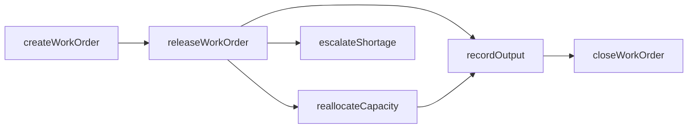
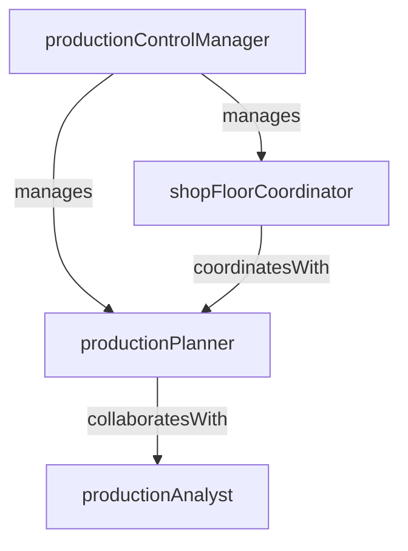

# Production Control

> Business-as-Code definition for the Production Control department. Models responsibilities, actions, events, and searches.

## Overview

Production Control manages work order lifecycle, capacity allocation, and output tracking across the manufacturing floor. The department ensures that production targets are met by coordinating material availability, machine capacity, and labor resources against the master production schedule.

## Responsibilities

| Responsibility | Description |
|---------------|-------------|
| manageWorkOrders | Create, release, track, and close work orders for all production runs |
| allocateCapacity | Assign work centers, machines, and labor to production orders based on available capacity |
| trackOutputAndYield | Record finished output, scrap, and rework quantities against each work order |
| coordinateMaterialRelease | Ensure raw materials and components are staged and available before production starts |
| monitorWipInventory | Track work-in-process inventory levels across production stages |

## Roles

| Role | Description |
|------|-------------|
| productionControlManager | Oversees work order flow, capacity planning, and production KPI reporting |
| productionPlanner | Creates and sequences work orders based on demand signals and capacity constraints |
| shopFloorCoordinator | Manages real-time work order execution and resolves bottlenecks on the production floor |
| productionAnalyst | Analyzes output, yield, and efficiency data to identify improvement opportunities |

## Entities

| Entity | Description |
|--------|-------------|
| WorkOrder | Instruction to produce a specific quantity of a product at a given work center |
| CapacityPlan | Allocation of machine hours, labor hours, and tooling against a planning horizon |
| ProductionRun | A single execution instance of a work order on the shop floor |
| OutputRecord | Log of completed units, scrap count, and rework quantities for a production run |
| WipSnapshot | Point-in-time inventory of work-in-process materials across production stages |

## Actions

| Action | Description |
|--------|-------------|
| createWorkOrder | Generate a new work order from a planned order or manual request |
| releaseWorkOrder | Authorize a work order for execution on the shop floor |
| recordOutput | Log completed units, scrap, and rework against a production run |
| reallocateCapacity | Reassign machines or labor to address bottlenecks or priority changes |
| closeWorkOrder | Finalize a work order after all output and costs are recorded |
| escalateShortage | Flag a material or capacity shortage for expedited resolution |

## Events

| Event | Description |
|-------|-------------|
| workOrderCreated | A new work order was generated and entered the planning queue |
| workOrderReleased | A work order was authorized and released to the shop floor |
| outputRecorded | Finished goods or partial output was logged against a production run |
| capacityReallocated | Machine or labor resources were reassigned to a different work order |
| workOrderCompleted | All operations on a work order were finished and the order was closed |
| shortageEscalated | A material or capacity shortage was flagged for expedited action |

## Searches

| Search | Description |
|--------|-------------|
| findOpenWorkOrders | Retrieve work orders currently in progress or awaiting release |
| getCapacityUtilization | Query machine and labor utilization rates over a given period |
| getOutputByLine | Retrieve output quantities and yield rates for a specific production line |
| findShortages | List active material or capacity shortages blocking production |
| getWipLevels | Retrieve current work-in-process inventory by production stage |

## Workflow



## Actor Relationships



## Related Processes

| Process | APQC ID | Relationship |
|---------|---------|-------------|
| Plan for and Align Supply Chain Resources | 4.2 | Receives demand-driven planned orders that become work orders |
| Produce/Manufacture/Deliver Product | 4.3 | Directly manages work order execution across manufacturing operations |

## Related Departments

| Department | Relationship |
|-----------|-------------|
| Production Scheduling | Receives the master schedule that drives work order creation and sequencing |
| Materials Management | Coordinates material availability and staging for work order release |
| Quality Control | Receives inspection results that may hold or release production output |
| Process Engineering | Provides routing and standard time data used in capacity allocation |

## Usage

```typescript
import { db } from '@headlessly/db'

const dept = await db.departments.get('productionControl')
const openOrders = await db.departments.search('findOpenWorkOrders', { plant: 'plant-01' })
const utilization = await db.departments.search('getCapacityUtilization', { period: '2025-Q1' })
```
