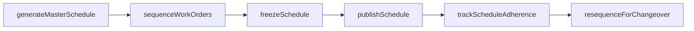
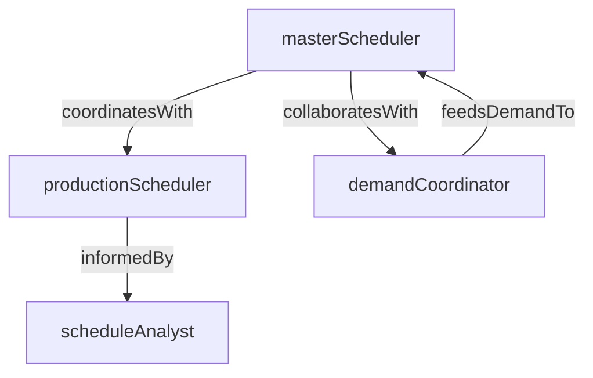

# Production Scheduling

> Business-as-Code definition for the Production Scheduling department. Models responsibilities, actions, events, and searches.

## Overview

Production Scheduling creates and maintains the master production schedule, sequences shop floor jobs, and monitors schedule adherence to ensure on-time delivery. The department balances customer demand, machine capacity, material availability, and changeover constraints to produce an executable manufacturing plan.

## Responsibilities

| Responsibility | Description |
|---------------|-------------|
| buildMasterSchedule | Create the master production schedule from demand forecasts, customer orders, and inventory targets |
| sequenceShopFloorJobs | Determine the run order of work orders on each production line to minimize changeover and maximize throughput |
| monitorScheduleAdherence | Track actual production progress against the schedule and flag deviations in real time |
| manageFrozenZone | Enforce the frozen scheduling horizon within which no changes are permitted without escalation |
| coordinateChangeoverPlanning | Plan and sequence product changeovers to minimize downtime between production runs |

## Roles

| Role | Description |
|------|-------------|
| masterScheduler | Builds and maintains the master production schedule across all product lines |
| productionScheduler | Sequences daily and weekly work orders on specific production lines and work centers |
| scheduleAnalyst | Monitors schedule performance metrics and analyzes root causes of schedule deviations |
| demandCoordinator | Interfaces with sales and demand planning to translate customer commitments into schedulable orders |

## Entities

| Entity | Description |
|--------|-------------|
| MasterProductionSchedule | Time-phased plan of production quantities by product, line, and period |
| ShopFloorSequence | Ordered list of work orders assigned to a production line for a specific shift or day |
| ScheduleAdherenceReport | Comparison of planned versus actual production output with variance analysis |
| ChangeoverMatrix | Matrix of product-to-product changeover times used to optimize sequencing decisions |
| FrozenZonePolicy | Rules defining the scheduling horizon within which the schedule cannot be changed |

## Actions

| Action | Description |
|--------|-------------|
| generateMasterSchedule | Build or refresh the master production schedule from current demand and capacity data |
| sequenceWorkOrders | Assign run order to work orders on a production line for a given period |
| trackScheduleAdherence | Compare actual output against the plan and calculate adherence percentages |
| freezeSchedule | Lock the schedule within the frozen horizon to prevent unauthorized changes |
| resequenceForChangeover | Adjust the run order to minimize changeover time after a disruption or priority change |
| publishSchedule | Distribute the finalized production schedule to shop floor supervisors and support departments |

## Events

| Event | Description |
|-------|-------------|
| masterScheduleGenerated | The master production schedule was created or refreshed for the planning period |
| workOrdersSequenced | Work orders were assigned a run order on a production line |
| scheduleDeviationDetected | Actual production fell behind or ahead of the planned schedule by more than the threshold |
| scheduleFrozen | The schedule was locked within the frozen horizon and change control was activated |
| changeoverResequenced | The shop floor sequence was adjusted to optimize changeover after a disruption |
| schedulePublished | The finalized schedule was distributed to production and support teams |

## Searches

| Search | Description |
|--------|-------------|
| getMasterSchedule | Retrieve the master production schedule for a product family or time period |
| getScheduleAdherence | Query schedule adherence percentages by line, shift, or product |
| findScheduleConflicts | Identify capacity overloads or material shortages that block the current schedule |
| getChangeoverTimeline | Retrieve planned changeover events and durations for a production line |
| findLateOrders | List work orders at risk of missing their committed delivery date |

## Workflow



## Actor Relationships



## Related Processes

| Process | APQC ID | Relationship |
|---------|---------|-------------|
| Plan for and Align Supply Chain Resources | 4.2 | Translates demand and supply plans into an executable master production schedule |
| Produce/Manufacture/Deliver Product | 4.3 | Drives the sequencing and timing of work order execution on the shop floor |

## Related Departments

| Department | Relationship |
|-----------|-------------|
| Production Control | Receives the schedule that drives work order creation, release, and prioritization |
| Materials Management | Coordinates material availability against the production schedule timeline |
| Process Engineering | Provides changeover time data and line capacity parameters used in scheduling |
| Receiving and Shipping | Aligns finished goods shipping schedules with production completion dates |

## Usage

```typescript
import { db } from '@headlessly/db'

const dept = await db.departments.get('productionScheduling')
const schedule = await db.departments.search('getMasterSchedule', { period: '2025-W12' })
const lateOrders = await db.departments.search('findLateOrders', { plant: 'plant-01' })
```
