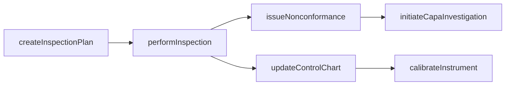
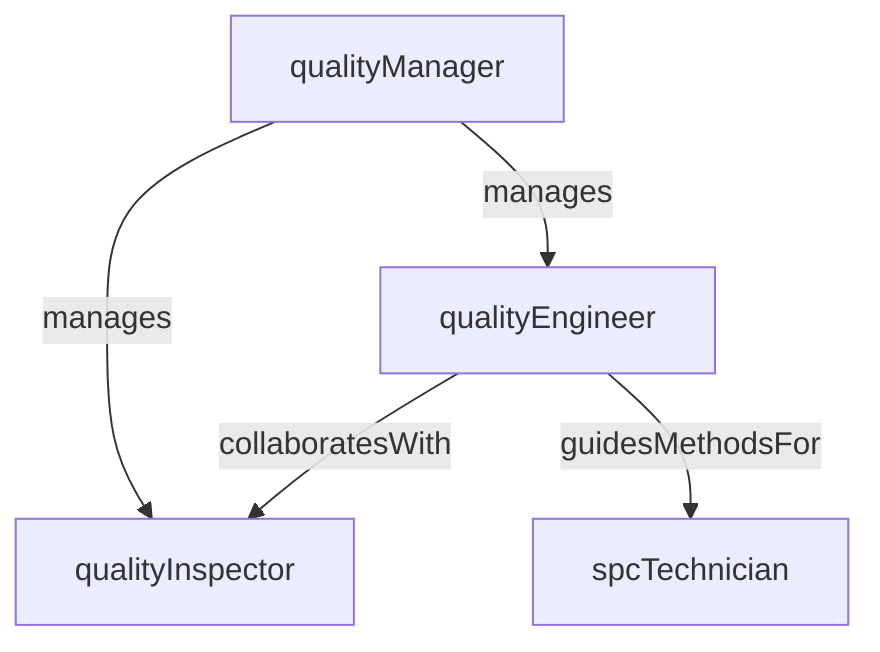

# Quality Control

> Business-as-Code definition for the Quality Control department. Models responsibilities, actions, events, and searches.

## Overview

Quality Control ensures product conformance through in-process inspection, final testing, statistical process control, and nonconformance management. The department enforces quality standards at every production stage and drives corrective action when deviations are detected.

## Responsibilities

| Responsibility | Description |
|---------------|-------------|
| performInspections | Execute incoming, in-process, and final inspections against specification |
| manageNonconformances | Document, disposition, and track nonconforming material through resolution |
| maintainSpcPrograms | Operate statistical process control charts and capability studies on critical parameters |
| administerCapa | Manage corrective and preventive action investigations to eliminate root causes |
| calibrateGauges | Schedule and perform calibration of inspection instruments and gauges |

## Roles

| Role | Description |
|------|-------------|
| qualityManager | Leads the quality function and owns inspection planning, audit schedules, and quality KPIs |
| qualityInspector | Performs dimensional, visual, and functional inspections at defined checkpoints |
| qualityEngineer | Designs inspection plans, conducts capability studies, and leads root cause analysis |
| spcTechnician | Monitors control charts, flags out-of-control conditions, and maintains SPC software |

## Entities

| Entity | Description |
|--------|-------------|
| InspectionPlan | Defines checkpoints, characteristics, sampling rules, and acceptance criteria for a product |
| InspectionResult | Recorded measurements, pass/fail disposition, and inspector sign-off for an inspection event |
| NonconformanceReport | Documentation of a quality deviation including defect description, disposition, and root cause |
| ControlChart | Time-series chart tracking a process characteristic against statistical control limits |
| CapaRecord | Corrective and preventive action record linking root cause analysis to implemented fixes |
| CalibrationRecord | Documentation of gauge or instrument calibration date, results, and next due date |

## Actions

| Action | Description |
|--------|-------------|
| createInspectionPlan | Define inspection checkpoints, sampling rules, and acceptance criteria for a product |
| performInspection | Execute an inspection at a defined checkpoint and record measurements |
| issueNonconformance | Document a quality deviation and initiate the disposition workflow |
| updateControlChart | Record new data points on a statistical process control chart |
| initiateCapaInvestigation | Open a corrective/preventive action investigation for a recurring defect |
| calibrateInstrument | Perform scheduled calibration on an inspection gauge or measurement device |

## Events

| Event | Description |
|-------|-------------|
| inspectionPassed | An inspection lot met all acceptance criteria and was released |
| defectDetected | An inspection identified a non-conformance requiring disposition |
| nonconformanceIssued | A nonconformance report was formally opened and routed for review |
| controlLimitBreached | A control chart data point exceeded the upper or lower control limit |
| capaCompleted | A corrective/preventive action investigation was closed with verified effectiveness |
| instrumentCalibrated | A gauge or instrument completed calibration and was returned to service |

## Searches

| Search | Description |
|--------|-------------|
| findOpenNonconformances | Retrieve unresolved nonconformance reports by product, line, or severity |
| getDefectsByLine | Query defect counts and Pareto data for a specific production line |
| getInspectionResults | Retrieve recent inspection results for a product or work order |
| findOverdueCalibrations | List instruments past their calibration due date |
| getCapaStatus | Retrieve open CAPA investigations and their current phase |

## Workflow



## Actor Relationships



## Related Processes

| Process | APQC ID | Relationship |
|---------|---------|-------------|
| Produce/Manufacture/Deliver Product | 4.3 | Inspects in-process and finished output at defined production stages |
| Manage Enterprise Asset Lifecycle | 10.2 | Calibrates and maintains quality measurement instruments |

## Related Departments

| Department | Relationship |
|-----------|-------------|
| Production Control | Provides inspection results that gate work order release and output disposition |
| Laboratory Testing | Performs specialized chemical, mechanical, or microbiological tests on samples |
| Process Engineering | Collaborates on SPC programs and process capability improvement |
| Environmental Health & Safety | Coordinates on nonconformances that involve safety-critical product characteristics |

## Usage

```typescript
import { db } from '@headlessly/db'

const dept = await db.departments.get('qualityControl')
const ncrs = await db.departments.search('findOpenNonconformances', { severity: 'critical' })
const defects = await db.departments.search('getDefectsByLine', { line: 'assembly-03' })
```
