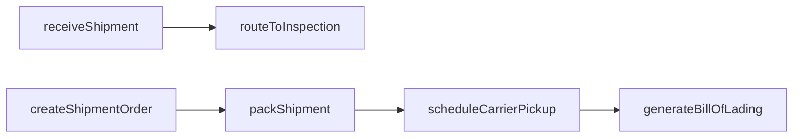
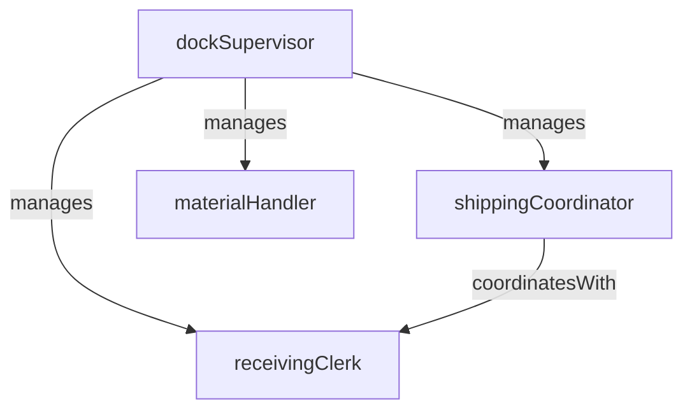

# Receiving and Shipping

> Business-as-Code definition for the Receiving and Shipping department. Models responsibilities, actions, events, and searches.

## Overview

Receiving and Shipping manages the physical flow of materials into and finished goods out of the plant. The department handles inbound dock operations, incoming inspection coordination, outbound packing and loading, freight carrier scheduling, and shipping documentation to ensure on-time and damage-free delivery.

## Responsibilities

| Responsibility | Description |
|---------------|-------------|
| processInboundReceipts | Unload, count, and verify inbound shipments against purchase orders and packing slips |
| coordinateIncomingInspection | Route received materials to quality inspection and manage hold-for-inspection queues |
| packAndStageOutbound | Pick, pack, label, and stage finished goods for outbound shipment |
| scheduleCarriers | Coordinate pickup appointments with freight carriers and manage dock door assignments |
| maintainShippingDocumentation | Generate bills of lading, packing lists, customs documents, and proof-of-delivery records |

## Roles

| Role | Description |
|------|-------------|
| dockSupervisor | Manages receiving and shipping dock operations, staffing, and dock door scheduling |
| receivingClerk | Unloads inbound freight, verifies quantities, and enters receipts into the inventory system |
| shippingCoordinator | Plans outbound shipments, selects carriers, and generates shipping documentation |
| materialHandler | Moves materials between the dock, warehouse, and production floor using forklifts and conveyors |

## Entities

| Entity | Description |
|--------|-------------|
| ReceivingRecord | Documentation of an inbound shipment including quantities received, PO reference, and condition |
| ShipmentOrder | Instruction to pack and ship a specific set of finished goods to a customer or distribution center |
| BillOfLading | Legal transport document listing goods, carrier, origin, and destination |
| DockSchedule | Calendar of inbound and outbound dock door appointments for carriers |
| PackingList | Itemized list of contents and quantities included in an outbound shipment |

## Actions

| Action | Description |
|--------|-------------|
| receiveShipment | Unload and verify an inbound shipment against the purchase order |
| routeToInspection | Send received materials to quality incoming inspection before warehouse put-away |
| createShipmentOrder | Generate an outbound shipment order for finished goods |
| packShipment | Pick, pack, and label finished goods according to the shipment order |
| scheduleCarrierPickup | Book a dock door appointment and assign a carrier for outbound freight |
| generateBillOfLading | Create the bill of lading and shipping documentation for an outbound load |

## Events

| Event | Description |
|-------|-------------|
| shipmentReceived | An inbound shipment was unloaded, counted, and entered into the receiving system |
| materialRoutedToInspection | Received material was sent to quality incoming inspection for verification |
| shipmentOrderCreated | An outbound shipment order was generated for customer or DC delivery |
| shipmentPacked | Finished goods were picked, packed, and staged at the shipping dock |
| carrierScheduled | A freight carrier was booked and a dock door appointment was confirmed |
| billOfLadingGenerated | Shipping documentation was created and the load was released to the carrier |

## Searches

| Search | Description |
|--------|-------------|
| findPendingReceipts | List inbound shipments expected but not yet received at the dock |
| getShipmentsReadyToShip | Retrieve outbound shipments packed and staged awaiting carrier pickup |
| getDockSchedule | Query dock door appointments for a given day or time range |
| findReceivingDiscrepancies | List inbound receipts with quantity or quality discrepancies |
| getShipmentTracking | Retrieve carrier tracking status for shipped outbound loads |

## Workflow



## Actor Relationships



## Related Processes

| Process | APQC ID | Relationship |
|---------|---------|-------------|
| Deliver Products and Services | 4.4 | Ships finished goods to customers and distribution centers |
| Produce/Manufacture/Deliver Product | 4.3 | Receives raw materials and components needed for production |

## Related Departments

| Department | Relationship |
|-----------|-------------|
| Materials Management | Hands off received materials for warehouse put-away and inventory tracking |
| Quality Control | Coordinates incoming material inspection before releasing to stock |
| Production Scheduling | Aligns shipping dates with production completion to meet delivery commitments |
| Production Control | Receives notice of finished goods available for shipment from completed work orders |

## Usage

```typescript
import { db } from '@headlessly/db'

const dept = await db.departments.get('receivingAndShipping')
const pending = await db.departments.search('findPendingReceipts', { date: '2025-03-15' })
const readyToShip = await db.departments.search('getShipmentsReadyToShip', { plant: 'plant-01' })
```
