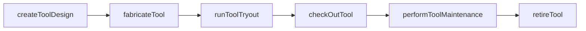
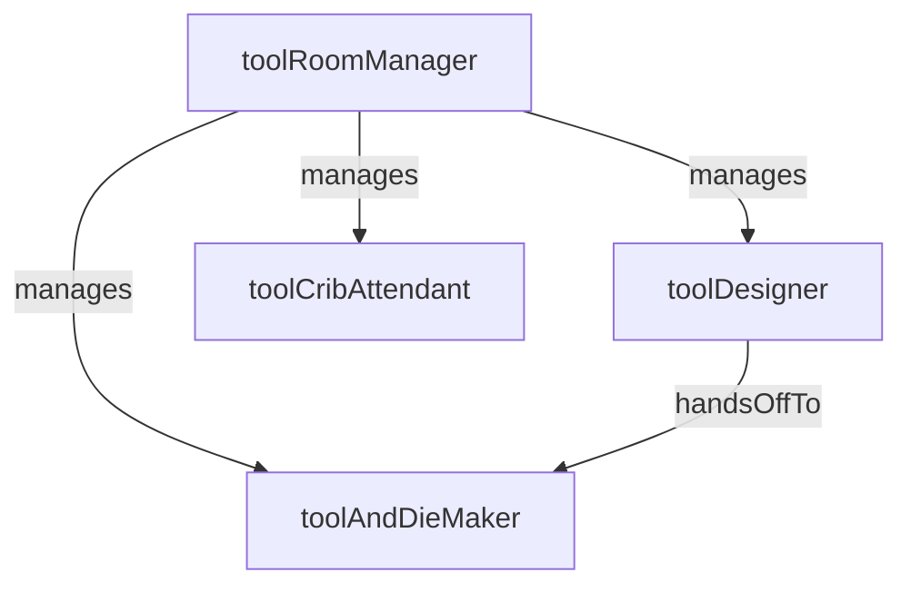

# Tooling and Die

> Business-as-Code definition for the Tooling and Die department. Models responsibilities, actions, events, and searches.

## Overview

Tooling and Die designs, fabricates, and maintains the dies, molds, jigs, and fixtures required for stamping, forming, injection molding, and machining operations. The department ensures that production tooling meets dimensional tolerances and longevity targets while minimizing changeover time.

## Responsibilities

| Responsibility | Description |
|---------------|-------------|
| designTooling | Create CAD designs for dies, molds, jigs, and fixtures to meet product specifications |
| fabricateTooling | Machine, grind, EDM, and assemble new tooling components in the tool room |
| maintainTooling | Perform preventive maintenance, sharpening, and repair on production tooling |
| manageToolInventory | Track tool life, location, and availability across the plant tool crib |
| validateToolPerformance | Run first-article inspections and tryouts to qualify new or refurbished tooling |

## Roles

| Role | Description |
|------|-------------|
| toolRoomManager | Oversees the tool room operations, staffing, budgets, and tooling project schedules |
| toolDesigner | Creates 3D CAD models and engineering drawings for new dies, molds, and fixtures |
| toolAndDieMaker | Fabricates, assembles, fits, and repairs precision tooling in the tool room |
| toolCribAttendant | Manages tool storage, check-out/check-in, and tracks tool life and inventory |

## Entities

| Entity | Description |
|--------|-------------|
| ToolDesign | CAD model and engineering drawing package for a die, mold, jig, or fixture |
| DieSet | A matched upper and lower die assembly used in stamping or forming operations |
| FixtureAssembly | A workholding device that locates and clamps parts during machining or assembly |
| ToolLifeRecord | Tracking record of cumulative hits, cycles, or hours for a tooling asset |
| ToolCribInventory | Current inventory of tooling assets including location, condition, and availability |

## Actions

| Action | Description |
|--------|-------------|
| createToolDesign | Develop a new CAD design for a die, mold, or fixture |
| fabricateTool | Machine and assemble a new tooling asset from the approved design |
| performToolMaintenance | Execute scheduled sharpening, polishing, or component replacement on a tool |
| checkOutTool | Issue a tool from the tool crib to a work center for production use |
| runToolTryout | Execute a trial run with new or refurbished tooling to validate dimensional output |
| retireTool | Remove end-of-life tooling from service and update the inventory |

## Events

| Event | Description |
|-------|-------------|
| toolDesignApproved | A new tooling design was reviewed and approved for fabrication |
| toolFabricated | A new die, mold, or fixture was completed in the tool room |
| toolMaintenanceCompleted | Scheduled maintenance on a tooling asset was finished and the tool returned to service |
| toolCheckedOut | A tool was issued from the tool crib to a production work center |
| toolTryoutPassed | A trial run confirmed the tooling produces output within specification |
| toolRetired | An end-of-life tool was removed from the active inventory |

## Searches

| Search | Description |
|--------|-------------|
| findToolsDueForMaintenance | List tooling assets approaching or past their scheduled maintenance interval |
| getToolLifeStatus | Retrieve cumulative cycle counts and remaining life estimates for a tool |
| searchToolInventory | Query the tool crib for available tooling by type, size, or product association |
| findActiveTryouts | List tool tryouts currently in progress or awaiting first-article approval |

## Workflow



## Actor Relationships



## Related Processes

| Process | APQC ID | Relationship |
|---------|---------|-------------|
| Produce/Manufacture/Deliver Product | 4.3 | Provides production-ready tooling that enables manufacturing operations |
| Manage Enterprise Asset Lifecycle | 10.2 | Tracks tooling assets through their full lifecycle from fabrication to retirement |

## Related Departments

| Department | Relationship |
|-----------|-------------|
| Production Control | Coordinates tool availability with work order scheduling and changeover planning |
| Maintenance Engineering | Collaborates on tooling-related equipment repairs and preventive maintenance |
| Process Engineering | Provides process parameters and tolerances that drive tooling design requirements |
| Quality Control | Performs first-article inspections to validate new or refurbished tooling |

## Usage

```typescript
import { db } from '@headlessly/db'

const dept = await db.departments.get('toolingAndDie')
const dueMaintenance = await db.departments.search('findToolsDueForMaintenance', { plant: 'plant-01' })
const inventory = await db.departments.search('searchToolInventory', { type: 'stamping-die' })
```
