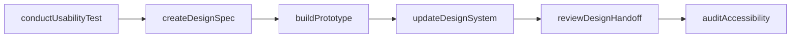
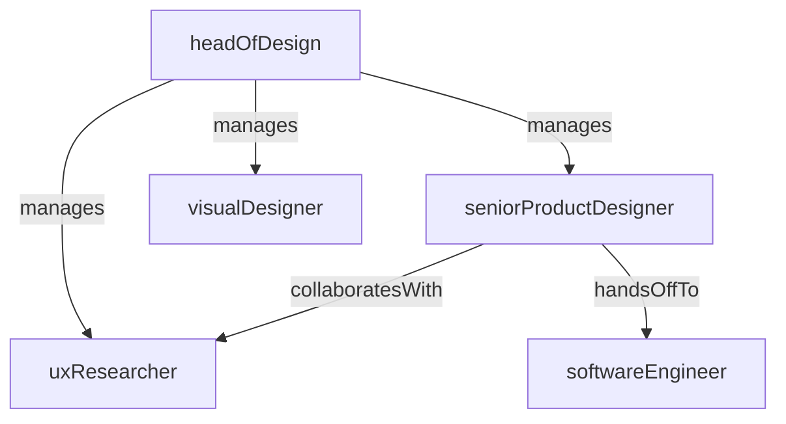

# Design

> Business-as-Code definition for the Design department. Models responsibilities, actions, events, and searches.

## Overview

UX/UI design, user research, design systems, and prototyping

## Responsibilities

| Responsibility | Description |
|---------------|-------------|
| designUserExperience | Create intuitive, accessible user experiences across all product surfaces |
| maintainDesignSystem | Build and evolve a shared component library, tokens, and design patterns |
| conductUserResearch | Plan and execute usability studies, interviews, and surveys to inform design |
| createPrototypes | Produce interactive prototypes for concept validation and stakeholder alignment |
| ensureAccessibility | Audit and enforce WCAG compliance and inclusive design standards |

## Roles

| Role | Description |
|------|-------------|
| headOfDesign | Leads the design organization and sets creative direction |
| seniorProductDesigner | Owns end-to-end design for a major product area or platform surface |
| uxResearcher | Plans and conducts user research studies to generate actionable insights |
| visualDesigner | Creates high-fidelity visual assets, illustrations, and brand-aligned UI |

## Entities

| Entity | Description |
|--------|-------------|
| DesignSpec | Detailed design deliverable with annotated mockups and interaction specs |
| Prototype | Interactive clickable prototype used for validation and testing |
| DesignToken | Standardized variable for color, spacing, typography, or motion |
| ResearchReport | Summary of user research findings with recommendations |
| ComponentLibrary | Shared library of reusable UI components and patterns |

## Actions

| Action | Description |
|--------|-------------|
| createDesignSpec | Produce annotated mockups and interaction specifications for a feature |
| buildPrototype | Assemble an interactive prototype for user testing or stakeholder review |
| conductUsabilityTest | Run moderated or unmoderated usability sessions with target users |
| updateDesignSystem | Add, modify, or deprecate components in the shared design system |
| reviewDesignHandoff | Validate that implemented UI matches the approved design spec |
| auditAccessibility | Evaluate product surfaces against WCAG accessibility guidelines |

## Events

| Event | Description |
|-------|-------------|
| designSpecApproved | Design specification reviewed and approved for engineering handoff |
| prototypeValidated | Prototype tested with users and confirmed as directionally sound |
| usabilityTestCompleted | User research session concluded with findings documented |
| designSystemUpdated | New or modified components published to the design system |
| accessibilityAuditCompleted | Accessibility review finished with issues logged and prioritized |

## Searches

| Search | Description |
|--------|-------------|
| findDesignSpecs | Search design specifications by product area or approval status |
| getDesignTokens | Retrieve design tokens filtered by category (color, spacing, type) |
| listResearchReports | List user research reports by date, product area, or method |
| findComponentsByStatus | Search design system components by status (stable, beta, deprecated) |

## Workflow



## Actor Relationships



## Related Processes

| Process | APQC ID | Relationship |
|---------|---------|-------------|
| Develop Products and Services | 2.1 | Contributes user experience design to product development lifecycle |
| Design and Build Products and Services | 2.2 | Owns UI/UX design, prototyping, and design system authoring |

## Related Departments

| Department | Relationship |
|-----------|-------------|
| Product Management | Receives requirements and collaborates on feature prioritization |
| Engineering | Hands off design specs and validates implementation fidelity |
| Marketing | Aligns on brand identity, visual language, and campaign design assets |

## Usage

```typescript
import { db } from '@headlessly/db'

const design = await db.departments.get('design')
const specs = await db.departments.search('findDesignSpecs', { status: 'approved' })
const tokens = await db.departments.search('getDesignTokens', { category: 'color' })
```
