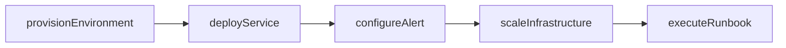
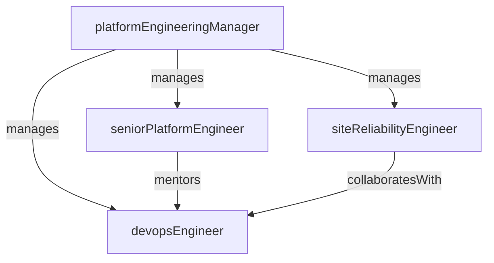

# DevOps & Platform

> Business-as-Code definition for the DevOps & Platform department. Models responsibilities, actions, events, and searches.

## Overview

CI/CD, infrastructure, observability, and developer experience

## Responsibilities

| Responsibility | Description |
|---------------|-------------|
| manageCiCdPipelines | Build and maintain continuous integration and delivery pipelines for all services |
| operateInfrastructure | Provision, configure, and manage cloud infrastructure and edge compute resources |
| ensureObservability | Implement logging, metrics, tracing, and alerting across the production stack |
| improveDeveloperExperience | Provide tooling, documentation, and self-service platforms for engineering teams |
| manageIncidentResponse | Operate on-call rotations, runbooks, and incident management processes |

## Roles

| Role | Description |
|------|-------------|
| platformEngineeringManager | Leads the DevOps and platform engineering function |
| seniorPlatformEngineer | Designs infrastructure architecture, IaC patterns, and platform services |
| devopsEngineer | Builds and maintains CI/CD pipelines, deployment automation, and tooling |
| siteReliabilityEngineer | Manages production reliability, SLO tracking, and incident response |

## Entities

| Entity | Description |
|--------|-------------|
| Pipeline | CI/CD workflow that builds, tests, and deploys a service or application |
| Environment | Isolated deployment target (development, staging, production, preview) |
| Alert | Monitoring rule that fires when a metric crosses a defined threshold |
| Runbook | Step-by-step operational procedure for responding to specific incidents |
| InfrastructureStack | Collection of cloud resources provisioned as a unit via infrastructure-as-code |

## Actions

| Action | Description |
|--------|-------------|
| provisionEnvironment | Create or update a deployment environment with required infrastructure |
| deployService | Push a service build to a target environment through the delivery pipeline |
| configureAlert | Define monitoring thresholds and notification rules for a service |
| executeRunbook | Follow a documented operational procedure during an incident or maintenance |
| scaleInfrastructure | Adjust compute, storage, or network capacity to meet demand |
| rotateCertificates | Renew and deploy TLS certificates and secrets across services |

## Events

| Event | Description |
|-------|-------------|
| environmentProvisioned | New deployment environment created and ready for use |
| deploymentCompleted | Service successfully deployed to the target environment |
| alertTriggered | Monitoring alert fired due to a metric threshold breach |
| infrastructureScaled | Compute or storage resources scaled up or down in response to demand |
| certificateRotated | TLS certificate or secret renewed and deployed across affected services |

## Searches

| Search | Description |
|--------|-------------|
| listPipelines | Retrieve CI/CD pipelines filtered by service or status |
| findTriggeredAlerts | Search for recently fired alerts by severity or service |
| getEnvironments | List deployment environments by type or health status |
| findDeployments | Search deployment history by service, environment, or date range |
| getInfrastructureCosts | Retrieve infrastructure cost metrics by service or environment |

## Workflow



## Actor Relationships



## Related Processes

| Process | APQC ID | Relationship |
|---------|---------|-------------|
| Manage IT Infrastructure and Operations | 2.4 | Core owner of cloud infrastructure, deployment, and operational tooling |
| Design and Build Products and Services | 2.2 | Enables the build and release pipeline for product development |

## Related Departments

| Department | Relationship |
|-----------|-------------|
| Engineering | Provides CI/CD pipelines, environments, and production infrastructure |
| Quality Assurance | Manages test environments and integrates automated testing into pipelines |
| Information Security | Collaborates on infrastructure hardening, certificate management, and access controls |

## Usage

```typescript
import { db } from '@headlessly/db'

const devops = await db.departments.get('devopsPlatform')
const pipelines = await db.departments.search('listPipelines', { status: 'active' })
const alerts = await db.departments.search('findTriggeredAlerts', { severity: 'critical' })
```
