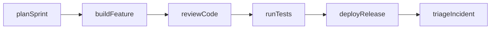
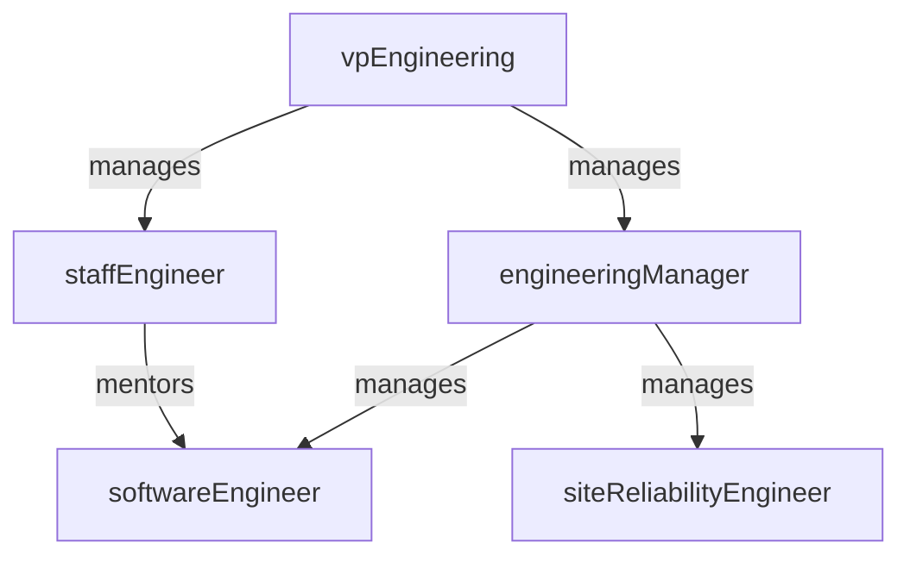

# Engineering

> Business-as-Code definition for the Engineering department. Models responsibilities, actions, events, and searches.

## Overview

Software/hardware development, architecture, and technical implementation

## Responsibilities

| Responsibility | Description |
|---------------|-------------|
| buildProduct | Design, implement, and ship customer-facing features and platform capabilities |
| maintainArchitecture | Evolve system architecture, enforce technical standards, and manage tech debt |
| ensureCodeQuality | Define and enforce code review, testing, and engineering best practices |
| manageSprintDelivery | Plan and execute time-boxed delivery iterations with predictable velocity |
| respondToIncidents | Investigate and resolve production incidents to restore service health |

## Roles

| Role | Description |
|------|-------------|
| vpEngineering | Leads the engineering organization and sets technical strategy |
| engineeringManager | Manages team delivery, hiring, and career growth for an engineering squad |
| staffEngineer | Drives architecture decisions, technical strategy, and cross-team standards |
| softwareEngineer | Designs and implements software components, services, and APIs |
| siteReliabilityEngineer | Ensures production reliability, performance, and incident response |

## Entities

| Entity | Description |
|--------|-------------|
| Repository | Source code repository for a service, library, or application |
| Service | Deployed application or microservice in the production environment |
| PullRequest | Code change submitted for peer review before merging |
| Sprint | Time-boxed delivery iteration with committed scope and goals |
| Incident | Production issue requiring investigation, mitigation, and resolution |

## Actions

| Action | Description |
|--------|-------------|
| planSprint | Define sprint goals, select backlog items, and commit team capacity |
| buildFeature | Implement new functionality according to approved specifications |
| reviewCode | Perform peer code review for correctness, quality, and standards |
| runTests | Execute automated test suites to validate correctness and performance |
| deployRelease | Release software to production through the CI/CD pipeline |
| triageIncident | Assess severity, assign responders, and coordinate incident resolution |

## Events

| Event | Description |
|-------|-------------|
| sprintPlanned | Sprint backlog finalized and committed by the engineering team |
| featureBuilt | Feature implementation completed and merged into the main branch |
| codeReviewApproved | Pull request approved after peer review with no blocking issues |
| deploymentSucceeded | Release deployed to production successfully with health checks passing |
| incidentResolved | Production incident mitigated, root cause identified, and service restored |

## Searches

| Search | Description |
|--------|-------------|
| findTeams | List engineering teams and their areas of ownership |
| listServices | Retrieve services owned by the engineering department |
| findOpenIncidents | Search for unresolved production incidents by severity or service |
| getSprintProgress | Check current sprint completion metrics and burndown |
| findPullRequests | List open pull requests filtered by repository or reviewer |

## Workflow



## Actor Relationships



## Related Processes

| Process | APQC ID | Relationship |
|---------|---------|-------------|
| Generate and Define New Product/Service Ideas | 2.2 | Core owner of software design, development, and delivery |
| Develop Products and Services | 2.3 | Executes development programs from sprint planning through release |
| Design and Prototype Products and Services | 2.3.1 | Responsible for automated testing and validation before release |

## Related Departments

| Department | Relationship |
|-----------|-------------|
| Product Management | Receives requirements and priorities, delivers implemented features |
| DevOps & Platform | Collaborates on CI/CD pipelines, infrastructure, and production operations |
| Quality Assurance | Partners on test strategy, regression coverage, and release validation |

## Usage

```typescript
import { db } from '@headlessly/db'

const eng = await db.departments.get('engineering')
const teams = await db.departments.search('findTeams', { department: 'engineering' })
const incidents = await db.departments.search('findOpenIncidents', { severity: 'critical' })
```
