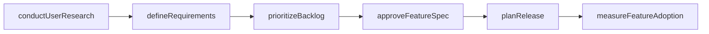
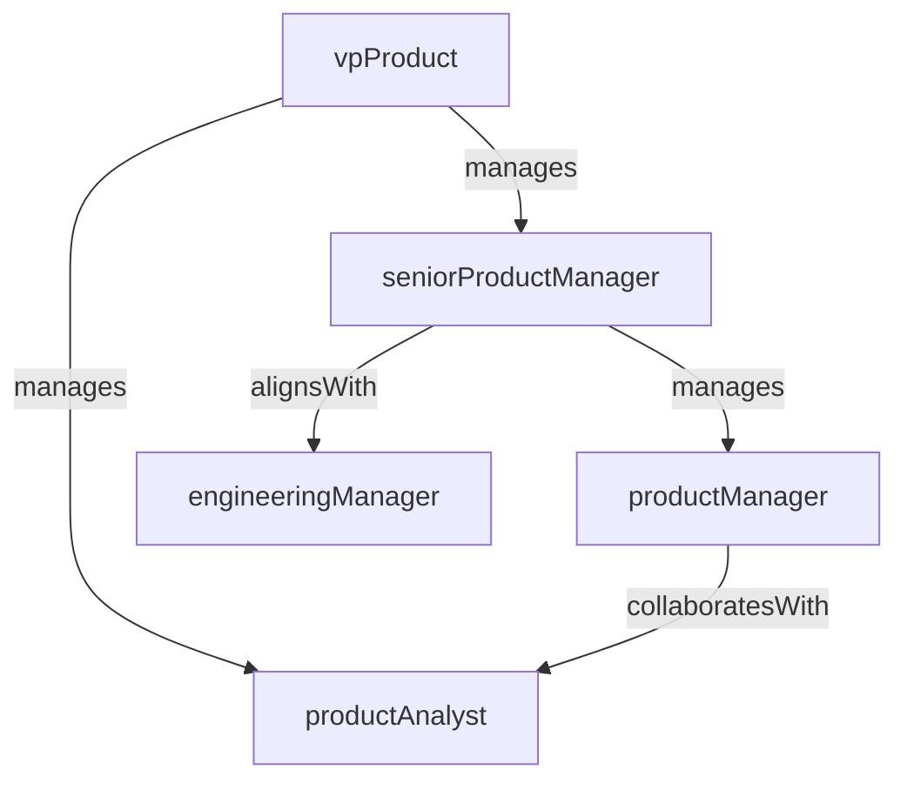

# Product Management

> Business-as-Code definition for the Product Management department. Models responsibilities, actions, events, and searches.

## Overview

Product strategy, roadmaps, requirements, and lifecycle management

## Responsibilities

| Responsibility | Description |
|---------------|-------------|
| defineProductStrategy | Set product vision, positioning, and go-to-market strategy |
| manageProductRoadmap | Prioritize features, plan releases, and maintain the product roadmap |
| gatherRequirements | Collect and synthesize customer feedback, market research, and business needs |
| driveProductLaunch | Coordinate cross-functional launch activities for new products and features |
| analyzeProductMetrics | Monitor adoption, engagement, retention, and revenue metrics |

## Roles

| Role | Description |
|------|-------------|
| vpProduct | Sets product vision and leads the product management organization |
| seniorProductManager | Owns strategy and roadmap for a major product line or platform area |
| productManager | Defines requirements and drives feature delivery for a product area |
| productAnalyst | Analyzes usage data, runs experiments, and generates product insights |

## Entities

| Entity | Description |
|--------|-------------|
| ProductRoadmap | Prioritized timeline of features, improvements, and milestones |
| FeatureSpec | Detailed requirements document for a product feature or capability |
| UserStory | Atomic unit of user-facing functionality with acceptance criteria |
| LaunchPlan | Cross-functional checklist and timeline for a product release |
| ProductMetric | Key performance indicator tracking product health and growth |

## Actions

| Action | Description |
|--------|-------------|
| defineRequirements | Author feature specifications and acceptance criteria |
| prioritizeBacklog | Rank features and improvements by impact, effort, and strategic fit |
| conductUserResearch | Run interviews, surveys, or usability studies to validate assumptions |
| approveFeatureSpec | Sign off on requirements before engineering implementation begins |
| planRelease | Define scope, timeline, and success criteria for an upcoming release |
| measureFeatureAdoption | Track usage and engagement metrics after a feature ships |

## Events

| Event | Description |
|-------|-------------|
| roadmapPublished | Product roadmap updated and shared with stakeholders |
| featureSpecApproved | Feature specification reviewed and approved for development |
| releaseScoped | Release scope finalized and committed to the engineering team |
| productLaunched | New product or major feature released to customers |
| adoptionMilestoneReached | Feature adoption exceeded a predefined engagement threshold |

## Searches

| Search | Description |
|--------|-------------|
| getRoadmap | Retrieve the current product roadmap and planned milestones |
| findFeatureSpecs | Search feature specifications by product area or status |
| listUserStories | List user stories filtered by sprint, priority, or assignee |
| getProductMetrics | Retrieve product KPIs for a given time period |
| findPendingApprovals | List feature specs or launch plans awaiting approval |

## Workflow



## Actor Relationships



## Related Processes

| Process | APQC ID | Relationship |
|---------|---------|-------------|
| Govern and Manage Product/Service Development Program | 2.1 | Owns product strategy, concept development, and lifecycle management |
| Define Product/Service Development Requirements | 2.2.3 | Responsible for gathering and documenting product requirements |
| Develop Products and Services | 2.3 | Drives portfolio-level prioritization and sunset decisions |

## Related Departments

| Department | Relationship |
|-----------|-------------|
| Engineering | Partners on feature implementation, technical feasibility, and release delivery |
| Design | Collaborates on user experience, prototyping, and usability validation |
| Marketing | Coordinates on positioning, messaging, and go-to-market execution |

## Usage

```typescript
import { db } from '@headlessly/db'

const pm = await db.departments.get('productManagement')
const roadmap = await db.departments.search('getRoadmap', { quarter: 'Q1-2025' })
const specs = await db.departments.search('findFeatureSpecs', { status: 'approved' })
```
