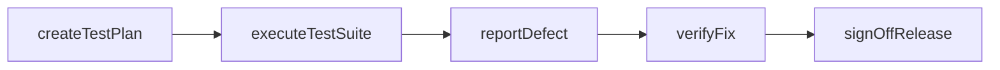
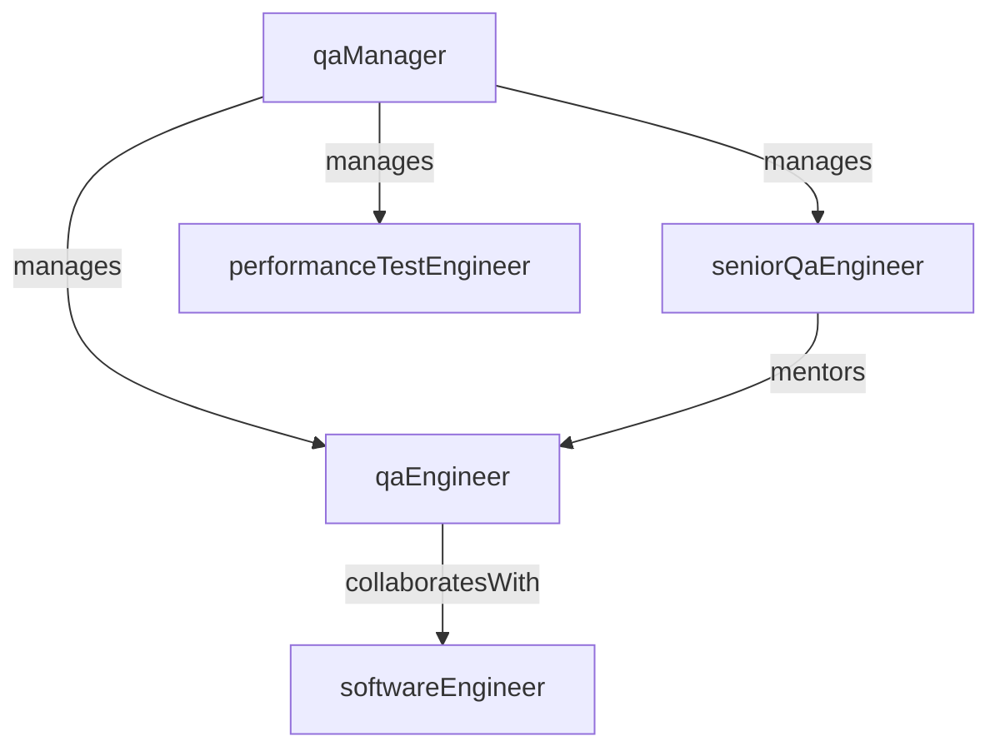

# Quality Assurance

> Business-as-Code definition for the Quality Assurance department. Models responsibilities, actions, events, and searches.

## Overview

Testing, quality standards, and release validation

## Responsibilities

| Responsibility | Description |
|---------------|-------------|
| defineQualityStandards | Establish testing policies, coverage targets, and acceptance criteria |
| executeTestPlans | Design and run manual and automated test suites for each release |
| manageRegressionCoverage | Maintain and expand automated regression test suites across products |
| validateReleases | Perform final release validation and sign-off before production deployment |
| trackDefects | Manage the defect lifecycle from discovery through resolution and verification |

## Roles

| Role | Description |
|------|-------------|
| qaManager | Leads the QA function, sets testing strategy, and manages the QA team |
| seniorQaEngineer | Designs test architectures, frameworks, and automation infrastructure |
| qaEngineer | Writes and executes test cases, reports defects, and validates fixes |
| performanceTestEngineer | Conducts load, stress, and performance testing across services |

## Entities

| Entity | Description |
|--------|-------------|
| TestPlan | Document defining test scope, approach, resources, and schedule for a release |
| TestCase | Individual test scenario with steps, expected results, and pass/fail criteria |
| Defect | Bug or issue discovered during testing with severity and reproduction steps |
| TestSuite | Collection of related test cases executed together (regression, smoke, etc.) |
| ReleaseSignoff | Formal approval record indicating a release meets quality gates |

## Actions

| Action | Description |
|--------|-------------|
| createTestPlan | Author a test plan defining scope, approach, and coverage for a release |
| executeTestSuite | Run a collection of test cases and record pass/fail results |
| reportDefect | Log a defect with reproduction steps, severity, and environment details |
| verifyFix | Re-test a resolved defect to confirm the fix is correct and complete |
| signOffRelease | Formally approve a release after all quality gates are satisfied |
| runPerformanceTest | Execute load and stress tests to validate system performance thresholds |

## Events

| Event | Description |
|-------|-------------|
| testPlanApproved | Test plan reviewed and approved for execution |
| testSuiteCompleted | All test cases in a suite executed with results recorded |
| defectReported | New defect logged and assigned for investigation |
| defectVerified | Resolved defect re-tested and confirmed as fixed |
| releaseSignedOff | Release cleared all quality gates and approved for production deployment |

## Searches

| Search | Description |
|--------|-------------|
| findOpenDefects | List unresolved defects filtered by severity, assignee, or release |
| getTestCoverage | Retrieve test coverage metrics by product area or release |
| listTestPlans | Search test plans by release version or status |
| findFailedTests | List test cases that failed in the most recent execution |
| getReleaseQualityReport | Retrieve quality summary metrics for a specific release |

## Workflow



## Actor Relationships



## Related Processes

| Process | APQC ID | Relationship |
|---------|---------|-------------|
| Test and Validate Products and Services | 2.2.4 | Core owner of product testing, validation, and quality gating |
| Design and Build Products and Services | 2.2 | Ensures quality is embedded throughout the development lifecycle |

## Related Departments

| Department | Relationship |
|-----------|-------------|
| Engineering | Partners on defect resolution, test automation, and release readiness |
| Product Management | Receives acceptance criteria and validates feature completeness |
| DevOps & Platform | Coordinates on test environment provisioning and CI/CD pipeline integration |

## Usage

```typescript
import { db } from '@headlessly/db'

const qa = await db.departments.get('qualityAssurance')
const defects = await db.departments.search('findOpenDefects', { severity: 'critical' })
const coverage = await db.departments.search('getTestCoverage', { release: 'v2.4.0' })
```
