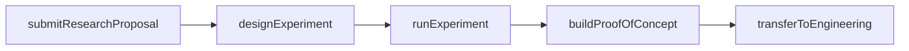
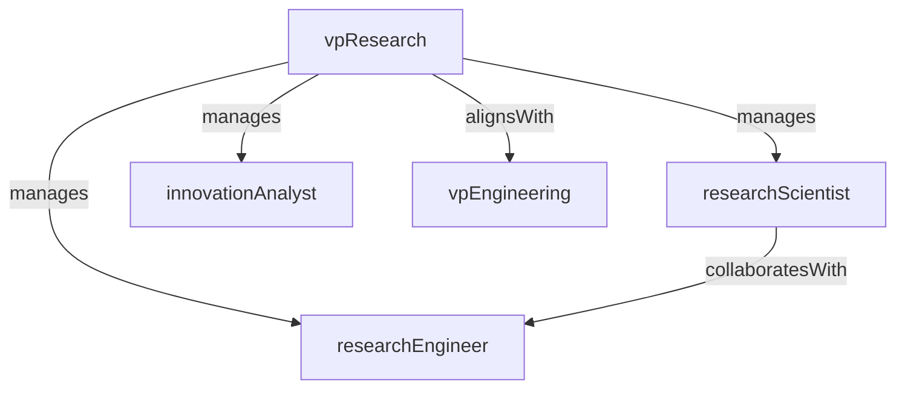

# Research & Development

> Business-as-Code definition for the Research & Development department. Models responsibilities, actions, events, and searches.

## Overview

Innovation, applied research, and experimental prototyping

## Responsibilities

| Responsibility | Description |
|---------------|-------------|
| conductAppliedResearch | Investigate emerging technologies and evaluate their applicability to the product |
| buildExperimentalPrototypes | Create proof-of-concept implementations to validate novel approaches |
| evaluateEmergingTech | Assess AI models, frameworks, and infrastructure advances for strategic adoption |
| publishTechnicalFindings | Document research outcomes, benchmarks, and architectural recommendations |
| driveInnovationPipeline | Manage the funnel from ideation through validation to production handoff |

## Roles

| Role | Description |
|------|-------------|
| vpResearch | Leads the R&D function and sets the innovation agenda |
| researchScientist | Conducts deep technical research on AI, data systems, or distributed computing |
| researchEngineer | Builds experimental prototypes and benchmarks to validate research hypotheses |
| innovationAnalyst | Tracks industry trends, patents, and academic papers for strategic insights |

## Entities

| Entity | Description |
|--------|-------------|
| ResearchProposal | Formal proposal describing a research question, approach, and expected outcomes |
| Experiment | Structured trial with hypothesis, methodology, metrics, and results |
| TechRadar | Curated assessment of emerging technologies ranked by adoption readiness |
| Prototype | Proof-of-concept implementation built to validate a research hypothesis |
| ResearchPaper | Internal or external publication documenting findings and recommendations |

## Actions

| Action | Description |
|--------|-------------|
| submitResearchProposal | Propose a new research initiative with goals, scope, and resource needs |
| designExperiment | Define hypotheses, variables, metrics, and methodology for a research trial |
| runExperiment | Execute an experiment and collect quantitative and qualitative results |
| buildProofOfConcept | Implement a working prototype to demonstrate feasibility |
| updateTechRadar | Reassess and publish the technology readiness radar |
| transferToEngineering | Hand off validated research outcomes to engineering for productionization |

## Events

| Event | Description |
|-------|-------------|
| researchProposalApproved | Research proposal reviewed and funded for execution |
| experimentCompleted | Experiment concluded with results documented and analyzed |
| proofOfConceptValidated | Prototype demonstrated feasibility and met success criteria |
| techRadarUpdated | Technology radar refreshed with new assessments and recommendations |
| researchTransferred | Validated research outcomes handed off to engineering for implementation |

## Searches

| Search | Description |
|--------|-------------|
| findActiveResearch | List research initiatives currently in progress |
| getExperimentResults | Retrieve results and metrics from completed experiments |
| listTechRadarEntries | Search the technology radar by category or readiness level |
| findResearchPapers | Search internal research papers by topic or author |
| getInnovationPipeline | Retrieve the current funnel of ideas from proposal through validation |

## Workflow



## Actor Relationships



## Related Processes

| Process | APQC ID | Relationship |
|---------|---------|-------------|
| Develop Products and Services | 2.1 | Feeds validated innovations into the product development pipeline |
| Manage Product and Service Portfolio | 2.3 | Informs portfolio decisions with technology readiness assessments |

## Related Departments

| Department | Relationship |
|-----------|-------------|
| Engineering | Receives validated prototypes and research outcomes for productionization |
| Product Management | Aligns research priorities with product strategy and market opportunities |
| Strategy & Planning | Provides technology foresight inputs for strategic planning |

## Usage

```typescript
import { db } from '@headlessly/db'

const rnd = await db.departments.get('researchDevelopment')
const research = await db.departments.search('findActiveResearch', { status: 'in-progress' })
const radar = await db.departments.search('listTechRadarEntries', { readiness: 'adopt' })
```
