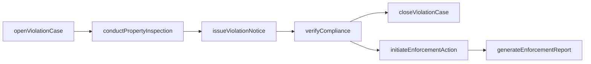
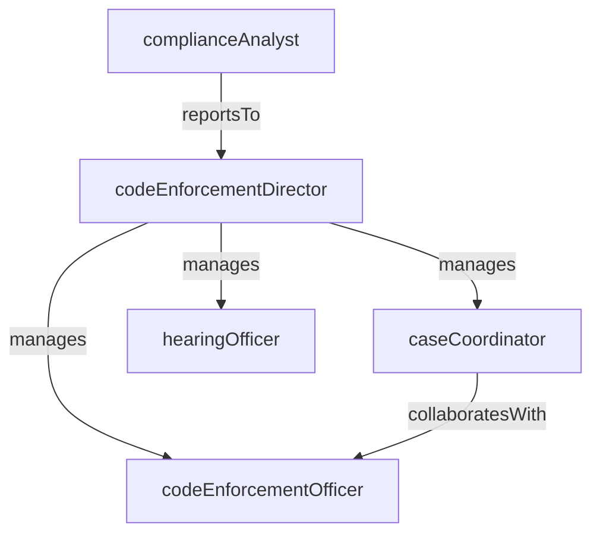

# Code Enforcement

> Business-as-Code definition for the Code Enforcement department. Models responsibilities, actions, events, and searches.

## Overview

Code Enforcement ensures properties within the jurisdiction comply with building, zoning, housing, and nuisance ordinances. The department investigates complaints and proactive patrol findings, issues violation notices, monitors corrective action, and pursues administrative or legal remedies when voluntary compliance fails.

## Responsibilities

| Responsibility | Description |
|---------------|-------------|
| investigateComplaints | Receive and investigate citizen complaints alleging property code or ordinance violations |
| conductPropertyInspections | Perform field inspections of properties to assess compliance with building, zoning, and housing codes |
| issueViolationNotices | Document violations and issue formal notices of violation with required corrective actions and deadlines |
| monitorComplianceDeadlines | Track open violations and verify that property owners complete required corrections within the allotted time |
| pursueEnforcementActions | Initiate administrative hearings, fines, liens, or legal proceedings for properties that fail to achieve compliance |

## Roles

| Role | Description |
|------|-------------|
| codeEnforcementDirector | Leads the department, sets enforcement priorities, and manages officer assignments and caseloads |
| codeEnforcementOfficer | Conducts field inspections, documents violations, issues notices, and verifies corrective actions |
| caseCoordinator | Manages the administrative workflow of violation cases from notice through resolution or escalation |
| hearingOfficer | Presides over administrative hearings for contested violations and issues rulings and penalties |
| complianceAnalyst | Tracks violation trends, monitors deadline adherence, and produces enforcement performance reports |

## Entities

| Entity | Description |
|--------|-------------|
| ViolationCase | A tracked enforcement case for a property found in violation of an applicable code or ordinance |
| ViolationNotice | A formal written notice to a property owner identifying the violation, required correction, and deadline |
| InspectionReport | A documented record of a field inspection including findings, photographs, and compliance status |
| EnforcementAction | An administrative hearing, fine, lien, or legal proceeding initiated for unresolved violations |
| ComplianceCertificate | A document confirming that a property has achieved compliance after corrective actions were verified |

## Actions

| Action | Description |
|--------|-------------|
| openViolationCase | Create a new enforcement case for a property based on a complaint or proactive inspection finding |
| conductPropertyInspection | Perform a field inspection and document findings, photographs, and compliance status |
| issueViolationNotice | Generate and deliver a formal notice of violation with required corrections and compliance deadline |
| verifyCompliance | Re-inspect a property to confirm that the required corrective actions have been completed |
| initiateEnforcementAction | Escalate an unresolved violation to an administrative hearing, fine assessment, or legal proceeding |
| closeViolationCase | Resolve a case after compliance is verified or enforcement action is concluded |
| generateEnforcementReport | Compile case volume, compliance rates, and enforcement action data into a periodic report |

## Events

| Event | Description |
|-------|-------------|
| violationCaseOpened | A new code enforcement case was created for a property |
| propertyInspectionConducted | A field inspection was completed and findings were documented |
| violationNoticeIssued | A formal notice of violation was generated and delivered to the property owner |
| complianceVerified | A re-inspection confirmed that required corrective actions were completed |
| enforcementActionInitiated | An administrative hearing, fine, or legal proceeding was initiated for an unresolved violation |
| violationCaseClosed | An enforcement case was resolved and closed |
| enforcementReportGenerated | A periodic enforcement performance report was compiled |

## Searches

| Search | Description |
|--------|-------------|
| findOpenViolationCases | Retrieve active violation cases filtered by violation type, property address, or officer |
| searchOverdueViolations | Identify violation cases where the compliance deadline has passed without resolution |
| listInspectionsByOfficer | Query inspection records by assigned officer and date range |
| getEnforcementActionsByStatus | Retrieve enforcement actions filtered by stage (hearing scheduled, fine assessed, lien filed) |
| findViolationsByOrdinance | Search violation cases by the specific code or ordinance section cited |
| getComplianceRateMetrics | Query compliance resolution rates by violation type and time period |

## Workflow



## Actor Relationships



## Related Processes

| Process | APQC ID | Relationship |
|---------|---------|-------------|
| Manage Customer Service | 5.1 | Citizen complaints are the primary intake channel for code enforcement investigations |
| Manage External Relationships | 12.1 | Enforcement actions involve coordination with property owners, attorneys, and administrative courts |
| Manage Enterprise Risk, Compliance, Remediation, and Resiliency | 12.6 | Property code compliance reduces community health, safety, and blight risks |

## Related Departments

| Department | Relationship |
|-----------|-------------|
| Constituent Services | Routes citizen complaints about property conditions and nuisances to Code Enforcement |
| Permitting and Licensing | Shares data on unpermitted work and refers cases requiring retroactive permitting |
| Public Works | Coordinates on violations involving public right-of-way encroachments and drainage obstructions |

## Usage

```typescript
import { db } from '@headlessly/db'

const dept = await db.departments.get('codeEnforcement')
const overdueViolations = await db.departments.search('searchOverdueViolations', { daysOverdue: 30 })
const complianceRate = await db.departments.search('getComplianceRateMetrics', { period: '2026-Q1' })
```
