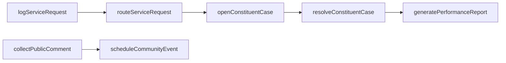
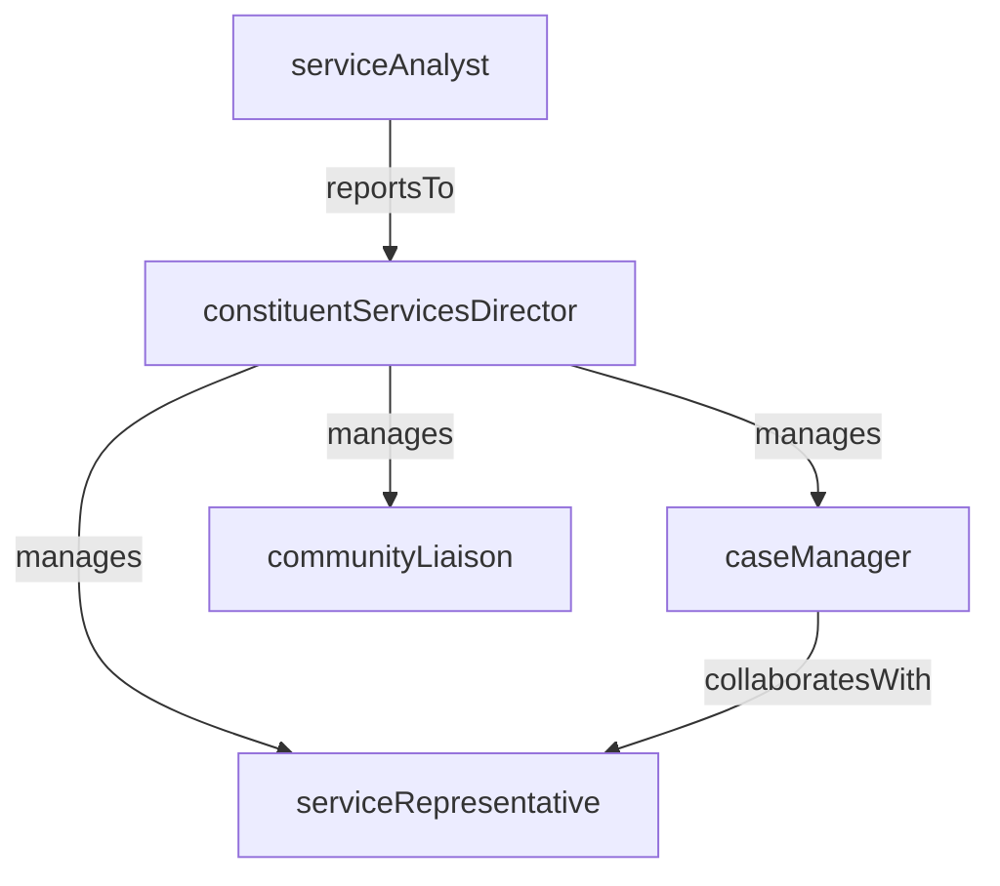

# Constituent Services

> Business-as-Code definition for the Constituent Services department. Models responsibilities, actions, events, and searches.

## Overview

Constituent Services is the primary interface between a government agency and the public, managing citizen inquiries, service requests, complaints, and case management. The department ensures residents can access government services, receive timely responses, and have their concerns tracked through resolution.

## Responsibilities

| Responsibility | Description |
|---------------|-------------|
| manageCitizenInquiries | Receive, classify, and respond to questions from residents via phone, email, web portal, and walk-in channels |
| trackServiceRequests | Log, route, and monitor public service requests such as pothole repairs, streetlight outages, and park maintenance |
| administerCaseManagement | Maintain a case management system to track complex constituent issues from intake through resolution |
| coordinateCommunityEngagement | Organize town halls, public comment periods, and outreach events to gather resident input |
| reportServicePerformance | Produce metrics on response times, resolution rates, and constituent satisfaction for agency leadership |

## Roles

| Role | Description |
|------|-------------|
| constituentServicesDirector | Leads the department, sets service standards, and reports on constituent satisfaction to agency leadership |
| serviceRepresentative | Handles inbound inquiries and service requests from residents across all contact channels |
| caseManager | Manages complex multi-step constituent cases that require coordination across departments |
| communityLiaison | Organizes public meetings, outreach events, and community engagement initiatives |
| serviceAnalyst | Tracks and analyzes service request data, response times, and satisfaction trends |

## Entities

| Entity | Description |
|--------|-------------|
| ServiceRequest | A resident-submitted request for a public service such as a repair, pickup, or information |
| ConstituentCase | A tracked issue requiring investigation and cross-departmental coordination to resolve |
| PublicComment | A formal comment submitted by a resident during a public hearing or comment period |
| CommunityEvent | A town hall, public meeting, or outreach event organized for resident engagement |
| SatisfactionSurvey | A post-interaction survey measuring constituent satisfaction with the services received |

## Actions

| Action | Description |
|--------|-------------|
| logServiceRequest | Record a new service request from a resident with category, location, and priority |
| routeServiceRequest | Assign a service request to the responsible department or field crew for fulfillment |
| openConstituentCase | Create a tracked case for a complex issue requiring investigation or multi-agency coordination |
| resolveConstituentCase | Close a case with a documented resolution and notify the constituent of the outcome |
| collectPublicComment | Receive and record a resident's formal comment during a public hearing or comment period |
| scheduleCommunityEvent | Create and publish a town hall, public meeting, or community outreach event |
| generatePerformanceReport | Compile response time, resolution rate, and satisfaction metrics into a periodic report |

## Events

| Event | Description |
|-------|-------------|
| serviceRequestLogged | A new service request was recorded in the system from a resident |
| serviceRequestRouted | A service request was assigned to the responsible department for action |
| constituentCaseOpened | A new complex constituent case was created and an investigation was initiated |
| constituentCaseResolved | A constituent case was closed with a documented resolution |
| publicCommentCollected | A formal public comment was received and recorded |
| communityEventScheduled | A town hall or public meeting was created and published to the calendar |
| performanceReportGenerated | A periodic service performance report was compiled and distributed |

## Searches

| Search | Description |
|--------|-------------|
| findOpenServiceRequests | Retrieve unresolved service requests filtered by category, priority, or location |
| searchConstituentCases | Find constituent cases by status, assigned department, or date range |
| listPublicCommentsByHearing | Retrieve public comments submitted for a specific hearing or comment period |
| getResponseTimeMetrics | Query average response and resolution times by category and period |
| findOverdueRequests | Identify service requests that have exceeded their target response time |

## Workflow



## Actor Relationships



## Related Processes

| Process | APQC ID | Relationship |
|---------|---------|-------------|
| Manage Customer Service | 5.1 | Constituent Services is the government equivalent of customer service, managing all resident interactions |
| Manage External Relationships | 12.1 | Community engagement and public comment processes manage the agency's external stakeholder relationships |

## Related Departments

| Department | Relationship |
|-----------|-------------|
| Public Works | Receives routed service requests for infrastructure repairs and maintenance fulfillment |
| Permitting and Licensing | Redirects permit and license inquiries to the specialized permitting team |
| Code Enforcement | Refers complaint-based service requests involving property violations to enforcement officers |

## Usage

```typescript
import { db } from '@headlessly/db'

const dept = await db.departments.get('constituentServices')
const openRequests = await db.departments.search('findOpenServiceRequests', { priority: 'high' })
const overdueItems = await db.departments.search('findOverdueRequests', { daysOverdue: 7 })
```
