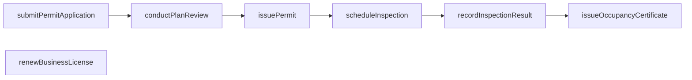
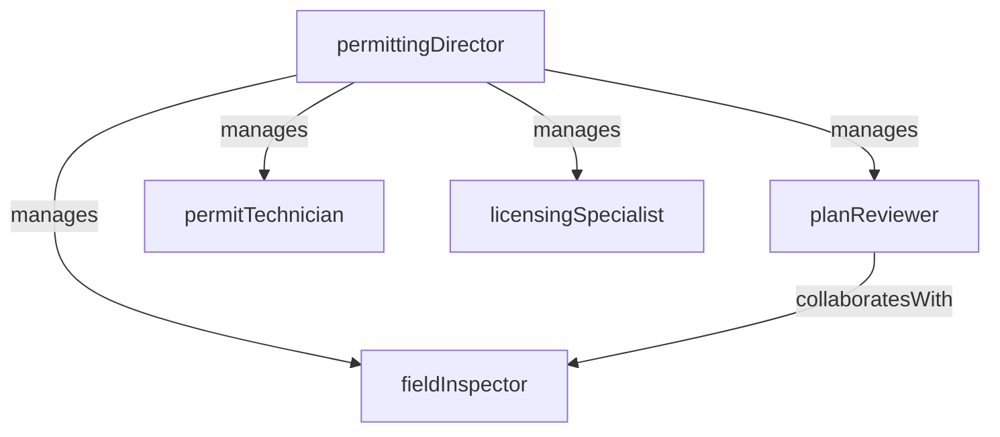

# Permitting and Licensing

> Business-as-Code definition for the Permitting and Licensing department. Models responsibilities, actions, events, and searches.

## Overview

Permitting and Licensing processes applications for building permits, business licenses, special-use permits, and occupancy certificates. The department conducts plan reviews, schedules inspections, ensures zoning and code compliance, and issues approvals that authorize construction, business operation, and land-use activities.

## Responsibilities

| Responsibility | Description |
|---------------|-------------|
| processPermitApplications | Receive, validate, and route permit applications through plan review and approval workflows |
| issueBusinessLicenses | Evaluate business license applications, verify compliance requirements, and issue or renew licenses |
| conductPlanReview | Review construction plans, site plans, and engineering drawings for code and zoning compliance |
| scheduleInspections | Coordinate field inspections at required construction milestones to verify code-compliant work |
| manageFeeCollection | Calculate, assess, and collect permit and license fees according to the published fee schedule |

## Roles

| Role | Description |
|------|-------------|
| permittingDirector | Oversees the permitting and licensing operation, sets processing standards, and manages staff |
| planReviewer | Evaluates submitted construction and site plans for compliance with building codes and zoning ordinances |
| permitTechnician | Processes permit applications, collects fees, issues permits, and manages application status |
| fieldInspector | Conducts on-site inspections at construction milestones to verify code compliance |
| licensingSpecialist | Reviews business license applications, verifies regulatory prerequisites, and issues licenses |

## Entities

| Entity | Description |
|--------|-------------|
| PermitApplication | A formal request for authorization to perform construction, renovation, or land-use activities |
| BusinessLicense | An authorization for an entity to operate a business within the jurisdiction |
| PlanReviewRecord | The documented evaluation of submitted construction or site plans against applicable codes |
| InspectionRecord | The result of a field inspection at a construction milestone including pass, fail, or correction required |
| FeeSchedule | The published schedule of permit and license fees by type, valuation, and scope |
| OccupancyCertificate | A certificate issued upon final inspection confirming a structure is safe and code-compliant for occupancy |

## Actions

| Action | Description |
|--------|-------------|
| submitPermitApplication | Receive a new permit application with plans, project description, and applicant information |
| conductPlanReview | Evaluate submitted plans against building code, zoning, and engineering requirements |
| issuePermit | Approve an application and generate the permit document authorizing the permitted activity |
| scheduleInspection | Book a field inspection for a permitted project at the required construction milestone |
| recordInspectionResult | Document the outcome of a field inspection including findings, corrections, and pass/fail status |
| issueOccupancyCertificate | Confirm final inspection passage and issue the certificate of occupancy for a completed project |
| renewBusinessLicense | Process a business license renewal, verify continued compliance, and issue the updated license |

## Events

| Event | Description |
|-------|-------------|
| permitApplicationSubmitted | A new permit application was received and entered into the tracking system |
| planReviewCompleted | A plan review evaluation was completed and the result was recorded |
| permitIssued | A permit was approved and the authorization document was generated |
| inspectionScheduled | A field inspection was booked for a permitted project |
| inspectionResultRecorded | A field inspection outcome was documented with findings and status |
| occupancyCertificateIssued | A certificate of occupancy was issued for a completed and inspected project |
| businessLicenseRenewed | A business license renewal was processed and the updated license was issued |

## Searches

| Search | Description |
|--------|-------------|
| findPermitsByStatus | Retrieve permit applications filtered by status (submitted, in review, approved, denied) |
| searchPlanReviewQueue | List plan reviews pending evaluation by reviewer assignment or submission date |
| getInspectionSchedule | Query upcoming inspections by date range, inspector, or project location |
| findExpiringLicenses | Identify business licenses approaching their renewal deadline |
| listPermitsByParcel | Retrieve all permits associated with a specific parcel or property address |
| getRevenueByFeeType | Query fee revenue totals by permit type, license category, and period |

## Workflow



## Actor Relationships



## Related Processes

| Process | APQC ID | Relationship |
|---------|---------|-------------|
| Manage Customer Service | 5.1 | Permit and license applicants are served through intake, status tracking, and issue resolution processes |
| Manage External Relationships | 12.1 | Permitting involves coordination with contractors, developers, and regulatory agencies |

## Related Departments

| Department | Relationship |
|-----------|-------------|
| Code Enforcement | Shares code compliance data and refers unpermitted work discovered during enforcement inspections |
| Public Works | Coordinates on infrastructure-related permits such as right-of-way, utility, and encroachment permits |
| Constituent Services | Receives and routes general permitting inquiries from residents to the permitting team |

## Usage

```typescript
import { db } from '@headlessly/db'

const dept = await db.departments.get('permittingAndLicensing')
const pendingReviews = await db.departments.search('searchPlanReviewQueue', { status: 'pending' })
const expiringLicenses = await db.departments.search('findExpiringLicenses', { daysUntilExpiry: 30 })
```
