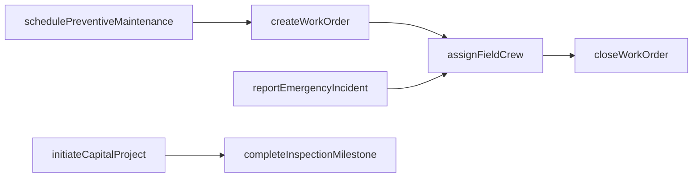
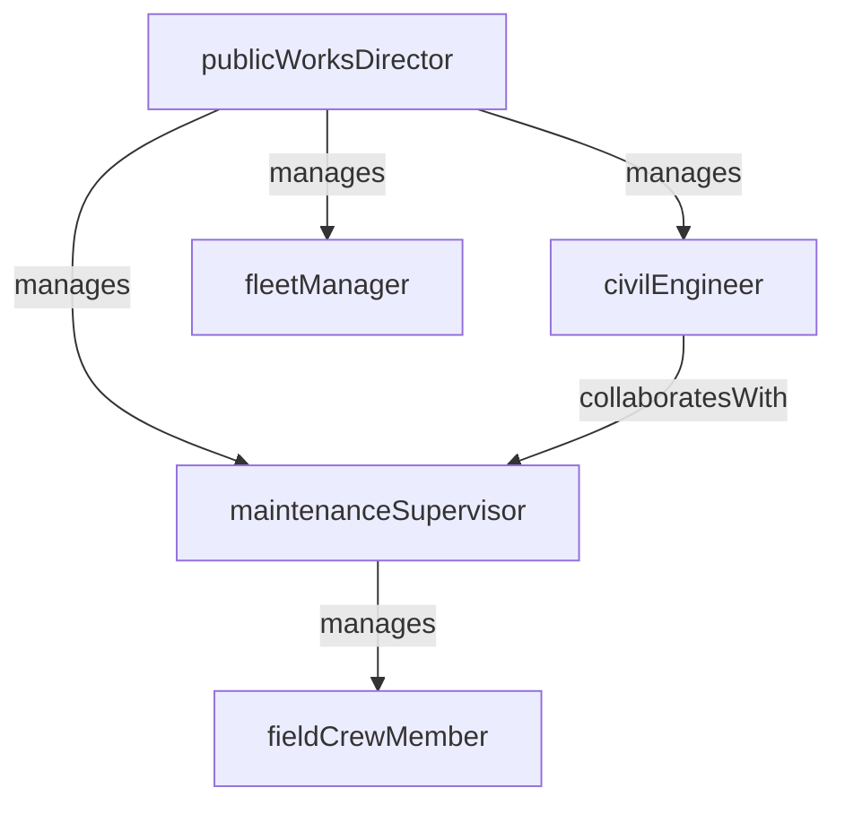

# Public Works

> Business-as-Code definition for the Public Works department. Models responsibilities, actions, events, and searches.

## Overview

Public Works maintains and improves public infrastructure including roads, bridges, water and sewer systems, stormwater facilities, and public buildings. The department manages capital improvement projects, operates fleet services, responds to emergency infrastructure failures, and fulfills maintenance work orders from field crews.

## Responsibilities

| Responsibility | Description |
|---------------|-------------|
| maintainRoadInfrastructure | Perform pavement repair, resurfacing, striping, signage, and traffic signal maintenance on public roadways |
| manageCapitalProjects | Plan, design, bid, and oversee construction of capital improvement projects for public infrastructure |
| operateUtilitySystems | Maintain water distribution, wastewater collection, and stormwater management systems |
| administerFleetServices | Manage the acquisition, maintenance, fueling, and disposal of the government vehicle and equipment fleet |
| respondToEmergencies | Mobilize crews for emergency infrastructure repairs including water main breaks, road washouts, and storm damage |

## Roles

| Role | Description |
|------|-------------|
| publicWorksDirector | Leads the department, sets infrastructure priorities, and oversees the capital improvement program |
| civilEngineer | Designs infrastructure projects, reviews construction plans, and manages project delivery |
| maintenanceSupervisor | Directs field maintenance crews performing road, utility, and facility repairs |
| fieldCrewMember | Performs hands-on infrastructure maintenance, repair, and construction tasks in the field |
| fleetManager | Oversees vehicle and equipment acquisition, preventive maintenance scheduling, and fleet utilization |

## Entities

| Entity | Description |
|--------|-------------|
| WorkOrder | A directive assigning a maintenance or repair task to a field crew with location, scope, and priority |
| CapitalProject | A planned infrastructure improvement project with budget, timeline, and construction milestones |
| InfrastructureAsset | A cataloged public asset such as a road segment, bridge, water main, or traffic signal |
| FleetVehicle | A government-owned vehicle or piece of heavy equipment in the fleet inventory |
| MaintenanceSchedule | A recurring preventive maintenance plan for infrastructure assets or fleet vehicles |
| EmergencyIncident | An unplanned infrastructure failure requiring immediate crew mobilization and repair |

## Actions

| Action | Description |
|--------|-------------|
| createWorkOrder | Log a new maintenance or repair work order with scope, location, and priority |
| assignFieldCrew | Dispatch a maintenance crew to fulfill a work order based on skills, equipment, and availability |
| initiateCapitalProject | Formally launch a capital improvement project with approved budget and preliminary design |
| completeInspectionMilestone | Record the completion and inspection of a construction milestone on a capital project |
| schedulePreventiveMaintenance | Create a recurring maintenance task for an infrastructure asset or fleet vehicle |
| reportEmergencyIncident | Log an unplanned infrastructure failure and initiate the emergency response workflow |
| closeWorkOrder | Mark a work order as complete with documented labor, materials, and outcome |

## Events

| Event | Description |
|-------|-------------|
| workOrderCreated | A new maintenance or repair work order was logged in the system |
| fieldCrewAssigned | A maintenance crew was dispatched to a work order location |
| capitalProjectInitiated | A capital improvement project was formally launched with budget approval |
| inspectionMilestoneCompleted | A construction milestone was completed and passed inspection |
| preventiveMaintenanceScheduled | A recurring maintenance task was added to the maintenance calendar |
| emergencyIncidentReported | An unplanned infrastructure failure was logged and response was initiated |
| workOrderClosed | A work order was marked complete with labor and materials documented |

## Searches

| Search | Description |
|--------|-------------|
| findOpenWorkOrders | Retrieve work orders pending assignment or completion filtered by priority or location |
| listCapitalProjectsByPhase | Query capital projects by phase (design, bidding, construction, closeout) |
| searchInfrastructureAssets | Find cataloged infrastructure assets by type, condition rating, or location |
| getFleetMaintenanceStatus | Query fleet vehicles by maintenance status (current, due, overdue) |
| findEmergencyIncidents | Retrieve active emergency infrastructure incidents by severity or area |
| getCrewUtilization | Query field crew assignment and availability across active work orders |

## Workflow



## Actor Relationships



## Related Processes

| Process | APQC ID | Relationship |
|---------|---------|-------------|
| Manage Customer Service | 5.1 | Service requests from residents for road repairs and utility issues are fulfilled by Public Works crews |
| Manage External Relationships | 12.1 | Capital projects involve coordination with contractors, utilities, and regulatory agencies |
| Manage Enterprise Risk, Compliance, Remediation, and Resiliency | 12.6 | Emergency infrastructure response and asset condition management address operational risk |

## Related Departments

| Department | Relationship |
|-----------|-------------|
| Constituent Services | Receives and routes infrastructure-related service requests to Public Works for fulfillment |
| Permitting and Licensing | Coordinates on right-of-way permits and utility connection authorizations |
| Code Enforcement | Shares information on infrastructure-adjacent violations such as encroachments and drainage obstructions |

## Usage

```typescript
import { db } from '@headlessly/db'

const dept = await db.departments.get('publicWorks')
const openOrders = await db.departments.search('findOpenWorkOrders', { priority: 'urgent' })
const activeProjects = await db.departments.search('listCapitalProjectsByPhase', { phase: 'construction' })
```
