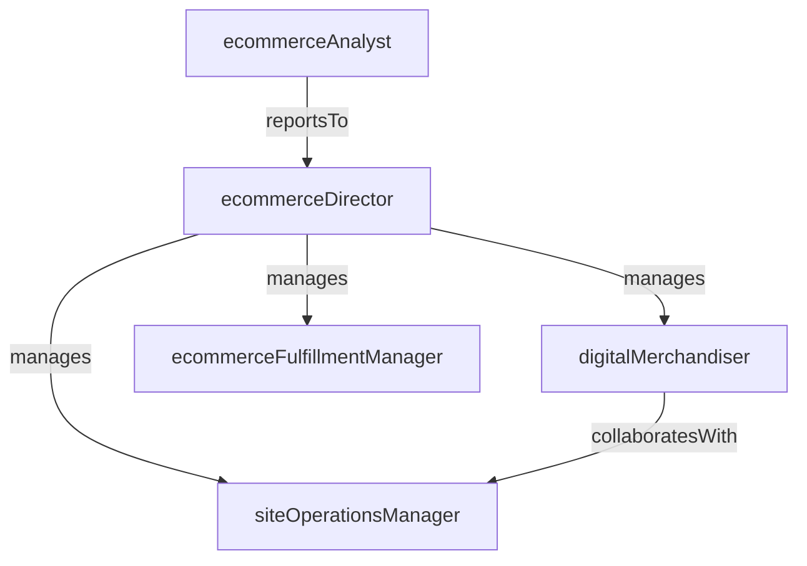

# Ecommerce

> Business-as-Code definition for the Ecommerce department. Models responsibilities, actions, events, and searches.

## Overview

Ecommerce manages the online storefront, digital merchandising, order fulfillment, and omnichannel integration to drive online revenue and provide a seamless shopping experience across digital and physical channels. The department optimizes the full digital customer journey from product discovery through delivery.

## Responsibilities

| Responsibility | Description |
|---------------|-------------|
| manageOnlineStorefront | Maintain the ecommerce platform including product catalog, navigation, and checkout experience |
| executedigitalMerchandising | Curate product listings, search rankings, recommendations, and promotional placements online |
| overseeOrderFulfillment | Coordinate picking, packing, and shipping of online orders from distribution centers or stores |
| enableOmnichannelIntegration | Support buy-online-pick-up-in-store, ship-from-store, and unified inventory visibility |
| optimizeConversionRate | Analyze and improve the digital purchase funnel from site visit through order completion |

## Roles

| Role | Description |
|------|-------------|
| ecommerceDirector | Leads digital commerce strategy, platform operations, and online revenue targets |
| digitalMerchandiser | Manages online product presentation, search optimization, and promotional placements |
| ecommerceFulfillmentManager | Oversees the picking, packing, and shipping workflow for online orders |
| siteOperationsManager | Maintains platform uptime, performance, and the checkout experience |
| ecommerceAnalyst | Analyzes conversion funnels, traffic patterns, and customer behavior data |

## Entities

| Entity | Description |
|--------|-------------|
| OnlineOrder | Customer purchase placed through the ecommerce platform with items, payment, and delivery details |
| ProductListing | Digital catalog entry with images, descriptions, pricing, and inventory availability |
| PromotionalBanner | Featured placement on the storefront promoting a product, category, or sale event |
| ConversionFunnel | Staged customer journey metrics from site visit through cart and checkout completion |
| FulfillmentShipment | Packed and labeled package ready for carrier pickup and delivery to the customer |
| OmnichannelInventory | Unified view of product availability across online, store, and distribution center locations |

## Actions

| Action | Description |
|--------|-------------|
| publishProductListing | Create or update a product's online catalog entry with images, copy, and pricing |
| launchPromotion | Activate a promotional banner, discount code, or featured collection on the storefront |
| processOnlineOrder | Validate payment, confirm inventory, and route an online order for fulfillment |
| shipFulfillmentOrder | Pack, label, and hand off a fulfilled order to the carrier for delivery |
| analyzeConversionFunnel | Evaluate drop-off rates and friction points across the digital purchase journey |
| syncOmnichannelInventory | Reconcile inventory levels across online, store, and warehouse locations |

## Events

| Event | Description |
|-------|-------------|
| productListingPublished | A new or updated product listing went live on the storefront |
| promotionLaunched | A promotional banner or discount was activated on the ecommerce site |
| onlineOrderPlaced | A customer completed checkout and an order was created |
| fulfillmentOrderShipped | A packed order was handed off to the carrier with a tracking number |
| conversionFunnelAnalyzed | A conversion analysis was completed and optimization recommendations produced |
| omnichannelInventorySynced | Inventory levels were reconciled across all selling channels |
| cartAbandonmentSpikeDetected | An unusual increase in cart abandonment rate was flagged for investigation |

## Searches

| Search | Description |
|--------|-------------|
| getOnlineRevenueByPeriod | Retrieve gross and net online revenue by day, week, or month |
| findOrdersByStatus | List online orders filtered by processing, shipped, delivered, or returned status |
| getConversionRate | Query site-wide or page-level conversion rates over a date range |
| searchProductListings | Find product listings by category, brand, or availability status |
| getTopSellingOnlineItems | List highest-revenue or highest-volume products sold online |
| findFulfillmentBottlenecks | Identify orders delayed in picking, packing, or carrier handoff stages |

## Workflow


## Actor Relationships



## Related Processes

| Process | APQC ID | Relationship |
|---------|---------|-------------|
| Market and Sell Products and Services | 3.5 | The online storefront is a primary sales and marketing channel |
| Deliver Products and Services | 4.4 | Order fulfillment and shipping are core product delivery functions |
| Manage Customer Service | 4.3 | Online order inquiries, returns, and support are key customer service activities |

## Related Departments

| Department | Relationship |
|-----------|-------------|
| Merchandising | Aligns online assortment, pricing, and promotions with enterprise merchandise plans |
| Store Operations | Enables buy-online-pick-up-in-store and ship-from-store fulfillment |
| Visual Merchandising | Coordinates online product imagery and presentation with in-store brand standards |
| Information Technology | Supports ecommerce platform infrastructure, integrations, and performance |

## Usage

```typescript
import { db } from '@headlessly/db'

const dept = await db.departments.get('ecommerce')
const revenue = await db.departments.search('getOnlineRevenueByPeriod', { period: '2025-03' })
const bottlenecks = await db.departments.search('findFulfillmentBottlenecks', { threshold: '48h' })
```
