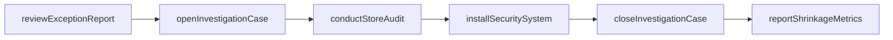
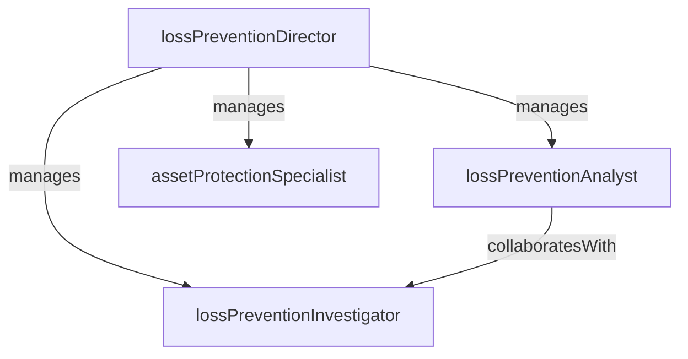

# Loss Prevention

> Business-as-Code definition for the Loss Prevention department. Models responsibilities, actions, events, and searches.

## Overview

Loss Prevention reduces shrinkage through theft investigation, exception-based reporting, asset protection programs, and operational compliance audits. The department safeguards inventory, cash, and company assets across all store locations.

## Responsibilities

| Responsibility | Description |
|---------------|-------------|
| investigateTheft | Conduct investigations into internal and external theft, fraud, and organized retail crime |
| manageExceptionBasedReporting | Monitor POS transaction exceptions to identify suspicious patterns and policy violations |
| conductStoreAudits | Perform scheduled and surprise audits of cash handling, receiving, and operational procedures |
| administerAssetProtection | Manage physical security systems including CCTV, EAS tags, and access control |
| analyzeShrinkageData | Identify shrinkage trends by store, category, and cause to target reduction efforts |

## Roles

| Role | Description |
|------|-------------|
| lossPreventionDirector | Sets LP strategy, manages the investigation team, and reports on company-wide shrinkage |
| lossPreventionInvestigator | Conducts theft and fraud investigations using surveillance, interviews, and data analysis |
| lossPreventionAnalyst | Mines exception reports and transaction data to identify shrinkage patterns |
| assetProtectionSpecialist | Manages physical security systems and supports store-level security operations |

## Entities

| Entity | Description |
|--------|-------------|
| ShrinkageReport | Periodic summary of inventory loss by store, category, and attributed cause |
| InvestigationCase | Documented investigation into suspected theft, fraud, or policy violation |
| ExceptionReport | Flagged POS transactions exhibiting patterns associated with theft or policy violations |
| AuditFinding | Documented result from a store compliance audit identifying a control weakness |
| RecoveryRecord | Documentation of recovered merchandise, restitution, or prosecution outcomes |

## Actions

| Action | Description |
|--------|-------------|
| openInvestigationCase | Initiate a formal investigation into suspected theft, fraud, or shrinkage anomaly |
| reviewExceptionReport | Analyze flagged POS transactions for indicators of internal theft or policy violations |
| conductStoreAudit | Perform a cash handling, receiving, or operational compliance audit at a store |
| installSecuritySystem | Deploy or upgrade CCTV, EAS, or access control equipment at a location |
| closeInvestigationCase | Finalize an investigation with findings, recovery amounts, and resolution actions |
| reportShrinkageMetrics | Compile and distribute shrinkage data by store, category, and time period |

## Events

| Event | Description |
|-------|-------------|
| investigationCaseOpened | A formal investigation was initiated for a suspected loss event |
| exceptionReportReviewed | A batch of flagged POS exceptions was analyzed and dispositioned |
| storeAuditCompleted | A compliance audit was finished and findings documented |
| investigationCaseClosed | An investigation was finalized with resolution actions and recovery amounts |
| securitySystemInstalled | New security equipment was deployed at a store location |
| shrinkageAlertRaised | A store or category exceeded the shrinkage threshold triggering review |
| restitutionRecovered | Recovered merchandise value or cash restitution was documented |

## Searches

| Search | Description |
|--------|-------------|
| getHighShrinkageStores | List stores with shrinkage rates above the company threshold |
| findOpenInvestigations | Retrieve active investigation cases by region, type, or investigator |
| searchExceptionsByStore | List flagged POS exceptions for a specific store and date range |
| getAuditFindingsByRegion | Retrieve unresolved audit findings grouped by district or region |
| getShrinkageTrend | Query shrinkage rates over time by store, category, or cause |
| findRecoveryHistory | Retrieve recovery and restitution amounts by investigation or store |

## Workflow



## Actor Relationships



## Related Processes

| Process | APQC ID | Relationship |
|---------|---------|-------------|
| Deliver Products and Services | 4.4 | Shrinkage directly reduces inventory available for sale and impacts product delivery |
| Manage Internal Controls | 4.6 | Exception-based reporting and store audits are core internal control mechanisms |
| Market and Sell Products and Services | 3.5 | Product availability and asset protection support in-store sales execution |

## Related Departments

| Department | Relationship |
|-----------|-------------|
| Store Operations | Partners on cash handling compliance, receiving procedures, and operational audits |
| Merchandising | Provides inventory data and category shrinkage analysis for buying decisions |
| Human Resources | Coordinates internal investigation outcomes, disciplinary actions, and policy training |
| Information Technology | Supports CCTV, POS exception reporting systems, and EAS technology infrastructure |

## Usage

```typescript
import { db } from '@headlessly/db'

const dept = await db.departments.get('lossPrevention')
const highShrink = await db.departments.search('getHighShrinkageStores', { threshold: 2.5 })
const openCases = await db.departments.search('findOpenInvestigations', { region: 'west' })
```
