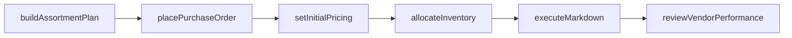
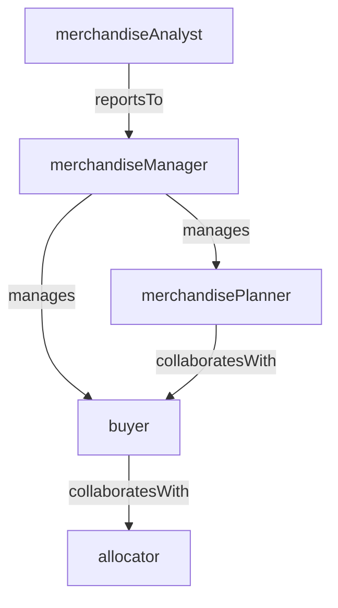

# Merchandising

> Business-as-Code definition for the Merchandising department. Models responsibilities, actions, events, and searches.

## Overview

Merchandising drives assortment planning, buying, pricing strategy, markdown optimization, and vendor negotiation to deliver the right products at the right price to each store cluster. The department balances sales performance, margin targets, and inventory investment across categories.

## Responsibilities

| Responsibility | Description |
|---------------|-------------|
| planAssortments | Define product assortments by category, store cluster, and selling season |
| executeOpenToBuy | Manage purchasing budgets and inventory investment by category and time period |
| optimizePricing | Set initial prices, promotional markdowns, and clearance strategies to meet margin targets |
| negotiateVendorTerms | Negotiate cost, payment terms, markdown allowances, and co-op funding with suppliers |
| analyzeSellingPerformance | Track sell-through rates, inventory turns, and margin by SKU, category, and location |

## Roles

| Role | Description |
|------|-------------|
| merchandiseManager | Oversees category strategy, buying decisions, and financial performance |
| buyer | Selects products, negotiates vendor terms, and manages purchase orders for a category |
| merchandisePlanner | Builds financial plans, manages open-to-buy budgets, and forecasts demand |
| merchandiseAnalyst | Analyzes sales trends, inventory productivity, and markdown effectiveness |
| allocator | Distributes purchased inventory across stores based on demand profiles and store clusters |

## Entities

| Entity | Description |
|--------|-------------|
| AssortmentPlan | Curated selection of products planned for a category, season, and store cluster |
| OpenToBuyBudget | Financial plan governing how much inventory can be purchased for a category and period |
| MarkdownSchedule | Timed sequence of price reductions to clear seasonal or slow-moving inventory |
| VendorAgreement | Negotiated terms with a supplier covering cost, delivery, returns, and co-op allowances |
| SkuPerformanceReport | Sales, margin, and inventory metrics for individual stock-keeping units |

## Actions

| Action | Description |
|--------|-------------|
| buildAssortmentPlan | Define the product selection for a category, season, and store cluster |
| placePurchaseOrder | Submit a buy order to a vendor for selected products and quantities |
| setInitialPricing | Establish retail prices for new products based on cost, competition, and margin targets |
| executeMarkdown | Apply a planned price reduction to move through aging or seasonal inventory |
| reviewVendorPerformance | Evaluate a supplier on fill rate, on-time delivery, quality, and allowance compliance |
| allocateInventory | Distribute purchased quantities across stores based on demand and cluster profiles |

## Events

| Event | Description |
|-------|-------------|
| assortmentPlanApproved | A category assortment plan was finalized for the upcoming season |
| purchaseOrderPlaced | A buy order was submitted to a vendor for production or shipment |
| pricingSet | Initial retail prices were established for a batch of new products |
| markdownExecuted | A price reduction was applied to designated SKUs across stores |
| vendorPerformanceReviewed | A supplier scorecard was completed and results shared with the vendor |
| inventoryAllocated | Purchased inventory was distributed to stores based on allocation rules |

## Searches

| Search | Description |
|--------|-------------|
| getAssortmentByCategory | Retrieve the current assortment plan for a category and store cluster |
| findSlowMovingSkus | List SKUs below sell-through targets that may need markdown intervention |
| getOpenToBuyStatus | Check remaining purchase budget by category and month |
| searchVendorsByCategory | Find approved vendors for a product category with performance ratings |
| getMarginByCategory | Retrieve gross margin performance by category, subcategory, or vendor |
| findOverstockedLocations | Identify stores with excess inventory relative to demand for a category |

## Workflow



## Actor Relationships



## Related Processes

| Process | APQC ID | Relationship |
|---------|---------|-------------|
| Market and Sell Products and Services | 3.5 | Assortment and pricing decisions directly drive product sales and revenue |
| Deliver Products and Services | 4.4 | Purchase orders and inventory allocation feed into store replenishment and delivery |
| Plan for and Align Supply Chain Resources | 4.2 | Open-to-buy planning aligns buying with supply chain capacity and vendor lead times |

## Related Departments

| Department | Relationship |
|-----------|-------------|
| Visual Merchandising | Translates assortment plans into in-store product presentation and display strategies |
| Store Operations | Receives allocated inventory and executes pricing and markdown directives |
| Ecommerce | Coordinates online assortment, pricing, and inventory visibility with in-store plans |
| Supply Chain Planning | Aligns purchase order flow with distribution center capacity and store delivery schedules |

## Usage

```typescript
import { db } from '@headlessly/db'

const dept = await db.departments.get('merchandising')
const slowMoving = await db.departments.search('findSlowMovingSkus', { category: 'apparel', threshold: 0.3 })
const otb = await db.departments.search('getOpenToBuyStatus', { category: 'footwear', month: '2025-04' })
```
