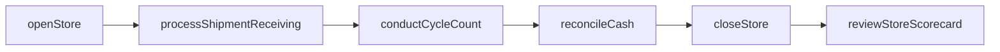
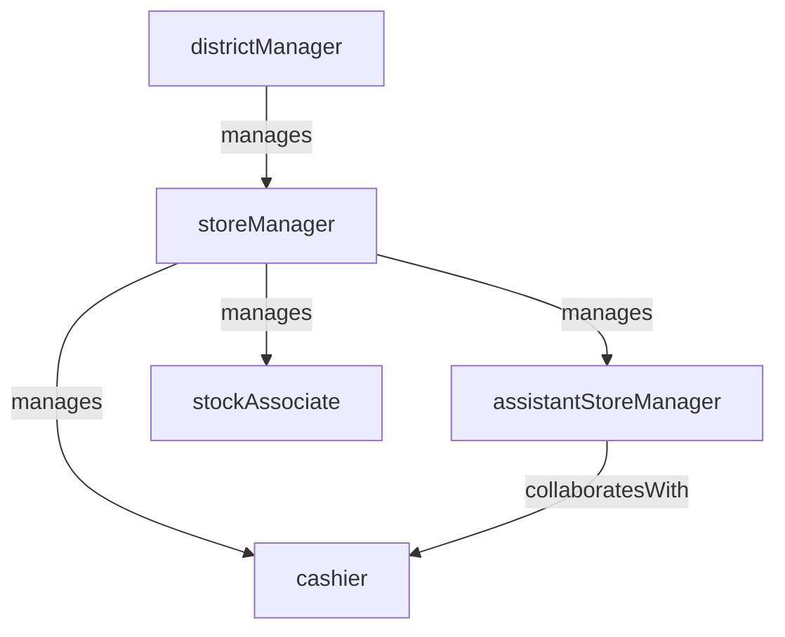

# Store Operations

> Business-as-Code definition for the Store Operations department. Models responsibilities, actions, events, and searches.

## Overview

Store Operations manages day-to-day retail store performance, including staffing, cash handling, customer service standards, inventory replenishment, and compliance with company operating procedures. The department ensures consistent execution across the store fleet.

## Responsibilities

| Responsibility | Description |
|---------------|-------------|
| manageStoreStaffing | Schedule, train, and develop store associates to meet labor budgets and coverage needs |
| enforceOperatingStandards | Ensure consistent execution of store procedures for opening, closing, and daily operations |
| manageCashHandling | Oversee POS operations, cash reconciliation, safe management, and deposit procedures |
| driveCustomerServiceExcellence | Set and monitor service standards, mystery shop scores, and customer satisfaction metrics |
| overseeStoreInventory | Manage receiving, cycle counts, stock replenishment, and shrinkage reduction at store level |

## Roles

| Role | Description |
|------|-------------|
| districtManager | Oversees a group of stores, driving performance and ensuring operational consistency |
| storeManager | Manages all operations, staff, and financial performance for a single store |
| assistantStoreManager | Supports the store manager in daily operations and serves as acting manager on alternate shifts |
| cashier | Processes customer transactions at the point of sale |
| stockAssociate | Receives shipments, replenishes shelves, and assists with inventory counts |

## Entities

| Entity | Description |
|--------|-------------|
| Store | A physical retail location with staff, inventory, and financial performance data |
| StoreSchedule | Weekly labor schedule mapping associates to shifts and departments |
| CashReconciliation | End-of-day cash count matched against POS transaction totals |
| StoreScorecard | Performance dashboard tracking sales, labor, shrinkage, and customer service by store |
| ReceivingLog | Record of inbound shipments received and verified at the store |

## Actions

| Action | Description |
|--------|-------------|
| openStore | Execute the opening checklist including POS startup, floor walk, and staffing confirmation |
| closeStore | Execute the closing checklist including cash pulls, deposit preparation, and alarm set |
| reconcileCash | Count register and safe cash and reconcile against POS transaction records |
| processShipmentReceiving | Receive, verify, and log an inbound inventory shipment at the store dock |
| conductCycleCount | Perform a partial physical inventory count for selected SKUs or sections |
| reviewStoreScorecard | Evaluate store performance metrics and identify action items for improvement |

## Events

| Event | Description |
|-------|-------------|
| storeOpened | The daily opening checklist was completed and the store is ready for customers |
| storeClosed | The daily closing checklist was completed and the store was secured |
| cashReconciled | End-of-day cash counts matched POS records or variances were documented |
| shipmentReceived | An inbound inventory shipment was received, verified, and logged |
| cycleCountCompleted | A partial physical inventory count was finished and variances recorded |
| storeScorecardReviewed | Store performance metrics were reviewed and improvement actions identified |
| cashVarianceDetected | A discrepancy between cash count and POS records was flagged for investigation |

## Searches

| Search | Description |
|--------|-------------|
| getStorePerformance | Retrieve sales, labor, shrinkage, and conversion metrics for a store |
| findStoresByDistrict | List all stores in a district with current performance summary |
| searchCashVariances | Find stores with cash reconciliation variances above a threshold |
| getScheduleCompliance | Check actual labor hours versus scheduled hours by store and department |
| findOverdueShipments | List expected shipments not yet received at a store |
| getCustomerSatisfactionScores | Retrieve mystery shop and customer feedback scores by store |

## Workflow



## Actor Relationships



## Related Processes

| Process | APQC ID | Relationship |
|---------|---------|-------------|
| Deliver Products and Services | 4.4 | Store operations is the front-line delivery channel for retail products and services |
| Market and Sell Products and Services | 3.5 | In-store customer experience and service execution drive sales conversion |
| Manage Health, Safety, and Environment | 5.5 | Store safety, cash handling controls, and facility compliance are operational requirements |

## Related Departments

| Department | Relationship |
|-----------|-------------|
| Merchandising | Provides assortment plans, pricing directives, and markdown instructions for execution |
| Loss Prevention | Partners on shrinkage reduction, cash handling audits, and exception-based reporting |
| Visual Merchandising | Supplies planograms and display standards that store teams execute |
| Human Resources | Supports store staffing, training programs, and labor law compliance |

## Usage

```typescript
import { db } from '@headlessly/db'

const dept = await db.departments.get('storeOperations')
const performance = await db.departments.search('getStorePerformance', { store: 'STR-0142', period: '2025-Q1' })
const variances = await db.departments.search('searchCashVariances', { threshold: 50, district: 'northeast' })
```
