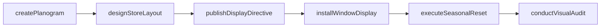
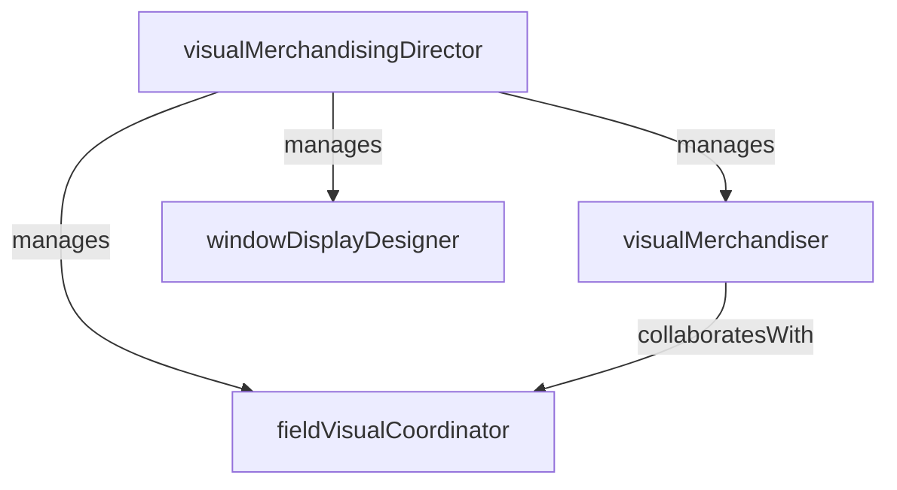

# Visual Merchandising

> Business-as-Code definition for the Visual Merchandising department. Models responsibilities, actions, events, and searches.

## Overview

Visual Merchandising designs store layouts, window displays, planograms, and in-store brand presentations to drive customer engagement and sales conversion. The department translates merchandising strategy into compelling physical shopping experiences.

## Responsibilities

| Responsibility | Description |
|---------------|-------------|
| designStorelayouts | Create floor plans, fixture placements, and traffic flow patterns for new and remodeled stores |
| managePlanograms | Develop and maintain shelf-level product placement diagrams for each category and fixture |
| createWindowDisplays | Design and install seasonal and promotional window displays |
| enforceVisualStandards | Audit store compliance with brand presentation, signage, and display guidelines |
| coordinateSeasonalResets | Plan and execute store-wide product resets for seasonal transitions and promotional events |

## Roles

| Role | Description |
|------|-------------|
| visualMerchandisingDirector | Sets the visual strategy and brand presentation standards across all locations |
| visualMerchandiser | Designs planograms, store layouts, and display concepts for assigned categories |
| windowDisplayDesigner | Creates and installs window displays for flagship and high-traffic locations |
| fieldVisualCoordinator | Executes visual standards and seasonal resets at store locations in the field |

## Entities

| Entity | Description |
|--------|-------------|
| Planogram | Shelf-level diagram specifying product placement, facings, and fixture configuration |
| StoreLayout | Floor plan defining departments, fixtures, aisles, and customer traffic flow |
| DisplayDirective | Instructions for a promotional or seasonal display including props, signage, and product |
| VisualAuditReport | Store-level compliance assessment against brand presentation and planogram standards |
| SeasonalResetCalendar | Timeline of planned store resets tied to merchandising seasons and promotional periods |

## Actions

| Action | Description |
|--------|-------------|
| createPlanogram | Design a shelf-level product placement diagram for a category and fixture type |
| designStoreLayout | Develop a floor plan with department zoning, fixture placement, and traffic flow |
| installWindowDisplay | Build and install a window display at a store location |
| conductVisualAudit | Assess a store's compliance with planograms, signage, and brand presentation standards |
| publishDisplayDirective | Distribute display instructions and visual guides to store teams |
| executeSeasonalReset | Coordinate the store-wide product transition for a new merchandising season |

## Events

| Event | Description |
|-------|-------------|
| planogramPublished | A new or revised planogram was finalized and distributed to stores |
| storeLayoutApproved | A store floor plan was approved for implementation in a new or remodeled location |
| windowDisplayInstalled | A window display was completed and went live at a store location |
| visualAuditCompleted | A store visual compliance assessment was completed and scored |
| displayDirectivePublished | Display instructions were distributed to field teams for execution |
| seasonalResetCompleted | A store-wide product transition was finished for the new season |

## Searches

| Search | Description |
|--------|-------------|
| getPlanogramsByCategory | Retrieve current planograms for a product category and fixture type |
| findStoresBelowVisualScore | List stores scoring below the visual compliance threshold on their last audit |
| getSeasonalResetStatus | Check completion status of seasonal resets across stores |
| searchDisplayDirectives | Find active display directives by season, promotion, or category |
| getAuditScoresByRegion | Retrieve visual audit scores aggregated by district or region |

## Workflow



## Actor Relationships



## Related Processes

| Process | APQC ID | Relationship |
|---------|---------|-------------|
| Market and Sell Products and Services | 3.5 | In-store visual presentation directly influences customer engagement and sales conversion |
| Deliver Products and Services | 4.4 | Planograms and store layouts guide how products are presented and accessible to customers |

## Related Departments

| Department | Relationship |
|-----------|-------------|
| Merchandising | Provides assortment plans and category strategies that planograms must reflect |
| Store Operations | Executes planogram changes, display setups, and seasonal resets at store level |
| Marketing | Aligns in-store visual campaigns with brand marketing initiatives and promotions |
| Ecommerce | Coordinates visual consistency between physical store and online product presentation |

## Usage

```typescript
import { db } from '@headlessly/db'

const dept = await db.departments.get('visualMerchandising')
const lowScores = await db.departments.search('findStoresBelowVisualScore', { threshold: 80 })
const resets = await db.departments.search('getSeasonalResetStatus', { season: 'fall-2025' })
```
