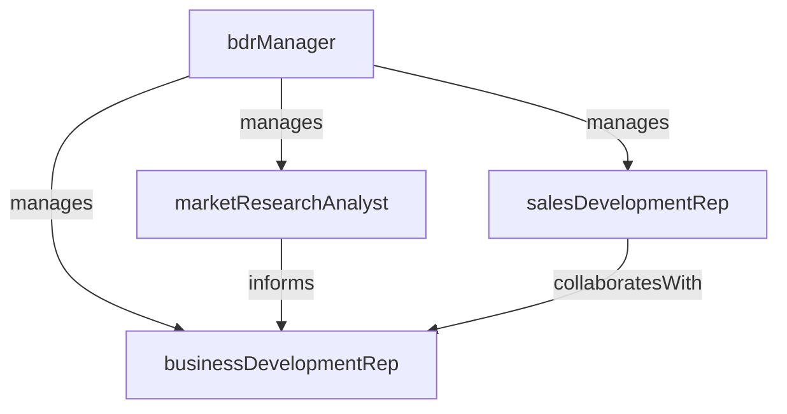

# Business Development

> Business-as-Code definition for the Business Development department. Models responsibilities, actions, events, and searches.

## Overview

New market identification, strategic partnerships, and outbound prospecting

## Responsibilities

| Responsibility | Description |
|---------------|-------------|
| conductOutboundProspecting | Identify and engage potential customers through cold outreach, social selling, and referral networks |
| qualifyInboundLeads | Assess inbound leads for fit, intent, and readiness before routing to sales |
| identifyNewMarkets | Research and evaluate new market segments, verticals, and geographic opportunities |
| buildStrategicPartnerships | Develop relationships with potential strategic partners to expand market reach |
| manageProspectPipeline | Maintain and advance early-stage pipeline from initial outreach to qualified opportunity |

## Roles

| Role | Description |
|------|-------------|
| bdrManager | Leads the business development team, sets outreach targets, and manages pipeline handoff |
| businessDevelopmentRep | Executes outbound prospecting sequences and qualifies leads for account executives |
| salesDevelopmentRep | Handles inbound lead qualification and schedules discovery meetings |
| marketResearchAnalyst | Researches target accounts, buyer signals, and new market opportunities |

## Entities

| Entity | Description |
|--------|-------------|
| Prospect | A potential customer being targeted for outbound outreach |
| OutreachSequence | A multi-step cadence of emails, calls, and social touches for prospecting |
| QualifiedOpportunity | A prospect that meets qualification criteria and is ready for sales handoff |
| TargetAccountList | A curated list of high-priority accounts for focused outreach |

## Actions

| Action | Description |
|--------|-------------|
| buildTargetAccountList | Research and compile a list of high-fit accounts for outbound campaigns |
| executeOutreachSequence | Launch a multi-channel prospecting cadence against target accounts |
| qualifyLead | Assess a prospect against qualification criteria such as budget, authority, need, and timeline |
| scheduleMeeting | Book a discovery or demo call between the prospect and an account executive |
| handoffOpportunity | Transfer a qualified opportunity to the sales team with context and notes |
| researchAccount | Gather intelligence on a target account including org structure, tech stack, and buying signals |

## Events

| Event | Description |
|-------|-------------|
| outreachSequenceLaunched | A new prospecting cadence was activated against a target account list |
| leadQualified | A prospect met qualification criteria and was marked as sales-ready |
| meetingScheduled | A discovery or demo meeting was booked with a prospect |
| opportunityHandedOff | A qualified opportunity was transferred to the sales team |
| targetAccountListCreated | A new target account list was compiled and approved for outreach |
| prospectEngaged | A prospect responded positively to an outreach touch |

## Searches

| Search | Description |
|--------|-------------|
| findActiveSequences | List outbound sequences currently in progress with response metrics |
| getQualifiedOpportunities | Query opportunities ready for handoff by segment or priority |
| listTargetAccounts | Retrieve target account lists with engagement status |
| getProspectActivity | View outreach history and engagement for a specific prospect |
| findHighIntentLeads | Identify leads showing buying signals based on engagement scoring |

## Workflow


## Actor Relationships



## Related Processes

| Process | APQC ID | Relationship |
|---------|---------|-------------|
| Develop Sales Strategy | 3.4.1 | Outbound targeting strategy aligns with overall sales plan |
| Manage Leads | 3.4.2 | Core process for qualifying and routing leads to sales |
| Manage Customers and Accounts | 3.4.5 | Account research supports strategic account identification |

## Related Departments

| Department | Relationship |
|-----------|-------------|
| Inside Sales | Receives qualified opportunities for demo delivery and deal closure |
| Demand Generation | Coordinates on inbound lead flow and campaign-sourced prospects |
| Enterprise Sales | Hands off strategic and large-deal opportunities for complex sales cycles |

## Usage

```typescript
import { db } from '@headlessly/db'

const bdr = await db.departments.get('businessDevelopment')
const qualified = await db.departments.search('getQualifiedOpportunities', { segment: 'mid-market' })
const highIntent = await db.departments.search('findHighIntentLeads', { minScore: 75 })
```
