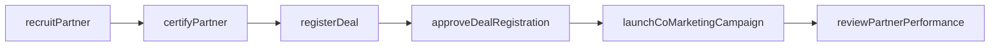
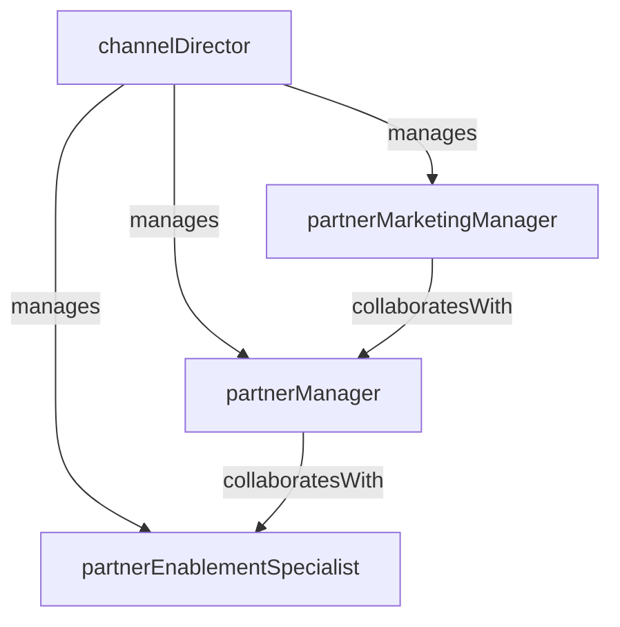

# Channel & Partnerships

> Business-as-Code definition for the Channel & Partnerships department. Models responsibilities, actions, events, and searches.

## Overview

Partner program management, channel enablement, and co-selling

## Responsibilities

| Responsibility | Description |
|---------------|-------------|
| managePartnerProgram | Design and operate tiered partner programs with certification, incentives, and co-marketing benefits |
| enableChannelPartners | Provide training, sales tools, and technical resources to help partners sell and implement effectively |
| driveCoselling | Coordinate joint sales motions with partners on shared opportunities |
| recruitNewPartners | Identify, evaluate, and onboard new reseller, referral, and technology partners |
| trackPartnerPerformance | Monitor partner-sourced pipeline, revenue, and program compliance |

## Roles

| Role | Description |
|------|-------------|
| channelDirector | Sets channel strategy, manages partner tiers, and owns partner revenue targets |
| partnerManager | Manages day-to-day relationships with assigned channel partners |
| partnerEnablementSpecialist | Develops training content, certification programs, and partner enablement resources |
| partnerMarketingManager | Plans and executes co-marketing campaigns and joint demand generation with partners |

## Entities

| Entity | Description |
|--------|-------------|
| Partner | A reseller, referral, or technology partner enrolled in the channel program |
| PartnerAgreement | The contractual framework governing a partner relationship including terms and incentives |
| DealRegistration | A partner-submitted opportunity claim for pipeline attribution and deal protection |
| PartnerCertification | A credential earned by completing product or sales training requirements |
| CosellingOpportunity | A joint sales engagement between the company and a channel partner |

## Actions

| Action | Description |
|--------|-------------|
| recruitPartner | Evaluate and onboard a new partner into the channel program |
| registerDeal | Process a partner deal registration and validate opportunity details |
| certifyPartner | Issue certification upon completion of partner training requirements |
| launchCoMarketingCampaign | Execute a joint marketing initiative with a channel partner |
| reviewPartnerPerformance | Assess partner metrics against program tier requirements and revenue targets |
| approveDealRegistration | Validate and approve a partner-submitted deal registration for protection |

## Events

| Event | Description |
|-------|-------------|
| partnerOnboarded | A new partner completed onboarding and was activated in the program |
| dealRegistrationApproved | A partner deal registration was validated and approved |
| partnerCertified | A partner completed certification requirements and received credentials |
| cosellingDealClosed | A joint partner-company opportunity was closed-won |
| partnerTierChanged | A partner moved to a new program tier based on performance review |
| coMarketingCampaignLaunched | A joint marketing campaign with a partner went live |

## Searches

| Search | Description |
|--------|-------------|
| findActivePartners | List partners by tier, region, or specialization with revenue data |
| getDealRegistrations | Query deal registrations by partner, status, or expected close date |
| listCertifiedPartners | Retrieve partners with active certifications by product or solution area |
| getPartnerPipelineContribution | View partner-sourced and partner-influenced pipeline metrics |
| findPartnersByRegion | Search for channel partners by geographic territory |

## Workflow



## Actor Relationships



## Related Processes

| Process | APQC ID | Relationship |
|---------|---------|-------------|
| Develop Sales Strategy | 3.4.1 | Channel strategy and partner revenue targets align with overall sales plan |
| Manage Partners and Alliances | 3.4.6 | Core process for partner recruitment, enablement, and lifecycle management |
| Develop and Manage Advertising | 3.3.2 | Co-marketing campaigns leverage joint advertising and demand generation |

## Related Departments

| Department | Relationship |
|-----------|-------------|
| Enterprise Sales | Collaborates on co-selling motions for strategic partner-sourced opportunities |
| Sales Operations | Provides deal registration workflows, partner attribution, and revenue reporting |
| Product Marketing | Supplies partner-facing positioning materials, battlecards, and enablement content |

## Usage

```typescript
import { db } from '@headlessly/db'

const channel = await db.departments.get('channelPartnerships')
const partners = await db.departments.search('findActivePartners', { tier: 'gold' })
const registrations = await db.departments.search('getDealRegistrations', { status: 'pending' })
```
