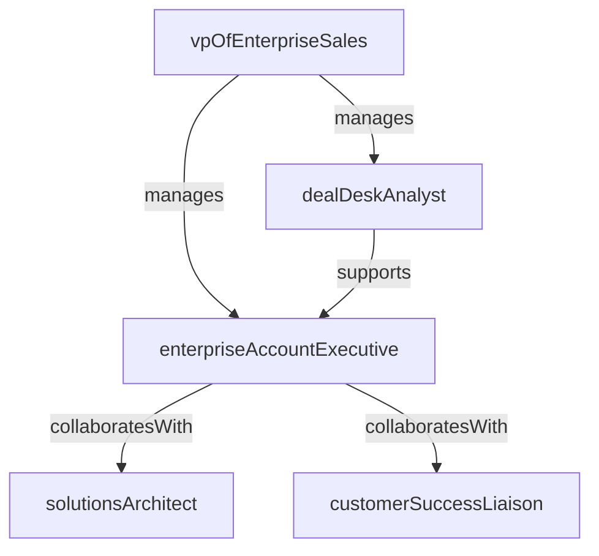

# Enterprise Sales

> Business-as-Code definition for the Enterprise Sales department. Models responsibilities, actions, events, and searches.

## Overview

Complex deal management, executive relationships, and strategic account growth

## Responsibilities

| Responsibility | Description |
|---------------|-------------|
| manageComplexDealCycles | Navigate multi-stakeholder, multi-month enterprise sales cycles from discovery to close |
| buildExecutiveRelationships | Develop and maintain C-level sponsor relationships within strategic accounts |
| growStrategicAccounts | Expand revenue within existing enterprise accounts through upsell and cross-sell |
| orchestrateDealTeams | Coordinate solutions engineers, legal, and executive sponsors for large deal execution |
| forecastEnterpriseRevenue | Provide accurate commit and upside forecasts for enterprise pipeline |

## Roles

| Role | Description |
|------|-------------|
| enterpriseAccountExecutive | Owns the full enterprise sales cycle including discovery, proposal, negotiation, and close |
| vpOfEnterpriseSales | Sets strategy, manages the enterprise team, and oversees key account relationships |
| solutionsArchitect | Designs technical solutions, runs proof-of-concept engagements, and addresses enterprise requirements |
| dealDeskAnalyst | Structures pricing, discount approvals, and non-standard contract terms for enterprise deals |
| customerSuccessLiaison | Partners with sales during late-stage deals to ensure smooth onboarding and retention |

## Entities

| Entity | Description |
|--------|-------------|
| StrategicAccount | A high-value enterprise customer with dedicated coverage and account plan |
| EnterpriseOpportunity | A large, complex deal involving multiple stakeholders and extended sales cycles |
| AccountPlan | A documented strategy for growing revenue and deepening engagement within a strategic account |
| ProofOfConcept | A scoped technical evaluation conducted to validate product fit for enterprise requirements |
| MasterServiceAgreement | The governing contract framework for enterprise customer engagements |

## Actions

| Action | Description |
|--------|-------------|
| developAccountPlan | Create a strategic plan outlining growth targets, stakeholder mapping, and engagement cadence |
| conductExecutiveBriefing | Present company vision and roadmap to C-level stakeholders at a prospect or customer |
| runProofOfConcept | Execute a scoped technical evaluation with the prospect's team |
| negotiateEnterpriseDeal | Structure pricing, terms, and scope for a large contract through multi-party negotiation |
| closeEnterpriseDeal | Finalize the enterprise contract including legal review and executive sign-off |
| conductQuarterlyBusinessReview | Review account health, usage, and expansion opportunities with the customer |

## Events

| Event | Description |
|-------|-------------|
| accountPlanCreated | A strategic account plan was developed and approved |
| executiveBriefingCompleted | A C-level presentation was delivered to a strategic account |
| proofOfConceptCompleted | A technical evaluation concluded with findings documented |
| enterpriseDealClosed | A large enterprise contract was executed and booked |
| enterpriseDealLost | A strategic opportunity was closed-lost with competitive analysis documented |
| quarterlyBusinessReviewHeld | An account health review was conducted with the customer |

## Searches

| Search | Description |
|--------|-------------|
| findStrategicAccounts | List strategic accounts with ARR, health score, and assigned executive |
| getEnterprisePipeline | Query enterprise opportunities by stage, value, or expected close date |
| listActiveProofsOfConcept | View in-progress technical evaluations with status and timeline |
| getAccountPlanStatus | Retrieve account plans with progress against growth targets |
| findAtRiskDeals | Identify enterprise opportunities flagged for slippage or competitive threat |

## Workflow


## Actor Relationships



## Related Processes

| Process | APQC ID | Relationship |
|---------|---------|-------------|
| Develop Sales Strategy | 3.4.1 | Enterprise targeting, quota, and coverage model derive from sales strategy |
| Manage Sales Pipeline | 3.4.3 | Core process for managing complex enterprise deal progression |
| Manage Customers and Accounts | 3.4.5 | Strategic account management and expansion planning |

## Related Departments

| Department | Relationship |
|-----------|-------------|
| Business Development | Sources and qualifies enterprise prospects for pipeline generation |
| Sales Operations | Provides forecasting tools, deal desk support, and territory planning |
| Product Marketing | Supplies competitive intelligence, battlecards, and executive presentation materials |

## Usage

```typescript
import { db } from '@headlessly/db'

const enterprise = await db.departments.get('enterpriseSales')
const pipeline = await db.departments.search('getEnterprisePipeline', { minValue: 100000 })
const atRisk = await db.departments.search('findAtRiskDeals', { quarter: '2026-Q1' })
```
