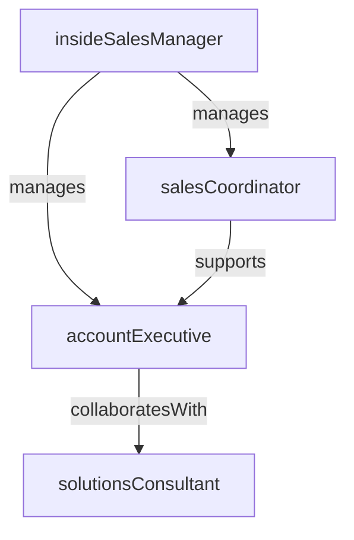

# Inside Sales

> Business-as-Code definition for the Inside Sales department. Models responsibilities, actions, events, and searches.

## Overview

Inbound lead qualification, demo delivery, and SMB deal closure

## Responsibilities

| Responsibility | Description |
|---------------|-------------|
| conductDiscoveryCalls | Run initial conversations to understand prospect needs, pain points, and buying timeline |
| deliverProductDemos | Present tailored product demonstrations aligned to prospect requirements |
| manageSalesOpportunities | Advance deals through the pipeline from discovery to close |
| negotiateAndClose | Handle pricing discussions, objections, and contract execution for SMB deals |
| maintainCrmHygiene | Keep opportunity records, activities, and forecasts current in the CRM |

## Roles

| Role | Description |
|------|-------------|
| insideSalesManager | Manages the ISR team, monitors pipeline health, and coaches reps on deal execution |
| accountExecutive | Owns the full sales cycle from discovery through close for assigned accounts |
| solutionsConsultant | Delivers technical demos and answers product-specific questions during sales calls |
| salesCoordinator | Manages scheduling, proposal preparation, and administrative sales support |

## Entities

| Entity | Description |
|--------|-------------|
| Opportunity | A qualified sales deal with associated value, stage, and close date |
| Proposal | A formal pricing and scope document sent to a prospect |
| DemoRecording | A recorded product demonstration used for follow-up or async evaluation |
| CallLog | A record of a sales call including notes, outcomes, and next steps |

## Actions

| Action | Description |
|--------|-------------|
| conductDiscovery | Run a discovery call to assess prospect fit and requirements |
| deliverDemo | Present a product demonstration tailored to the prospect's use case |
| sendProposal | Generate and deliver a pricing proposal to the prospect |
| negotiateTerms | Discuss pricing, contract terms, and scope adjustments with the buyer |
| closeDeal | Finalize the contract and mark the opportunity as closed-won |
| logActivity | Record call notes, emails, and meeting outcomes in the CRM |

## Events

| Event | Description |
|-------|-------------|
| discoveryCompleted | A discovery call was held and prospect requirements documented |
| demoDelivered | A product demonstration was presented to the prospect |
| proposalSent | A pricing proposal was sent to the prospect for review |
| dealClosed | An opportunity was closed-won and contract executed |
| dealLost | An opportunity was closed-lost with loss reason captured |
| opportunityStageAdvanced | A deal moved forward to the next pipeline stage |

## Searches

| Search | Description |
|--------|-------------|
| findOpenOpportunities | List active deals by stage, owner, or expected close date |
| getStaleDeals | Identify opportunities that have not advanced in a defined period |
| listUpcomingDemos | View scheduled product demonstrations with prospect details |
| getDealsByRep | Query pipeline and closed deals grouped by account executive |
| findProposalsPending | Retrieve proposals awaiting prospect response |

## Workflow


## Actor Relationships



## Related Processes

| Process | APQC ID | Relationship |
|---------|---------|-------------|
| Develop Sales Strategy | 3.4.1 | Sales motion and quota targets derive from overall sales strategy |
| Manage Sales Pipeline | 3.4.3 | Core process for advancing and closing opportunities |
| Manage Sales Orders | 3.4.4 | Order processing and contract execution for closed deals |

## Related Departments

| Department | Relationship |
|-----------|-------------|
| Business Development | Receives qualified leads and scheduled meetings for pipeline generation |
| Sales Operations | Provides CRM tooling, pipeline analytics, and territory assignments |
| Enterprise Sales | Escalates larger or more complex opportunities for enterprise deal management |

## Usage

```typescript
import { db } from '@headlessly/db'

const isr = await db.departments.get('insideSales')
const pipeline = await db.departments.search('findOpenOpportunities', { stage: 'proposal' })
const stale = await db.departments.search('getStaleDeals', { daysStale: 14 })
```
