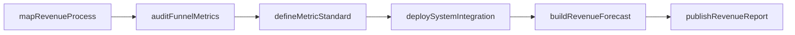
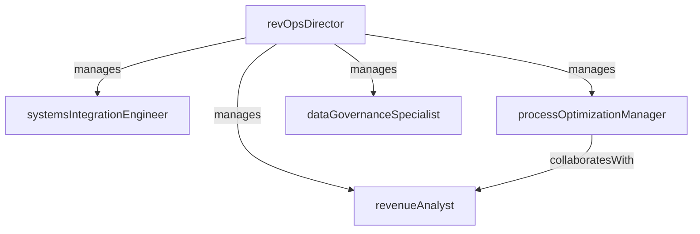

# Revenue Operations

> Business-as-Code definition for the Revenue Operations department. Models responsibilities, actions, events, and searches.

## Overview

Cross-functional revenue alignment, data infrastructure, and process optimization

## Responsibilities

| Responsibility | Description |
|---------------|-------------|
| alignRevenueFunctions | Ensure marketing, sales, and customer success operate from shared metrics, definitions, and processes |
| manageRevenueDataInfrastructure | Build and maintain the unified data model connecting CRM, marketing automation, and billing systems |
| forecastRevenuePerformance | Produce company-level revenue forecasts combining pipeline, expansion, and renewal data |
| optimizeFunnelProcesses | Identify and eliminate bottlenecks across the lead-to-cash lifecycle |
| governRevenueMetrics | Define, standardize, and enforce metric definitions for ARR, net retention, CAC, and LTV |

## Roles

| Role | Description |
|------|-------------|
| revOpsDirector | Leads cross-functional revenue operations strategy and data governance |
| revenueAnalyst | Builds forecasting models, cohort analyses, and cross-functional revenue dashboards |
| systemsIntegrationEngineer | Designs and maintains integrations between CRM, billing, and marketing platforms |
| processOptimizationManager | Maps revenue processes, identifies friction points, and implements workflow improvements |
| dataGovernanceSpecialist | Enforces data standards, field definitions, and quality controls across revenue systems |

## Entities

| Entity | Description |
|--------|-------------|
| RevenueForecast | A consolidated projection of bookings, expansion, and renewal revenue |
| FunnelMetric | A key performance indicator tracking conversion between revenue lifecycle stages |
| SystemIntegration | A data connection between two or more revenue technology platforms |
| RevenueProcess | A documented workflow governing a stage of the lead-to-cash lifecycle |
| MetricDefinition | A standardized specification for how a revenue KPI is calculated and reported |

## Actions

| Action | Description |
|--------|-------------|
| buildRevenueForecast | Consolidate pipeline, expansion, and renewal data into a unified revenue projection |
| auditFunnelMetrics | Validate metric accuracy and identify conversion anomalies across lifecycle stages |
| mapRevenueProcess | Document and analyze a cross-functional revenue workflow for optimization |
| deploySystemIntegration | Implement or update a data integration between revenue technology platforms |
| defineMetricStandard | Establish or revise a standardized calculation methodology for a revenue KPI |
| publishRevenueReport | Generate and distribute a cross-functional revenue performance analysis |

## Events

| Event | Description |
|-------|-------------|
| revenueForecastPublished | A consolidated revenue forecast was finalized and distributed to leadership |
| funnelMetricAuditCompleted | A cross-functional metric validation was completed with findings documented |
| revenueProcessOptimized | A revenue workflow was redesigned and deployed with measurable improvement |
| systemIntegrationDeployed | A new or updated integration between revenue systems went live |
| metricStandardPublished | A standardized metric definition was approved and communicated to teams |
| revenueReportDistributed | A periodic cross-functional revenue analysis was shared with stakeholders |

## Searches

| Search | Description |
|--------|-------------|
| getRevenueForecast | Retrieve the current consolidated revenue forecast by segment or period |
| getFunnelConversionRates | Query stage-by-stage conversion rates across the revenue lifecycle |
| listSystemIntegrations | View active integrations with health status and sync frequency |
| findProcessBottlenecks | Identify revenue workflow stages with below-target conversion or velocity |
| getRevenueKpis | Retrieve current values for standardized revenue metrics like ARR, NRR, CAC, and LTV |

## Workflow



## Actor Relationships



## Related Processes

| Process | APQC ID | Relationship |
|---------|---------|-------------|
| Develop Sales Strategy | 3.4.1 | Revenue operations provides forecasting data and process insights to inform sales strategy |
| Manage Sales Pipeline | 3.4.3 | Funnel optimization and metric governance support pipeline management |
| Perform Planning and Management Accounting | 9.1 | Revenue forecasting feeds into financial planning and budgeting |

## Related Departments

| Department | Relationship |
|-----------|-------------|
| Sales Operations | Collaborates on CRM data, forecasting, and deal desk processes |
| Marketing Operations | Aligns on lead definitions, attribution models, and funnel handoff criteria |
| Channel & Partnerships | Integrates partner-sourced revenue data into unified forecasting and reporting |

## Usage

```typescript
import { db } from '@headlessly/db'

const revOps = await db.departments.get('revenueOperations')
const forecast = await db.departments.search('getRevenueForecast', { period: '2026-Q1' })
const kpis = await db.departments.search('getRevenueKpis', { metrics: ['arr', 'nrr', 'cac'] })
```
