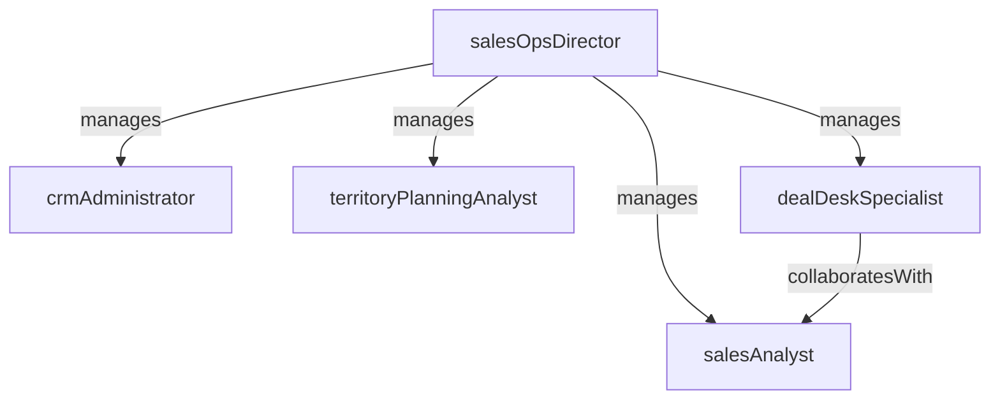

# Sales Operations

> Business-as-Code definition for the Sales Operations department. Models responsibilities, actions, events, and searches.

## Overview

Pipeline management, forecasting, territory planning, and CRM administration

## Responsibilities

| Responsibility | Description |
|---------------|-------------|
| manageSalesForecasting | Build and maintain rolling forecasts, commit calls, and pipeline coverage analysis |
| administerCrm | Configure, maintain, and optimize the CRM platform including custom objects and automations |
| planTerritories | Design and assign sales territories based on account potential, rep capacity, and market data |
| operateDealDesk | Structure non-standard pricing, discount approvals, and contract terms for sales teams |
| deliverSalesAnalytics | Produce pipeline reports, rep performance dashboards, and win rate analysis |

## Roles

| Role | Description |
|------|-------------|
| salesOpsDirector | Leads sales operations strategy, quota setting, and cross-functional process alignment |
| salesAnalyst | Builds pipeline reports, win/loss dashboards, and forecasting models |
| crmAdministrator | Manages CRM configuration, integrations, data quality, and user access |
| territoryPlanningAnalyst | Models territory assignments, account segmentation, and capacity planning |
| dealDeskSpecialist | Reviews pricing exceptions, structures deal terms, and manages approval workflows |

## Entities

| Entity | Description |
|--------|-------------|
| SalesForecast | A periodic projection of expected revenue by segment, team, or rep |
| Territory | A defined geographic or account-based sales assignment with quota targets |
| QuotaAssignment | Revenue target allocated to a rep or team for a specific period |
| PipelineReport | An analytical view of deal flow by stage, velocity, and conversion rate |
| DealApproval | A pricing or terms exception request requiring management authorization |

## Actions

| Action | Description |
|--------|-------------|
| generateForecast | Compile pipeline data into a revenue forecast with commit and upside categories |
| assignTerritory | Allocate accounts and regions to sales reps based on segmentation rules |
| setQuota | Define and distribute revenue targets for reps and teams |
| approveDealTerms | Review and authorize non-standard pricing or contract terms |
| buildPipelineReport | Create analytical views of pipeline health, velocity, and stage conversion |
| auditCrmData | Run data quality checks and remediate inconsistencies in the CRM |

## Events

| Event | Description |
|-------|-------------|
| forecastSubmitted | A sales forecast was compiled and submitted for the current period |
| territoriesAssigned | Territory and account assignments were finalized and published |
| quotasPublished | Revenue quotas were set and distributed to sales teams |
| dealTermsApproved | A non-standard deal received pricing or contract approval |
| crmAuditCompleted | A CRM data quality audit was finished with findings documented |
| pipelineReportPublished | A pipeline analysis report was generated and shared with leadership |

## Searches

| Search | Description |
|--------|-------------|
| getForecastByTeam | Retrieve current forecast data grouped by team or segment |
| listTerritoryAssignments | View territory-to-rep mappings with account counts and quota |
| findPendingApprovals | Query deal desk requests awaiting authorization |
| getPipelineVelocity | Analyze average deal cycle time and stage conversion rates |
| getCrmHealthMetrics | Check data completeness, duplicate rates, and field coverage in the CRM |

## Workflow


## Actor Relationships



## Related Processes

| Process | APQC ID | Relationship |
|---------|---------|-------------|
| Develop Sales Forecast | 3.4.1 | Territory planning and quota setting operationalize the sales strategy |
| Establish Sales Goals and Measures | 3.4.5 | Provides pipeline analytics and forecasting infrastructure for deal management |
| Manage Sales Orders | 3.5.4 | Deal desk supports pricing and contract structuring for order execution |

## Related Departments

| Department | Relationship |
|-----------|-------------|
| Inside Sales | Provides CRM tooling, territory assignments, and pipeline reporting |
| Enterprise Sales | Supports deal desk approvals, forecast compilation, and strategic account planning |
| Revenue Operations | Collaborates on cross-functional forecasting, data alignment, and process optimization |

## Usage

```typescript
import { db } from '@headlessly/db'

const sops = await db.departments.get('salesOperations')
const forecast = await db.departments.search('getForecastByTeam', { quarter: '2026-Q1' })
const pending = await db.departments.search('findPendingApprovals', { status: 'pending' })
```
