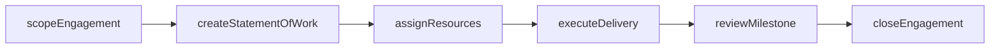
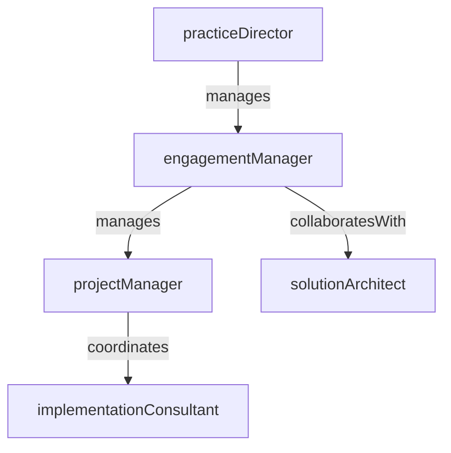

# Professional Services

> Business-as-Code definition for the Professional Services department. Models responsibilities, actions, events, and searches.

## Overview

Client implementation, consulting engagements, and solution delivery

## Responsibilities

| Responsibility | Description |
|---------------|-------------|
| deliverClientImplementations | Plan and execute customer onboarding and product implementation projects |
| manageConsultingEngagements | Scope, staff, and deliver advisory and consulting projects for clients |
| ensureProjectProfitability | Track project budgets, utilization rates, and margin targets across engagements |
| developSolutionAccelerators | Build reusable templates, frameworks, and best-practice playbooks to accelerate delivery |
| manageClientRelationships | Maintain executive-level relationships and drive customer satisfaction through delivery excellence |

## Roles

| Role | Description |
|------|-------------|
| engagementManager | Owns the client relationship and overall delivery for an engagement |
| solutionArchitect | Designs the technical solution and integration approach for client implementations |
| implementationConsultant | Configures, customizes, and deploys the product to meet client requirements |
| projectManager | Manages scope, schedule, budget, and risk across delivery milestones |
| practiceDirector | Leads a service practice area, sets methodology standards, and drives revenue targets |

## Entities

| Entity | Description |
|--------|-------------|
| Engagement | A scoped consulting or implementation project with a client |
| StatementOfWork | Contractual document defining deliverables, timeline, and pricing for an engagement |
| ProjectPlan | Detailed schedule of tasks, milestones, and resource assignments for delivery |
| Deliverable | A defined output or artifact produced during an engagement |
| TimeEntry | Consultant hours logged against a project for billing and utilization tracking |

## Actions

| Action | Description |
|--------|-------------|
| scopeEngagement | Define the objectives, deliverables, and resource requirements for a new project |
| createStatementOfWork | Draft and finalize the contractual scope, pricing, and terms for client approval |
| assignResources | Allocate consultants and architects to engagement roles based on skills and availability |
| executeDelivery | Carry out implementation tasks, configuration, and solution build activities |
| reviewMilestone | Conduct a milestone review with the client to validate progress and acceptance |
| closeEngagement | Complete final deliverables, obtain sign-off, and transition to support |

## Events

| Event | Description |
|-------|-------------|
| engagementScoped | A new engagement was defined with objectives and preliminary resource estimates |
| statementOfWorkSigned | The client signed the statement of work and the project was authorized |
| milestoneCompleted | A project milestone was delivered and accepted by the client |
| deliverableAccepted | A specific project deliverable was reviewed and formally accepted |
| engagementClosed | All deliverables were completed and the engagement was formally closed |
| utilizationThresholdBreached | Consultant utilization fell below or exceeded target thresholds |

## Searches

| Search | Description |
|--------|-------------|
| findActiveEngagements | Retrieve all engagements currently in delivery |
| getConsultantUtilization | Query billable utilization rates for consultants over a period |
| searchEngagementsByClient | List all past and current engagements for a specific client |
| findAtRiskProjects | Identify projects flagged for budget overrun, schedule delay, or scope creep |

## Workflow



## Actor Relationships



## Related Processes

| Process | APQC ID | Relationship |
|---------|---------|-------------|
| Manage Customer Service | 5.1 | Professional services engagements are a core component of post-sale customer service |
| Develop and Manage Products and Services | 5.2 | Feedback from implementations informs product and service improvement |

## Related Departments

| Department | Relationship |
|-----------|-------------|
| Service Operations | Transitions completed implementations into ongoing managed service support |
| Training & Enablement | Delivers customer training as part of implementation and onboarding projects |
| Enterprise Sales | Collaborates on pre-sales scoping and hands off signed deals for delivery |

## Usage

```typescript
import { db } from '@headlessly/db'

const dept = await db.departments.get('professionalServices')
const active = await db.departments.search('findActiveEngagements', { status: 'in-progress' })
const utilization = await db.departments.search('getConsultantUtilization', { quarter: 'Q1-2026' })
```
