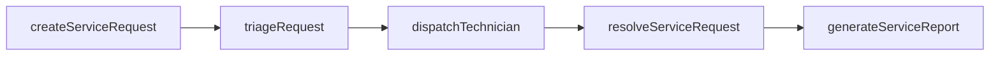
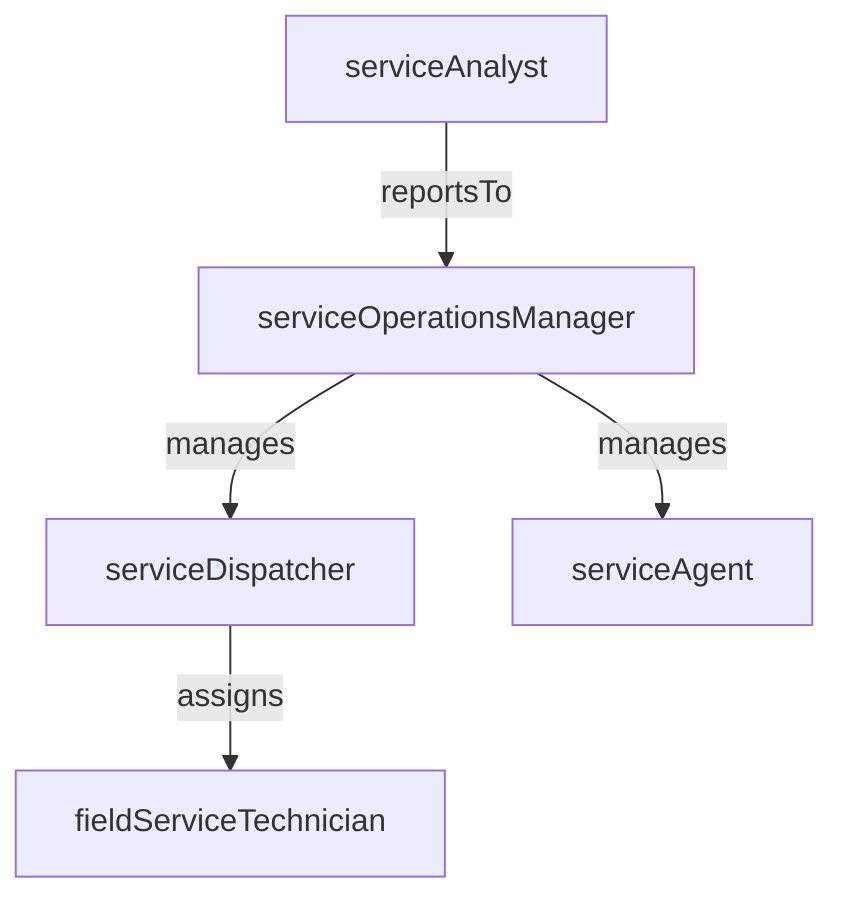

# Service Operations

> Business-as-Code definition for the Service Operations department. Models responsibilities, actions, events, and searches.

## Overview

Service scheduling, dispatch, resource allocation, and SLA management

## Responsibilities

| Responsibility | Description |
|---------------|-------------|
| manageServiceRequests | Receive, triage, and route inbound service requests to the appropriate resolution teams |
| enforceServiceLevelAgreements | Monitor SLA compliance, escalate at-risk tickets, and report on service performance |
| scheduleAndDispatchResources | Assign field or remote technicians to service tasks based on skills, location, and availability |
| operateServiceDesk | Maintain the central service desk for incident intake, status tracking, and customer communication |
| analyzServicePerformance | Track key service metrics such as resolution time, first-contact resolution, and customer satisfaction |

## Roles

| Role | Description |
|------|-------------|
| serviceOperationsManager | Oversees the service operations team and owns SLA performance targets |
| serviceDispatcher | Schedules and assigns service requests to available technicians or agents |
| serviceAgent | Handles inbound service requests, performs initial triage, and resolves tier-1 issues |
| fieldServiceTechnician | Provides on-site technical support, installation, and repair services |
| serviceAnalyst | Monitors service KPIs, identifies trends, and recommends process improvements |

## Entities

| Entity | Description |
|--------|-------------|
| ServiceRequest | A customer or internal request for technical support, maintenance, or information |
| ServiceLevelAgreement | Contractual commitment defining response and resolution time targets |
| WorkOrder | An assignment directing a technician to perform a specific service task |
| EscalationRule | Automated rule that triggers escalation when SLA thresholds are at risk |
| ServiceReport | Summary of service activities, outcomes, and performance metrics for a period |

## Actions

| Action | Description |
|--------|-------------|
| createServiceRequest | Log a new service request from a customer or internal stakeholder |
| triageRequest | Classify priority, category, and required skills for a service request |
| dispatchTechnician | Assign and schedule a technician to fulfill a work order |
| resolveServiceRequest | Complete the requested service and record the resolution |
| escalateRequest | Raise a service request to a higher tier or manager due to SLA risk |
| generateServiceReport | Compile service performance data into a periodic report |

## Events

| Event | Description |
|-------|-------------|
| serviceRequestCreated | A new service request was logged into the system |
| technicianDispatched | A technician was assigned and scheduled for a work order |
| serviceRequestResolved | A service request was completed and the customer was notified |
| slaBreachWarningRaised | A service request approached its SLA threshold and an escalation was triggered |
| serviceRequestEscalated | A request was escalated to a higher support tier or management |
| serviceReportPublished | A periodic service performance report was generated and distributed |

## Searches

| Search | Description |
|--------|-------------|
| findOpenServiceRequests | Retrieve all unresolved service requests filtered by priority or category |
| getSlAComplianceMetrics | Query SLA adherence rates by team, client, or time period |
| searchWorkOrdersByTechnician | List work orders assigned to a specific technician |
| findEscalatedRequests | Retrieve service requests that have been escalated |

## Workflow



## Actor Relationships



## Related Processes

| Process | APQC ID | Relationship |
|---------|---------|-------------|
| Manage Customer Service | 5.1 | Core process for receiving, resolving, and reporting on customer service requests |
| Develop and Manage Products and Services | 5.2 | Service operations feedback drives product and service quality improvements |

## Related Departments

| Department | Relationship |
|-----------|-------------|
| Professional Services | Transitions implementation projects into ongoing service operations support |
| Training & Enablement | Provides knowledge base content and training that reduces service request volume |
| Customer Success | Shares customer health data to prioritize service response and proactive outreach |

## Usage

```typescript
import { db } from '@headlessly/db'

const dept = await db.departments.get('serviceOperations')
const openRequests = await db.departments.search('findOpenServiceRequests', { priority: 'high' })
const slaMetrics = await db.departments.search('getSlAComplianceMetrics', { period: '2026-Q1' })
```
