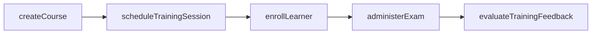
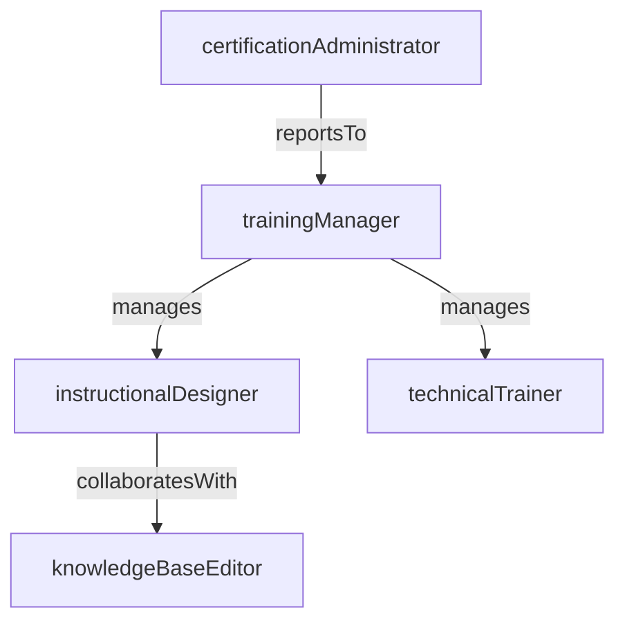

# Training & Enablement

> Business-as-Code definition for the Training & Enablement department. Models responsibilities, actions, events, and searches.

## Overview

Customer training programs, certification, and knowledge base management

## Responsibilities

| Responsibility | Description |
|---------------|-------------|
| developTrainingCurriculum | Design and maintain structured learning paths, courses, and hands-on labs for customers |
| manageCertificationPrograms | Administer professional certification tracks including exams, credentials, and renewals |
| maintainKnowledgeBase | Curate and publish self-service documentation, FAQs, and how-to guides |
| deliverTrainingSessions | Facilitate instructor-led, virtual, and on-demand training sessions for customers and partners |
| measureLearningEffectiveness | Track completion rates, assessment scores, and learner satisfaction to improve content |

## Roles

| Role | Description |
|------|-------------|
| trainingManager | Oversees the training and enablement team, sets curriculum strategy, and manages budgets |
| instructionalDesigner | Creates course content, learning objectives, assessments, and multimedia materials |
| technicalTrainer | Delivers live and virtual training sessions and provides hands-on coaching |
| knowledgeBaseEditor | Authors, reviews, and publishes documentation and self-service support articles |
| certificationAdministrator | Manages certification exam logistics, credential issuance, and renewal tracking |

## Entities

| Entity | Description |
|--------|-------------|
| Course | A structured learning module with objectives, content, and assessments |
| Certification | A credential awarded upon successful completion of an exam or learning path |
| KnowledgeArticle | A self-service support document published in the knowledge base |
| LearningPath | An ordered sequence of courses and assessments leading to a competency or certification |
| TrainingSession | A scheduled delivery instance of a course, either live or virtual |

## Actions

| Action | Description |
|--------|-------------|
| createCourse | Design and publish a new training course with content and assessments |
| scheduleTrainingSession | Book a delivery slot for an instructor-led or virtual training session |
| enrollLearner | Register a customer or partner user into a course or learning path |
| administerExam | Deliver a certification exam and record the candidate's results |
| publishKnowledgeArticle | Author and release a new or updated knowledge base article |
| evaluateTrainingFeedback | Collect and analyze post-training survey responses and assessment data |

## Events

| Event | Description |
|-------|-------------|
| coursePublished | A new or updated training course was made available to learners |
| learnerEnrolled | A user was registered into a course or learning path |
| trainingSessionCompleted | An instructor-led or virtual training session concluded |
| certificationAwarded | A learner passed the certification exam and received their credential |
| knowledgeArticlePublished | A new or revised knowledge base article was published |
| trainingFeedbackCollected | Post-session evaluation responses were gathered and recorded |

## Searches

| Search | Description |
|--------|-------------|
| findAvailableCourses | List courses open for enrollment filtered by topic or skill level |
| getCertificationStatus | Retrieve certification progress and credential status for a learner |
| searchKnowledgeBase | Full-text search across published knowledge base articles |
| getTrainingCompletionRates | Query course and learning path completion metrics by cohort or period |

## Workflow



## Actor Relationships



## Related Processes

| Process | APQC ID | Relationship |
|---------|---------|-------------|
| Manage Customer Service | 5.1 | Training reduces support volume and accelerates customer self-sufficiency |
| Develop and Manage Products and Services | 5.2 | Enablement content is aligned to product releases and feature updates |

## Related Departments

| Department | Relationship |
|-----------|-------------|
| Professional Services | Delivers customer training as part of implementation and onboarding engagements |
| Service Operations | Knowledge base content deflects service requests and improves first-contact resolution |
| Product Management | Coordinates training content updates aligned to product release cycles |

## Usage

```typescript
import { db } from '@headlessly/db'

const dept = await db.departments.get('trainingEnablement')
const courses = await db.departments.search('findAvailableCourses', { topic: 'platform-admin' })
const certStatus = await db.departments.search('getCertificationStatus', { learnerId: 'usr_12345' })
```
