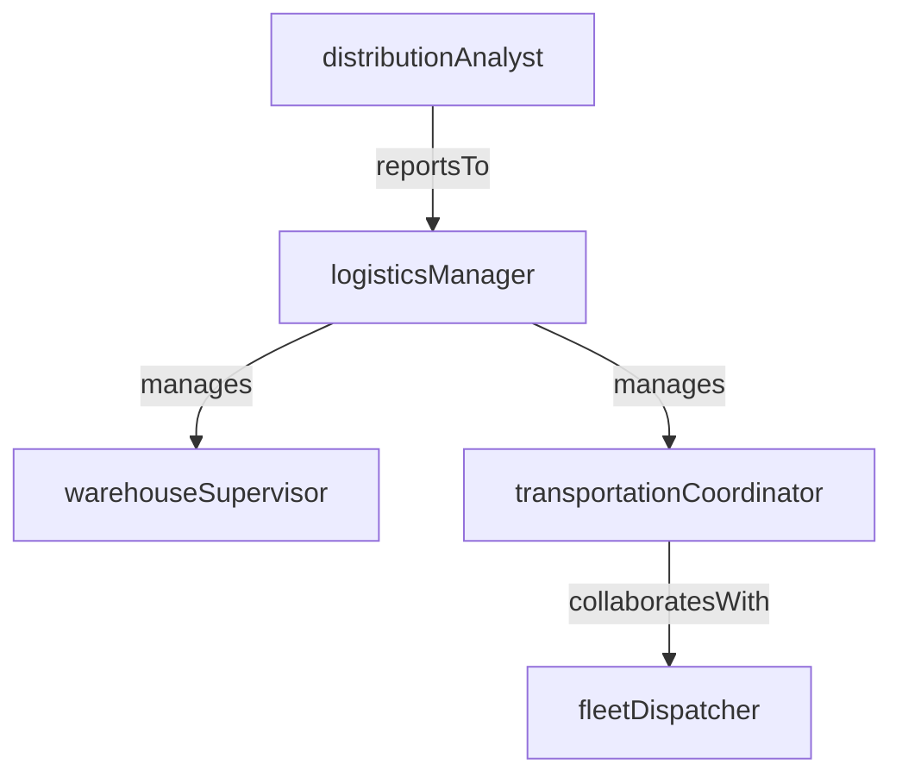

# Logistics & Distribution

> Business-as-Code definition for the Logistics & Distribution department. Models responsibilities, actions, events, and searches.

## Overview

Warehousing, shipping, freight management, and last-mile delivery

## Responsibilities

| Responsibility | Description |
|---------------|-------------|
| manageWarehouseOperations | Oversee receiving, putaway, picking, packing, and shipping within distribution centers |
| coordinateFreight | Select carriers, negotiate rates, and manage inbound and outbound transportation |
| optimizeDistributionNetwork | Design and refine distribution routes, hub locations, and delivery zones |
| trackShipments | Monitor in-transit shipments and provide real-time visibility to stakeholders |
| ensureDeliveryCompliance | Enforce on-time delivery targets, carrier SLAs, and regulatory requirements |

## Roles

| Role | Description |
|------|-------------|
| logisticsManager | Oversees end-to-end logistics operations including warehousing and transportation |
| warehouseSupervisor | Manages daily warehouse floor operations, labor scheduling, and throughput |
| transportationCoordinator | Plans shipments, books carriers, and resolves transit exceptions |
| distributionAnalyst | Analyzes logistics data to identify cost savings and service improvements |
| fleetDispatcher | Schedules and routes company-owned or dedicated fleet vehicles |

## Entities

| Entity | Description |
|--------|-------------|
| Shipment | A consignment of goods being transported from origin to destination |
| Warehouse | Physical distribution center where inventory is stored, processed, and shipped |
| CarrierContract | Agreement with a freight carrier defining lanes, rates, and service commitments |
| DeliveryOrder | Instruction to ship specific items to a customer or location |
| FreightInvoice | Carrier billing document for transportation services rendered |

## Actions

| Action | Description |
|--------|-------------|
| createShipment | Initiate a new shipment with origin, destination, and cargo details |
| assignCarrier | Select and book a carrier for a pending shipment |
| dispatchLoad | Release a shipment for pickup and begin transit tracking |
| confirmDelivery | Record proof of delivery and close the shipment |
| processFreightInvoice | Validate and approve a carrier invoice against shipment records |
| optimizeRoute | Calculate the most efficient delivery route for a set of stops |

## Events

| Event | Description |
|-------|-------------|
| shipmentCreated | A new shipment record was created and is awaiting carrier assignment |
| shipmentDispatched | A shipment was picked up by the carrier and is in transit |
| deliveryConfirmed | Goods were delivered and proof of delivery was recorded |
| deliveryExceptionRaised | A shipment encountered a delay, damage, or routing issue |
| freightInvoiceApproved | A carrier freight invoice was validated and approved for payment |
| warehouseInventoryReconciled | Physical warehouse counts were matched against system records |

## Searches

| Search | Description |
|--------|-------------|
| findShipmentsInTransit | Retrieve all shipments currently between pickup and delivery |
| searchDeliveryExceptions | List shipments with delays, damages, or failed delivery attempts |
| getWarehouseThroughput | Retrieve picking, packing, and shipping volume metrics for a warehouse |
| findCarriersByLane | List available carriers for a specific origin-destination lane |
| getFreightCostByPeriod | Summarize transportation spend over a date range |

## Workflow


## Actor Relationships



## Related Processes

| Process | APQC ID | Relationship |
|---------|---------|-------------|
| Plan for and Align Supply Chain Resources | 4.2 | Provides inventory deployment plans that drive warehousing and distribution |
| Deliver Products and Services | 4.4 | Core process for order fulfillment, shipping, and last-mile delivery |

## Related Departments

| Department | Relationship |
|-----------|-------------|
| Procurement | Coordinates inbound shipping for purchased materials and goods |
| Supply Chain Planning | Provides inventory deployment targets and distribution schedules |
| Manufacturing | Ships finished goods from production facilities to distribution centers |

## Usage

```typescript
import { db } from '@headlessly/db'

const dept = await db.departments.get('logisticsDistribution')
const inTransit = await db.departments.search('findShipmentsInTransit', { region: 'us-west' })
const exceptions = await db.departments.search('searchDeliveryExceptions', { severity: 'high' })
```
