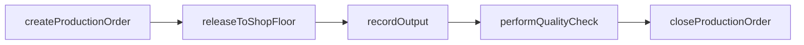
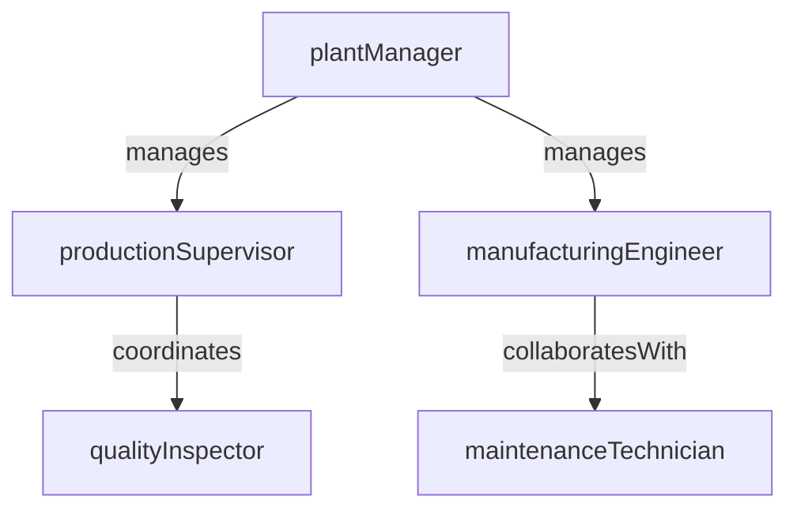

# Manufacturing

> Business-as-Code definition for the Manufacturing department. Models responsibilities, actions, events, and searches.

## Overview

Production planning, shop floor operations, and manufacturing engineering

## Responsibilities

| Responsibility | Description |
|---------------|-------------|
| scheduleProduction | Create and maintain production schedules based on supply plans and capacity |
| manageShopFloorOperations | Oversee day-to-day execution of manufacturing orders on the production floor |
| ensureProductQuality | Implement quality control inspections, testing, and defect tracking at each production stage |
| maintainEquipment | Plan and execute preventive and corrective maintenance on production machinery |
| optimizeManufacturingProcesses | Identify and implement continuous improvement initiatives to reduce waste and increase throughput |

## Roles

| Role | Description |
|------|-------------|
| plantManager | Leads the manufacturing facility and owns production output and efficiency targets |
| productionSupervisor | Manages shift operations, work assignments, and real-time production adjustments |
| manufacturingEngineer | Designs and improves production processes, tooling, and work instructions |
| qualityInspector | Performs in-process and final inspections to verify product conformance |
| maintenanceTechnician | Executes preventive and breakdown maintenance on production equipment |

## Entities

| Entity | Description |
|--------|-------------|
| ProductionOrder | Instruction to manufacture a specific quantity of a product by a target date |
| BillOfMaterials | Structured list of raw materials, components, and sub-assemblies required to produce a finished good |
| WorkCenter | A defined production resource such as a machine, assembly line, or work station |
| QualityInspection | Record of inspection results, defect counts, and pass/fail disposition |
| MaintenanceRequest | Scheduled or unplanned request for equipment repair or servicing |

## Actions

| Action | Description |
|--------|-------------|
| createProductionOrder | Generate a new manufacturing order for a product and quantity |
| releaseToShopFloor | Authorize a production order for execution on the manufacturing floor |
| recordOutput | Log completed units, scrap, and rework quantities for a production run |
| performQualityCheck | Execute an inspection at a defined quality checkpoint |
| scheduleMaintenanceWindow | Book planned downtime for equipment maintenance or calibration |
| closeProductionOrder | Finalize a production order after all output and costs are recorded |

## Events

| Event | Description |
|-------|-------------|
| productionOrderCreated | A new production order was generated from the supply plan |
| productionStarted | A manufacturing order was released and work began on the shop floor |
| outputRecorded | Finished goods or semi-finished output was logged against a production order |
| qualityDefectDetected | An inspection identified a non-conformance requiring disposition |
| equipmentDowntimeLogged | A machine or work center was taken offline for planned or unplanned maintenance |
| productionOrderCompleted | All operations on a production order were finished and the order was closed |

## Searches

| Search | Description |
|--------|-------------|
| findActiveProductionOrders | Retrieve production orders currently in progress on the shop floor |
| getEquipmentUtilization | Query machine and work center utilization rates over a time period |
| searchQualityDefects | List quality defects filtered by product, line, or severity |
| getProductionYieldByLine | Retrieve yield and scrap rates for a specific production line |

## Workflow



## Actor Relationships



## Related Processes

| Process | APQC ID | Relationship |
|---------|---------|-------------|
| Plan for and Align Supply Chain Resources | 4.2 | Provides production schedules derived from demand and supply plans |
| Deliver Products and Services | 4.4 | Manufacturing produces finished goods that feed into fulfillment and distribution |

## Related Departments

| Department | Relationship |
|-----------|-------------|
| Supply Chain Planning | Provides demand-driven production schedules and capacity requirements |
| Procurement | Sources raw materials and components required for manufacturing orders |
| Logistics & Distribution | Receives finished goods for warehousing and outbound shipment |

## Usage

```typescript
import { db } from '@headlessly/db'

const dept = await db.departments.get('manufacturing')
const activeOrders = await db.departments.search('findActiveProductionOrders', { plant: 'plant-01' })
const defects = await db.departments.search('searchQualityDefects', { severity: 'critical' })
```
