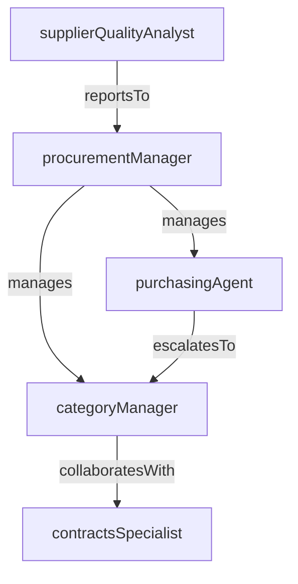

# Procurement

> Business-as-Code definition for the Procurement department. Models responsibilities, actions, events, and searches.

## Overview

Strategic sourcing, vendor management, and purchase order processing

## Responsibilities

| Responsibility | Description |
|---------------|-------------|
| manageStrategicSourcing | Identify, evaluate, and select suppliers to optimize cost, quality, and delivery |
| processPurchaseOrders | Create, approve, and track purchase orders through the procurement lifecycle |
| negotiateContracts | Draft, negotiate, and manage supplier contracts and service-level agreements |
| maintainVendorRelationships | Oversee supplier performance, scorecards, and relationship development |
| ensureProcurementCompliance | Enforce purchasing policies, approval thresholds, and regulatory requirements |

## Roles

| Role | Description |
|------|-------------|
| procurementManager | Leads sourcing strategy and manages the procurement team |
| categoryManager | Owns supplier strategy and negotiations for a specific spend category |
| purchasingAgent | Processes purchase requisitions, creates POs, and tracks order fulfillment |
| contractsSpecialist | Drafts, reviews, and administers supplier agreements and amendments |
| supplierQualityAnalyst | Evaluates supplier performance metrics and conducts audits |

## Entities

| Entity | Description |
|--------|-------------|
| PurchaseOrder | Formal document authorizing a supplier to deliver goods or services at an agreed price |
| Supplier | External vendor or service provider registered in the procurement system |
| Contract | Legally binding agreement defining terms, pricing, and obligations with a supplier |
| PurchaseRequisition | Internal request from a department to procure goods or services |
| SupplierScorecard | Performance evaluation record tracking delivery, quality, and responsiveness metrics |

## Actions

| Action | Description |
|--------|-------------|
| createRequisition | Submit a new purchase requisition for goods or services |
| approveRequisition | Review and authorize a purchase requisition for PO creation |
| issuePurchaseOrder | Generate and send a purchase order to the selected supplier |
| evaluateSupplier | Assess supplier performance against contractual KPIs |
| negotiateContract | Conduct contract negotiations with a supplier on terms and pricing |
| receiveGoods | Confirm receipt and inspection of delivered goods against the PO |

## Events

| Event | Description |
|-------|-------------|
| requisitionSubmitted | A new purchase requisition was created and submitted for approval |
| purchaseOrderIssued | A purchase order was generated and transmitted to the supplier |
| goodsReceived | Delivered goods were inspected and accepted into inventory |
| contractExecuted | A supplier contract was fully signed and activated |
| supplierEvaluationCompleted | A periodic supplier performance review was finalized |
| purchaseOrderClosed | A purchase order was fulfilled and closed out |

## Searches

| Search | Description |
|--------|-------------|
| findOpenPurchaseOrders | Retrieve all purchase orders pending delivery or completion |
| searchSuppliersByCategory | List approved suppliers filtered by spend category |
| findExpiringContracts | Identify supplier contracts approaching renewal or expiration dates |
| getPendingRequisitions | Retrieve purchase requisitions awaiting approval |

## Workflow


## Actor Relationships



## Related Processes

| Process | APQC ID | Relationship |
|---------|---------|-------------|
| Procure Materials and Services | 4.2 | Core process for sourcing, selecting suppliers, and managing purchasing |
| Plan for and Align Supply Chain Resources | 4.1 | Governs supplier evaluation, performance management, and strategic partnerships |

## Related Departments

| Department | Relationship |
|-----------|-------------|
| Supply Chain Planning | Provides demand forecasts that drive procurement volumes and timing |
| Logistics & Distribution | Coordinates inbound freight and warehouse receiving for purchased goods |
| Accounts Payable | Processes supplier invoices and manages accounts payable reconciliation |

## Usage

```typescript
import { db } from '@headlessly/db'

const dept = await db.departments.get('procurement')
const openPOs = await db.departments.search('findOpenPurchaseOrders', { status: 'open' })
const expiring = await db.departments.search('findExpiringContracts', { withinDays: 90 })
```
