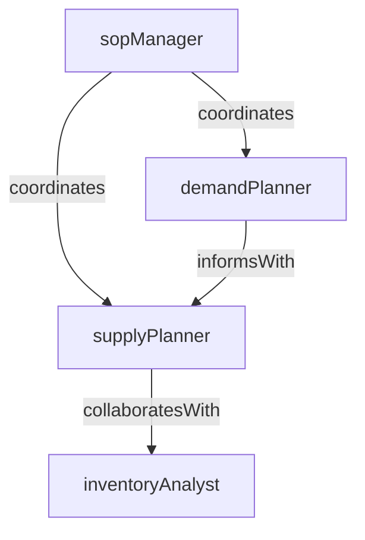

# Supply Chain Planning

> Business-as-Code definition for the Supply Chain Planning department. Models responsibilities, actions, events, and searches.

## Overview

Demand planning, inventory optimization, and supply network design

## Responsibilities

| Responsibility | Description |
|---------------|-------------|
| forecastDemand | Generate and refine demand forecasts using historical data, market signals, and statistical models |
| optimizeInventory | Set and maintain optimal inventory levels across locations to balance service and cost |
| planSupplyNetwork | Design and adjust the supply network topology including sourcing lanes and distribution points |
| coordinateSalesOperationsPlanning | Facilitate cross-functional S&OP meetings to align demand, supply, and financial plans |
| manageCapacityPlanning | Assess production and warehouse capacity constraints and recommend adjustments |

## Roles

| Role | Description |
|------|-------------|
| demandPlanner | Builds and maintains demand forecasts using quantitative and qualitative inputs |
| supplyPlanner | Translates demand plans into supply schedules and production requirements |
| inventoryAnalyst | Monitors stock levels, calculates safety stock, and flags overstock or shortfall risks |
| sopManager | Orchestrates the sales and operations planning cycle across business functions |

## Entities

| Entity | Description |
|--------|-------------|
| DemandForecast | Projected demand quantities by SKU, location, and time period |
| SupplyPlan | Scheduled supply commitments aligned to demand forecasts and capacity constraints |
| InventoryPolicy | Rules governing reorder points, safety stock levels, and replenishment strategies |
| SalesForecast | Revenue-based projections from Sales used as input to demand planning |
| CapacityPlan | Assessment of production and warehouse capacity against planned volume |

## Actions

| Action | Description |
|--------|-------------|
| generateForecast | Create a new demand forecast for a planning horizon |
| adjustForecast | Modify an existing forecast based on updated market intelligence or actuals |
| createSupplyPlan | Build a supply plan to satisfy the approved demand forecast |
| runInventoryOptimization | Execute algorithms to calculate optimal stock levels and reorder parameters |
| conductSopReview | Facilitate the monthly S&OP consensus review meeting |
| simulateScenario | Model what-if scenarios to evaluate supply chain disruption or demand shifts |

## Events

| Event | Description |
|-------|-------------|
| forecastGenerated | A new demand forecast was published for the planning period |
| supplyPlanApproved | The supply plan was reviewed and approved in the S&OP cycle |
| inventoryPolicyUpdated | Safety stock or reorder parameters were recalculated and published |
| demandVarianceDetected | Actual demand deviated beyond threshold from the forecast |
| capacityConstraintIdentified | A bottleneck in production or warehouse capacity was flagged |
| sopCycleCompleted | The monthly sales and operations planning cycle concluded with consensus |

## Searches

| Search | Description |
|--------|-------------|
| getForecastAccuracy | Retrieve forecast-vs-actual accuracy metrics by product or region |
| findInventoryExceptions | List SKUs where stock levels breach policy thresholds |
| getSupplyPlanByPeriod | Retrieve the active supply plan for a given planning period |
| searchDemandVariances | Identify products with significant forecast deviation |

## Workflow


## Actor Relationships



## Related Processes

| Process | APQC ID | Relationship |
|---------|---------|-------------|
| Plan for and Align Supply Chain Resources | 4.2 | Core process for demand planning, supply scheduling, and inventory management |
| Procure Materials and Services | 4.1 | Procurement executes sourcing plans generated by supply chain planning |

## Related Departments

| Department | Relationship |
|-----------|-------------|
| Procurement | Executes purchase orders based on supply plans and replenishment signals |
| Manufacturing | Receives production schedules derived from supply and capacity plans |
| Logistics & Distribution | Coordinates warehousing and transportation based on inventory deployment plans |

## Usage

```typescript
import { db } from '@headlessly/db'

const dept = await db.departments.get('supplyChainPlanning')
const accuracy = await db.departments.search('getForecastAccuracy', { region: 'north-america' })
const exceptions = await db.departments.search('findInventoryExceptions', { threshold: 'critical' })
```
