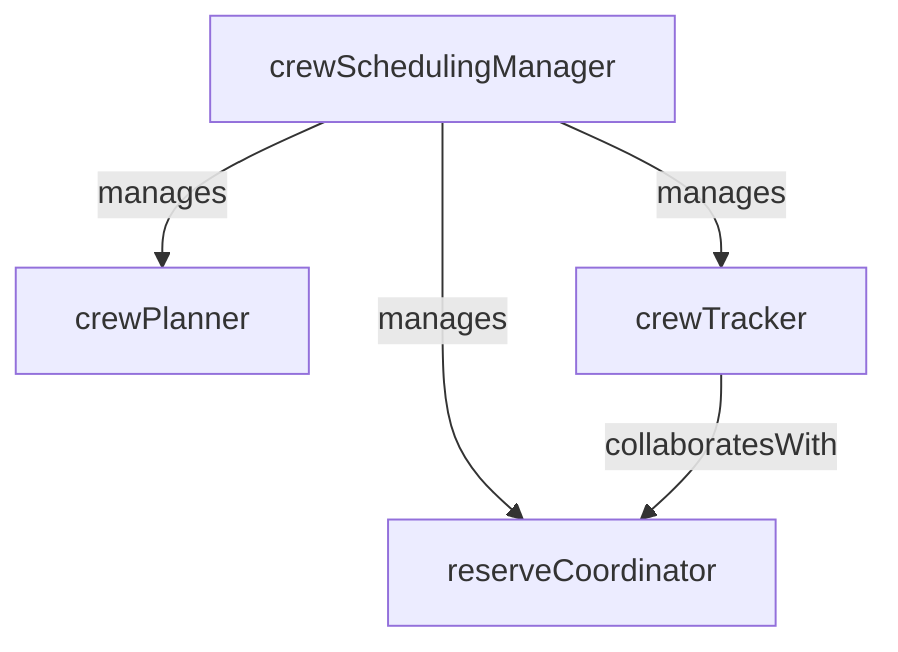

# Crew Scheduling

> Business-as-Code definition for the Crew Scheduling department. Models responsibilities, actions, events, and searches.

## Overview

Crew Scheduling builds and maintains crew rosters, tracks duty and rest times, manages fatigue risk, and allocates reserve crew members to ensure every flight is legally and safely staffed. The department balances regulatory compliance with operational efficiency and crew quality of life.

## Responsibilities

| Responsibility | Description |
|---------------|-------------|
| buildCrewRosters | Construct monthly crew pairings and line assignments for pilots and cabin crew |
| trackDutyTime | Monitor cumulative flight hours, duty periods, and mandatory rest requirements |
| manageFatigueRisk | Apply fatigue risk management system rules and flag at-risk crew schedules |
| allocateReserveCrew | Assign standby and reserve crew members to cover open trips and disruptions |
| resolveCrewDisruptions | Reassign crew during irregular operations to minimize cancellations and delays |

## Roles

| Role | Description |
|------|-------------|
| crewSchedulingManager | Oversees crew planning, rostering, and day-of-operations crew control |
| crewPlanner | Builds monthly pairings and bid lines optimizing coverage and legality |
| crewTracker | Monitors real-time crew positions, duty clocks, and rest compliance |
| reserveCoordinator | Manages reserve and standby crew pools for short-notice assignments |

## Entities

| Entity | Description |
|--------|-------------|
| CrewRoster | Monthly schedule of flight assignments for an individual crew member |
| CrewPairing | Multi-day sequence of flight legs forming a crew work trip |
| DutyPeriod | Continuous block of duty time from report to release for a crew member |
| ReservePool | Group of standby crew members available for short-notice flight assignments |
| FatigueRiskAssessment | Evaluation of cumulative fatigue factors for a crew member or pairing |

## Actions

| Action | Description |
|--------|-------------|
| generateCrewPairings | Create optimized multi-day trip sequences covering all scheduled flights |
| assignCrewToFlight | Allocate a qualified crew member to a specific flight leg |
| checkDutyCompliance | Validate that a crew assignment meets hours-of-service and rest regulations |
| activateReserveCrew | Call up a reserve crew member to cover an open or disrupted trip |
| adjustRosterForDisruption | Modify crew assignments in response to delays, cancellations, or sick calls |
| assessFatigueRisk | Evaluate fatigue indicators for a crew member based on schedule and history |

## Events

| Event | Description |
|-------|-------------|
| crewRosterPublished | Monthly crew rosters were finalized and released to crew members |
| crewAssignedToFlight | A crew member was assigned to a specific flight leg |
| dutyLimitExceeded | A crew member reached or exceeded regulatory duty time limits |
| reserveCrewActivated | A reserve crew member was called to cover an open assignment |
| crewDisruptionResolved | Crew reassignment during irregular operations was completed |
| fatigueRiskFlagged | A crew schedule was flagged for elevated fatigue risk |

## Searches

| Search | Description |
|--------|-------------|
| findAvailableCrew | List crew members available for assignment based on qualifications and legality |
| getCrewDutyStatus | Retrieve current duty hours, rest status, and next available time for a crew member |
| searchOpenTrips | Find unassigned pairings or flight legs requiring crew coverage |
| getReservePoolStatus | List reserve crew members and their current standby windows |
| findFatigueFlaggedSchedules | Retrieve crew schedules flagged by the fatigue risk management system |

## Workflow


## Actor Relationships



## Related Processes

| Process | APQC ID | Relationship |
|---------|---------|-------------|
| Deliver Products and Services | 4.4 | Crew availability directly gates flight departure and service delivery |
| Manage Health, Safety, and Environment | 5.5 | Fatigue risk management and duty time compliance are core safety obligations |

## Related Departments

| Department | Relationship |
|-----------|-------------|
| Flight Operations | Provides flight schedules and dispatch requirements that drive crew assignments |
| Human Resources | Manages crew employment records, training certifications, and labor agreements |
| DOT Safety Compliance | Enforces regulatory duty time limits and fatigue risk management standards |

## Usage

```typescript
import { db } from '@headlessly/db'

const dept = await db.departments.get('crewScheduling')
const available = await db.departments.search('findAvailableCrew', { base: 'ORD', type: 'captain' })
const openTrips = await db.departments.search('searchOpenTrips', { date: '2025-03-15' })
```
