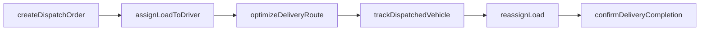
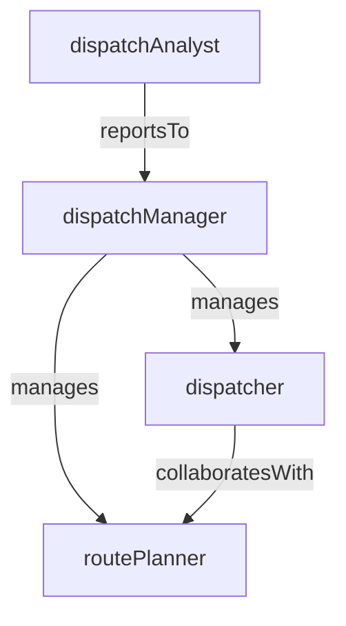

# Dispatch

> Business-as-Code definition for the Dispatch department. Models responsibilities, actions, events, and searches.

## Overview

Dispatch assigns loads to drivers and vehicles, optimizes routes, and provides real-time tracking and communication for freight, passenger, and rail operations. The department serves as the operational nerve center connecting shippers, drivers, and customers.

## Responsibilities

| Responsibility | Description |
|---------------|-------------|
| assignLoadsToDrivers | Match available freight loads or passenger trips to qualified, available drivers |
| optimizeRoutes | Calculate efficient routes considering distance, time windows, and regulatory constraints |
| trackVehiclesInRealTime | Monitor GPS positions and status of all dispatched vehicles and drivers |
| manageDriverCommunication | Relay instructions, pickup details, and schedule changes to drivers in the field |
| handleServiceDisruptions | Reroute or reassign loads when breakdowns, weather, or delays occur |

## Roles

| Role | Description |
|------|-------------|
| dispatchManager | Oversees the dispatch center and sets load assignment and routing policies |
| dispatcher | Assigns loads, plans routes, and communicates with drivers throughout the shift |
| routePlanner | Designs optimized multi-stop routes and delivery sequences |
| dispatchAnalyst | Analyzes on-time delivery, driver utilization, and route efficiency metrics |

## Entities

| Entity | Description |
|--------|-------------|
| DispatchOrder | Instruction to move a specific load or passenger group on a vehicle and route |
| LoadAssignment | Mapping of a freight load or trip to a specific driver and vehicle |
| Route | Planned path with stops, time windows, and mileage for a dispatched vehicle |
| DriverAvailability | Record of a driver's current status, hours remaining, and location |
| DeliveryStop | Individual pickup or dropoff point within a multi-stop route |

## Actions

| Action | Description |
|--------|-------------|
| createDispatchOrder | Generate a new dispatch instruction for a load or trip |
| assignLoadToDriver | Match a pending load to an available, qualified driver and vehicle |
| optimizeDeliveryRoute | Calculate the most efficient stop sequence and path for a set of deliveries |
| trackDispatchedVehicle | Monitor the real-time position and ETA of a dispatched vehicle |
| reassignLoad | Transfer a load to a different driver or vehicle due to a disruption |
| confirmDeliveryCompletion | Record proof of delivery and close out the dispatch order |

## Events

| Event | Description |
|-------|-------------|
| dispatchOrderCreated | A new dispatch order was generated and is pending driver assignment |
| loadAssignedToDriver | A load was matched to a driver and vehicle for pickup |
| vehicleDispatched | A vehicle departed on its assigned route |
| deliveryCompleted | A dispatched load was delivered and proof of delivery recorded |
| loadReassigned | A load was transferred to a different driver due to disruption |
| routeDeviationDetected | A dispatched vehicle deviated from its planned route or schedule |
| etaUpdated | The estimated arrival time for a dispatched vehicle was recalculated |

## Searches

| Search | Description |
|--------|-------------|
| findAvailableDrivers | List drivers with remaining hours and proximity to a pickup location |
| getActiveDispatches | Retrieve all currently dispatched vehicles and their statuses |
| searchUnassignedLoads | Find loads pending driver assignment within a date and region filter |
| getOnTimeDeliveryRate | Calculate delivery punctuality metrics over a date range |
| findRouteDeviations | List vehicles that deviated from planned routes or exceeded time windows |
| getDriverUtilization | Retrieve hours driven, loads completed, and idle time by driver |

## Workflow



## Actor Relationships



## Related Processes

| Process | APQC ID | Relationship |
|---------|---------|-------------|
| Deliver Products and Services | 4.4 | Dispatch is the operational execution layer for freight and passenger delivery |
| Plan for and Align Supply Chain Resources | 4.2 | Route planning and load optimization align with broader supply chain resource planning |
| Manage Health, Safety, and Environment | 5.5 | Hours-of-service tracking and driver safety are core dispatch responsibilities |

## Related Departments

| Department | Relationship |
|-----------|-------------|
| Fleet Management | Provides vehicle availability, maintenance status, and capacity data |
| DOT Safety Compliance | Enforces hours-of-service rules and driver qualification requirements |
| Terminal Operations | Coordinates pickup and delivery schedules at terminal facilities |
| Crew Scheduling | Aligns driver rosters and availability with dispatch demand |

## Usage

```typescript
import { db } from '@headlessly/db'

const dept = await db.departments.get('dispatch')
const available = await db.departments.search('findAvailableDrivers', { region: 'midwest', loadType: 'FTL' })
const unassigned = await db.departments.search('searchUnassignedLoads', { date: '2025-03-15' })
```
