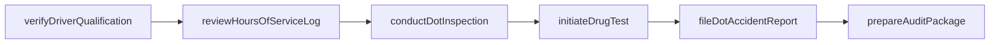
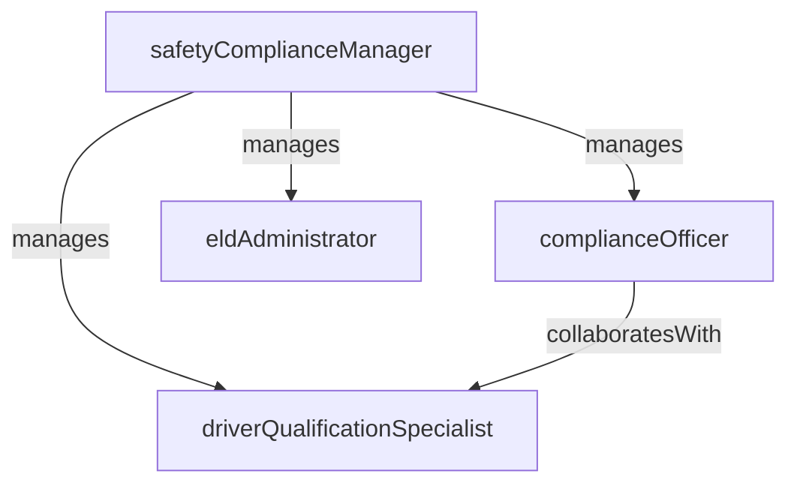

# DOT Safety Compliance

> Business-as-Code definition for the DOT Safety Compliance department. Models responsibilities, actions, events, and searches.

## Overview

DOT Safety Compliance ensures adherence to Department of Transportation regulations including hours-of-service rules, vehicle inspection programs, driver qualification files, and audit readiness. The department protects the organization's operating authority and safety rating.

## Responsibilities

| Responsibility | Description |
|---------------|-------------|
| enforceHoursOfService | Monitor and enforce driver hours-of-service limits under FMCSA regulations |
| manageDriverQualification | Maintain driver qualification files including CDL, medical certificates, and road tests |
| administerInspectionPrograms | Oversee systematic vehicle inspection, repair, and maintenance programs |
| prepareDotAudits | Maintain documentation and readiness for DOT compliance reviews and audits |
| manageAccidentReporting | Ensure timely and accurate reporting of DOT-recordable accidents and incidents |
| trackDrugAlcoholTesting | Administer DOT-mandated drug and alcohol testing programs for safety-sensitive employees |

## Roles

| Role | Description |
|------|-------------|
| safetyComplianceManager | Oversees all DOT regulatory compliance programs and serves as the designated employer representative |
| complianceOfficer | Audits driver files, vehicle records, and operational practices for regulatory adherence |
| driverQualificationSpecialist | Manages CDL verification, medical card tracking, and road test documentation |
| eldAdministrator | Administers the electronic logging device program and reviews hours-of-service data |

## Entities

| Entity | Description |
|--------|-------------|
| DriverQualificationFile | Regulatory file containing CDL, medical certificate, MVR, road test, and employment history |
| DotInspection | Record of a systematic vehicle inspection with deficiency findings and corrective actions |
| HoursOfServiceLog | Driver duty status record showing driving, on-duty, sleeper berth, and off-duty time |
| DrugTestResult | Outcome of a DOT-mandated drug or alcohol test for a safety-sensitive employee |
| ComplianceAuditRecord | Documentation package prepared for or resulting from a DOT compliance review |
| AccidentReport | DOT-recordable accident filing with details, root cause, and corrective actions |

## Actions

| Action | Description |
|--------|-------------|
| reviewHoursOfServiceLog | Audit a driver's ELD records for hours-of-service violations or edit requests |
| verifyDriverQualification | Validate that a driver's CDL, medical certificate, and training records are current |
| conductDotInspection | Perform a systematic vehicle inspection and document findings |
| fileDotAccidentReport | Submit a DOT-recordable accident report within regulatory time limits |
| initiateDrugTest | Order a pre-employment, random, post-accident, or reasonable suspicion drug test |
| prepareAuditPackage | Compile driver files, vehicle records, and operational data for a DOT compliance review |

## Events

| Event | Description |
|-------|-------------|
| hoursOfServiceViolationDetected | A driver was found to have exceeded regulatory duty or driving time limits |
| driverQualificationVerified | A driver's qualification file was reviewed and confirmed as complete and current |
| dotInspectionCompleted | A systematic vehicle inspection was performed and results documented |
| accidentReportFiled | A DOT-recordable accident report was submitted to the required authorities |
| drugTestCompleted | A DOT-mandated drug or alcohol test was administered and results recorded |
| complianceAuditCompleted | A DOT compliance review was conducted and findings were documented |

## Searches

| Search | Description |
|--------|-------------|
| findDriversWithExpiringCredentials | List drivers whose CDL, medical certificate, or training records are expiring soon |
| getHoursOfServiceViolations | Retrieve HOS violations by driver, date range, or violation type |
| searchOverdueInspections | Find vehicles past their scheduled inspection dates |
| getDrugTestingStatus | Check testing compliance rates and pending test results |
| getComplianceScorecard | Retrieve aggregate safety and compliance metrics across the operation |
| findOpenCorrectiveActions | List unresolved inspection deficiencies or audit findings requiring remediation |

## Workflow



## Actor Relationships



## Related Processes

| Process | APQC ID | Relationship |
|---------|---------|-------------|
| Manage Health, Safety, and Environment | 5.5 | DOT compliance is a specialized safety management function for transportation |
| Deliver Products and Services | 4.4 | Driver and vehicle compliance directly gates the ability to operate and deliver |
| Manage Compliance | 5.6 | DOT audit readiness is part of the broader enterprise compliance management framework |

## Related Departments

| Department | Relationship |
|-----------|-------------|
| Fleet Management | Provides vehicle maintenance records and inspection data for compliance tracking |
| Dispatch | Supplies driver hours and trip data used for hours-of-service monitoring |
| Human Resources | Maintains employment records and coordinates drug testing administration |
| Crew Scheduling | Aligns crew duty assignments with regulatory rest and duty time requirements |

## Usage

```typescript
import { db } from '@headlessly/db'

const dept = await db.departments.get('dotSafetyCompliance')
const expiring = await db.departments.search('findDriversWithExpiringCredentials', { daysUntilExpiry: 30 })
const violations = await db.departments.search('getHoursOfServiceViolations', { period: '2025-Q1' })
```
