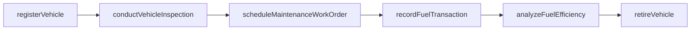
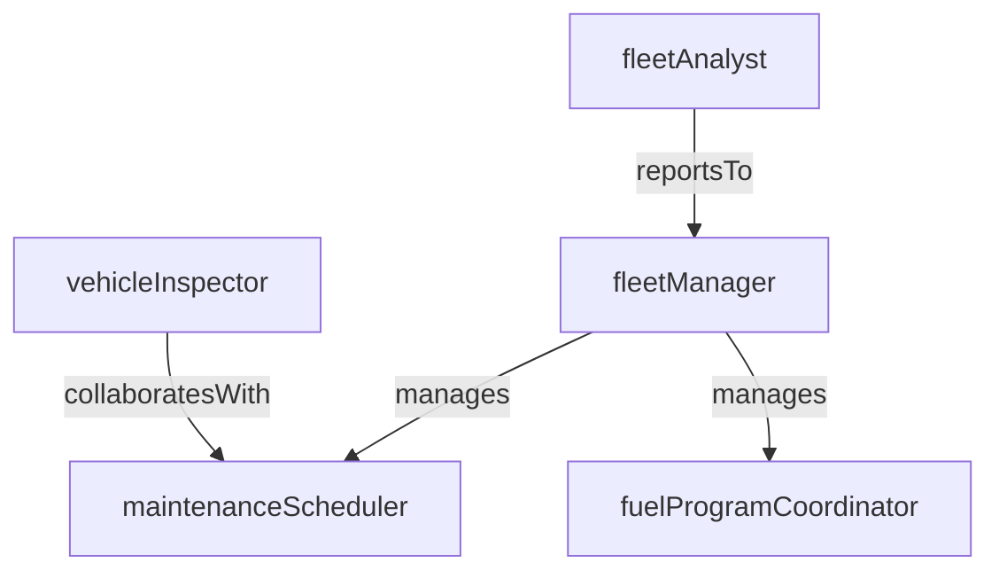

# Fleet Management

> Business-as-Code definition for the Fleet Management department. Models responsibilities, actions, events, and searches.

## Overview

Fleet Management oversees the full lifecycle of transport vehicles, from acquisition and registration through maintenance scheduling, fuel management, and eventual disposition. The department ensures assets are available, roadworthy, and cost-effective across the fleet.

## Responsibilities

| Responsibility | Description |
|---------------|-------------|
| manageVehicleAcquisition | Evaluate, procure, and register new vehicles to meet fleet capacity requirements |
| schedulePreventiveMaintenance | Plan and track routine maintenance intervals based on mileage, hours, and calendar triggers |
| manageFuelProgram | Monitor fuel consumption, manage fuel cards, and optimize fueling strategies |
| trackVehicleLifecycle | Maintain records for each asset from acquisition through depreciation and disposal |
| analyzeFleetCosts | Evaluate total cost of ownership including maintenance, fuel, insurance, and depreciation |

## Roles

| Role | Description |
|------|-------------|
| fleetManager | Oversees all fleet assets, budgets, and lifecycle planning |
| maintenanceScheduler | Plans preventive and corrective maintenance work orders for fleet vehicles |
| fleetAnalyst | Analyzes fleet utilization, cost trends, and replacement timing |
| vehicleInspector | Conducts pre-trip, post-trip, and periodic vehicle inspections |
| fuelProgramCoordinator | Manages fuel cards, monitors consumption anomalies, and negotiates fuel contracts |

## Entities

| Entity | Description |
|--------|-------------|
| Vehicle | A fleet asset with registration, specifications, and lifecycle data |
| MaintenanceWorkOrder | Scheduled or unscheduled repair and service task for a specific vehicle |
| FuelTransaction | Individual fueling event recording volume, cost, location, and vehicle |
| InspectionRecord | Documented results of a pre-trip, post-trip, or periodic vehicle inspection |
| VehicleLifecyclePlan | Projected acquisition, depreciation, and replacement schedule for a fleet asset |

## Actions

| Action | Description |
|--------|-------------|
| registerVehicle | Add a new vehicle to the fleet with registration, specifications, and assignment |
| scheduleMaintenanceWorkOrder | Create a preventive or corrective maintenance task for a specific vehicle |
| recordFuelTransaction | Log a fueling event with volume, cost, and odometer reading |
| conductVehicleInspection | Perform and document a pre-trip, post-trip, or periodic vehicle inspection |
| retireVehicle | Remove a vehicle from active service and initiate disposition |
| analyzeFuelEfficiency | Evaluate fuel consumption trends and identify anomalies across the fleet |

## Events

| Event | Description |
|-------|-------------|
| vehicleRegistered | A new vehicle was added to the active fleet |
| maintenanceWorkOrderCompleted | A scheduled or corrective maintenance task was finished and the vehicle returned to service |
| fuelAnomalyDetected | An unusual fuel consumption pattern was flagged for investigation |
| inspectionFailed | A vehicle inspection identified deficiencies requiring corrective action |
| vehicleRetired | A vehicle was removed from active service and marked for disposal |
| maintenanceDueAlertRaised | A vehicle reached a preventive maintenance trigger for mileage, hours, or calendar |

## Searches

| Search | Description |
|--------|-------------|
| findVehiclesDueForMaintenance | List vehicles approaching or past preventive maintenance intervals |
| getFleetUtilization | Retrieve utilization rates, mileage, and idle time by vehicle or category |
| searchOpenWorkOrders | Find maintenance work orders in progress or awaiting parts |
| getFuelCostByVehicle | Summarize fuel spend and efficiency metrics for a specific vehicle or group |
| findVehiclesForReplacement | Identify vehicles exceeding age, mileage, or cost-per-mile replacement thresholds |
| getInspectionHistory | Retrieve inspection records and deficiency trends for a vehicle |

## Workflow



## Actor Relationships



## Related Processes

| Process | APQC ID | Relationship |
|---------|---------|-------------|
| Manage Logistics and Warehousing | 4.4 | Fleet availability directly determines delivery capacity and service levels |
| Manage Environmental Health and Safety (EHS) | 13.7 | Vehicle inspections and maintenance compliance are core safety requirements |
| Maintain Productive Assets | 10.3 | Fleet vehicles are capital assets requiring lifecycle planning and depreciation tracking |

## Related Departments

| Department | Relationship |
|-----------|-------------|
| Dispatch | Consumes vehicle availability data to assign loads and plan routes |
| DOT Safety Compliance | Enforces vehicle inspection standards and maintenance record requirements |
| Procurement | Manages vehicle acquisition contracts, parts sourcing, and vendor negotiations |

## Usage

```typescript
import { db } from '@headlessly/db'

const dept = await db.departments.get('fleetManagement')
const dueMaintenance = await db.departments.search('findVehiclesDueForMaintenance', { threshold: 'overdue' })
const utilization = await db.departments.search('getFleetUtilization', { period: '2025-Q1' })
```
