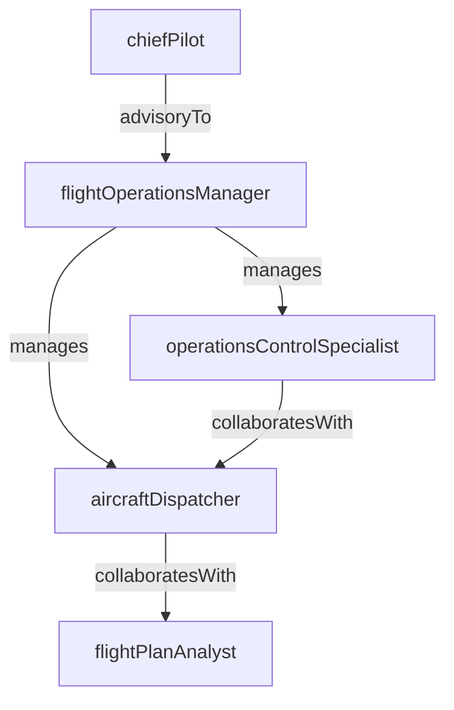

# Flight Operations

> Business-as-Code definition for the Flight Operations department. Models responsibilities, actions, events, and searches.

## Overview

Flight Operations manages pilot scheduling, flight planning, aircraft dispatch, and operational control to ensure safe, on-time departures across the airline network. The department coordinates with ATC, maintenance, and crew scheduling to maintain regulatory compliance and operational efficiency.

## Responsibilities

| Responsibility | Description |
|---------------|-------------|
| manageFlight Planning | Develop and file flight plans including routes, fuel calculations, and weather analysis |
| coordinateAircraftDispatch | Authorize flight releases and monitor operational control of active flights |
| ensureRegulatoryCompliance | Maintain adherence to FAA/ICAO regulations for flight operations and crew duty limits |
| monitorFlightPerformance | Track on-time performance, fuel burn, and flight path deviations across the network |
| manageOperationalControl | Provide real-time decision support for diversions, delays, and irregular operations |

## Roles

| Role | Description |
|------|-------------|
| flightOperationsManager | Oversees all flight operations activities and coordinates with network planning |
| aircraftDispatcher | Plans flights, calculates fuel loads, and issues dispatch releases |
| flightPlanAnalyst | Develops optimized flight plans considering weather, airspace, and fuel efficiency |
| operationsControlSpecialist | Monitors active flights and manages real-time operational decisions |
| chiefPilot | Provides pilot oversight, standards enforcement, and regulatory liaison |

## Entities

| Entity | Description |
|--------|-------------|
| FlightPlan | Approved routing, altitude, fuel, and weather package for a specific flight |
| DispatchRelease | Authorization document permitting an aircraft to depart on a planned flight |
| AircraftAssignment | Mapping of a specific tail number to a scheduled flight leg |
| OperationalFlightLeg | A single segment of a flight from departure to arrival |
| WeatherBriefing | Meteorological package covering en-route, departure, and arrival conditions |
| FuelUplift | Calculated fuel load including reserves, tankering, and contingency amounts |

## Actions

| Action | Description |
|--------|-------------|
| createFlightPlan | Build a flight plan with route, altitude, fuel, and weather data |
| issueDispatchRelease | Authorize an aircraft for departure after verifying all operational requirements |
| assignAircraft | Allocate a specific aircraft to a scheduled flight based on availability and capability |
| monitorActiveFlight | Track an in-progress flight for deviations, weather, and ATC changes |
| amendFlightPlan | Update an active or pending flight plan due to weather or operational changes |
| initiateDisruptionRecovery | Trigger recovery procedures for delays, cancellations, or diversions |
| reviewFuelPolicy | Evaluate and adjust fuel uplift calculations for a flight or route |

## Events

| Event | Description |
|-------|-------------|
| flightPlanFiled | A flight plan was filed with ATC and is ready for dispatch release |
| dispatchReleaseIssued | An aircraft was authorized for departure on a specific flight |
| aircraftAssigned | A tail number was assigned to a scheduled flight leg |
| flightDeparted | An aircraft pushed back from the gate and began its flight |
| flightDiverted | An active flight was rerouted to an alternate airport |
| disruptionRecoveryInitiated | Irregular operations procedures were activated for a disruption event |
| flightPlanAmended | An existing flight plan was modified due to operational or weather changes |

## Searches

| Search | Description |
|--------|-------------|
| findActiveFlights | Retrieve all flights currently airborne or in taxi phase |
| getFlightsByRoute | List flights for a specific city-pair over a given date range |
| searchUnreleasedFlights | Find flights pending dispatch release within the next operational window |
| getDisruptedFlights | Retrieve flights impacted by weather, mechanical, or ATC delays |
| findAircraftUtilization | Query aircraft assignment and utilization metrics by tail number |
| getFuelVarianceReport | Compare planned versus actual fuel burn across flight legs |

## Workflow


## Actor Relationships



## Related Processes

| Process | APQC ID | Relationship |
|---------|---------|-------------|
| Deliver Products and Services | 4.4 | Flight operations is the core delivery mechanism for airline passenger and cargo services |
| Manage Logistics and Warehousing | 4.5 | Coordinates aircraft routing and cargo load planning with logistics |
| Manage Health, Safety, and Environment | 5.5 | Enforces aviation safety standards, incident reporting, and risk mitigation |

## Related Departments

| Department | Relationship |
|-----------|-------------|
| Crew Scheduling | Provides crew assignments and duty time compliance for each flight |
| Ground Operations | Coordinates gate assignments, turnaround, and departure readiness |
| Fleet Management | Supplies aircraft availability, maintenance status, and airworthiness data |

## Usage

```typescript
import { db } from '@headlessly/db'

const dept = await db.departments.get('flightOperations')
const active = await db.departments.search('findActiveFlights', { region: 'domestic' })
const disrupted = await db.departments.search('getDisruptedFlights', { severity: 'high' })
```
