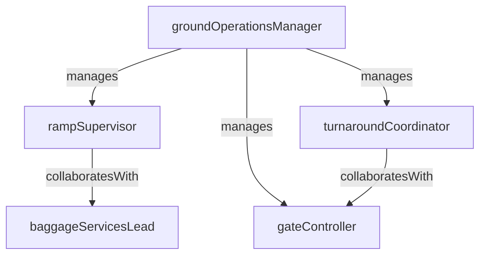

# Ground Operations

> Business-as-Code definition for the Ground Operations department. Models responsibilities, actions, events, and searches.

## Overview

Ground Operations manages gate assignments, ramp services, baggage handling, and aircraft turnaround coordination to ensure on-time departures and safe ground-side movement. The department bridges airside logistics with terminal passenger flow and maintenance activities.

## Responsibilities

| Responsibility | Description |
|---------------|-------------|
| coordinateAircraftTurnaround | Manage the sequence of ground activities between aircraft arrival and departure |
| manageGateAssignments | Allocate and adjust gate positions based on flight schedule and aircraft type |
| overseeRampServices | Direct baggage loading, fueling, catering, and pushback operations on the ramp |
| manageBaggageHandling | Ensure accurate sorting, routing, and delivery of passenger baggage |
| maintainGroundSafetyStandards | Enforce ramp safety protocols, FOD prevention, and ground vehicle operations |

## Roles

| Role | Description |
|------|-------------|
| groundOperationsManager | Oversees all airside ground activities and turnaround coordination |
| rampSupervisor | Manages ramp agents performing baggage, fueling, and pushback operations |
| gateController | Assigns and adjusts gate positions in real time based on arrivals and departures |
| baggageServicesLead | Coordinates baggage sorting, transfer connections, and mishandled baggage resolution |
| turnaroundCoordinator | Sequences all ground tasks to meet target off-block times for departures |

## Entities

| Entity | Description |
|--------|-------------|
| GateAssignment | Mapping of a flight to a specific gate position and time window |
| TurnaroundPlan | Sequenced checklist of ground tasks required between aircraft arrival and departure |
| BaggageManifest | Inventory of checked baggage loaded onto a specific flight |
| RampServiceOrder | Work order for fueling, catering, lavatory, or water servicing of an aircraft |
| GroundIncidentReport | Documentation of a safety event or damage occurrence on the ramp |

## Actions

| Action | Description |
|--------|-------------|
| assignGate | Allocate a gate position to an arriving or departing flight |
| initiateTurnaround | Begin the sequenced ground handling process for an arrived aircraft |
| loadBaggage | Sort and load checked baggage onto the aircraft per manifest |
| dispatchRampService | Send fueling, catering, or servicing crew to the aircraft |
| clearAircraftForDeparture | Confirm all ground tasks are complete and authorize pushback |
| reportGroundIncident | Document a ramp safety event, FOD strike, or ground damage occurrence |

## Events

| Event | Description |
|-------|-------------|
| gateAssigned | A gate position was allocated to a flight |
| turnaroundInitiated | Ground handling sequence began for an arrived aircraft |
| baggageLoaded | All checked baggage was loaded and the cargo doors secured |
| rampServiceCompleted | Fueling, catering, or other ramp servicing was completed for a flight |
| aircraftClearedForDeparture | All ground checks passed and the aircraft was released for pushback |
| groundIncidentReported | A ramp safety event or ground damage was documented |

## Searches

| Search | Description |
|--------|-------------|
| findActiveturnarounds | List all aircraft currently in ground handling turnaround |
| getGateAvailability | Check open gate positions for a time window and aircraft type |
| searchMishandledBaggage | Find baggage that missed connections or was not delivered to the belt |
| getturnaroundPerformance | Retrieve on-time turnaround metrics by station and time period |
| findGroundIncidents | List ramp safety incidents filtered by station, date, or severity |

## Workflow


## Actor Relationships



## Related Processes

| Process | APQC ID | Relationship |
|---------|---------|-------------|
| Deliver Products and Services | 4.4 | Ground handling is the critical path for on-time flight departure and service delivery |
| Manage Logistics and Warehousing | 4.5 | Baggage and cargo handling are core logistics functions within ground operations |
| Manage Health, Safety, and Environment | 5.5 | Ramp safety, FOD prevention, and ground vehicle operations are safety-critical |

## Related Departments

| Department | Relationship |
|-----------|-------------|
| Flight Operations | Provides flight schedules and departure targets that drive turnaround planning |
| Terminal Operations | Coordinates passenger flow between gates and ground-side terminal facilities |
| Fleet Management | Supplies aircraft maintenance status affecting gate assignments and turnarounds |

## Usage

```typescript
import { db } from '@headlessly/db'

const dept = await db.departments.get('groundOperations')
const turnarounds = await db.departments.search('findActiveturnarounds', { station: 'JFK' })
const gates = await db.departments.search('getGateAvailability', { terminal: 'T4', window: '14:00-18:00' })
```
