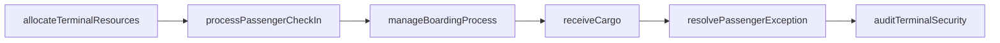
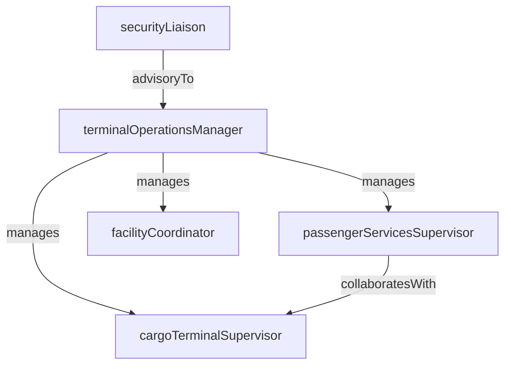

# Terminal Operations

> Business-as-Code definition for the Terminal Operations department. Models responsibilities, actions, events, and searches.

## Overview

Terminal Operations manages passenger processing, cargo handling, and facility coordination at airports, rail stations, and marine ports. The department ensures efficient throughput of people and goods through check-in, security, boarding, and freight staging areas.

## Responsibilities

| Responsibility | Description |
|---------------|-------------|
| managePassengerProcessing | Oversee check-in, security screening, boarding, and arrival procedures at terminals |
| coordinateCargoHandling | Manage freight receiving, staging, and transfer within terminal cargo facilities |
| maintainFacilityOperations | Ensure terminal infrastructure, signage, and passenger amenities are operational |
| manageTerminalCapacity | Balance passenger and cargo volumes against terminal capacity constraints |
| enforceSecurityProtocols | Coordinate with security agencies and enforce access control within terminal areas |

## Roles

| Role | Description |
|------|-------------|
| terminalOperationsManager | Oversees all terminal functions including passenger processing and cargo handling |
| passengerServicesSupervisor | Manages check-in agents, gate agents, and customer service representatives |
| cargoTerminalSupervisor | Directs freight receiving, staging, and loading operations within the cargo facility |
| facilityCoordinator | Maintains terminal systems, signage, and coordinates vendor access for repairs |
| securityLiaison | Interfaces with TSA, port authority, and security contractors on terminal security matters |

## Entities

| Entity | Description |
|--------|-------------|
| TerminalFacility | Physical terminal building with gates, cargo bays, and passenger processing areas |
| CheckInCounter | Staffed or automated station for passenger check-in and baggage acceptance |
| CargoManifest | Detailed list of freight items received, staged, or shipped through the terminal |
| BoardingRecord | Documentation of a passenger's boarding status for a specific departure |
| TerminalCapacityPlan | Projected throughput schedule balancing arrivals, departures, and facility limits |

## Actions

| Action | Description |
|--------|-------------|
| processPassengerCheckIn | Complete passenger check-in, issue boarding pass, and accept checked baggage |
| manageBoardingProcess | Execute boarding sequence by zone, priority, or group for a departure |
| receiveCargo | Accept incoming freight at the terminal cargo facility and log it on the manifest |
| allocateTerminalResources | Assign counters, gates, and staffing to match the flight or vessel schedule |
| resolvePassengerException | Handle rebooking, denied boarding, or special assistance requests |
| auditTerminalSecurity | Review and validate security checkpoint compliance and access control logs |

## Events

| Event | Description |
|-------|-------------|
| passengerCheckedIn | A passenger completed check-in and received a boarding pass |
| boardingCompleted | All passengers boarded and the gate was closed for departure |
| cargoReceived | Incoming freight was accepted and logged at the cargo terminal |
| terminalResourcesAllocated | Counters, gates, and staff were assigned for an upcoming schedule block |
| passengerExceptionResolved | A rebooking, denied boarding, or special assistance case was resolved |
| securityAuditCompleted | A terminal security compliance review was finished and documented |

## Searches

| Search | Description |
|--------|-------------|
| getTerminalThroughput | Retrieve passenger and cargo volume metrics for a terminal over a time period |
| findDelayedDepartures | List departures running behind schedule at a specific terminal |
| searchCargoByManifest | Look up cargo items by manifest number, shipper, or commodity type |
| getCheckInQueueStatus | Monitor current wait times and queue lengths at check-in counters |
| findTerminalCapacityGaps | Identify time windows where terminal capacity is over or under utilized |

## Workflow



## Actor Relationships



## Related Processes

| Process | APQC ID | Relationship |
|---------|---------|-------------|
| Deliver Products and Services | 4.4 | Terminal operations is the passenger and cargo interface for transport service delivery |
| Manage Logistics and Warehousing | 4.5 | Cargo terminal handling is a logistics function for freight receiving and staging |
| Manage Health, Safety, and Environment | 5.5 | Terminal security and safety protocols are critical operational requirements |

## Related Departments

| Department | Relationship |
|-----------|-------------|
| Ground Operations | Coordinates airside gate assignments and ramp activities with terminal processing |
| Flight Operations | Provides flight schedules that drive terminal resource allocation and staffing |
| Dispatch | Aligns terminal cargo schedules with outbound dispatch and routing plans |

## Usage

```typescript
import { db } from '@headlessly/db'

const dept = await db.departments.get('terminalOperations')
const throughput = await db.departments.search('getTerminalThroughput', { terminal: 'T1', period: 'today' })
const delays = await db.departments.search('findDelayedDepartures', { terminal: 'T1' })
```
